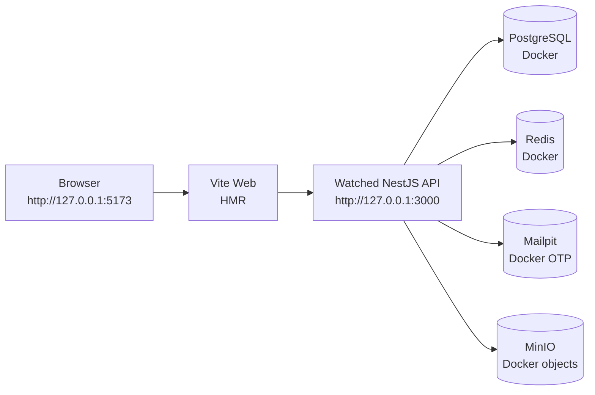
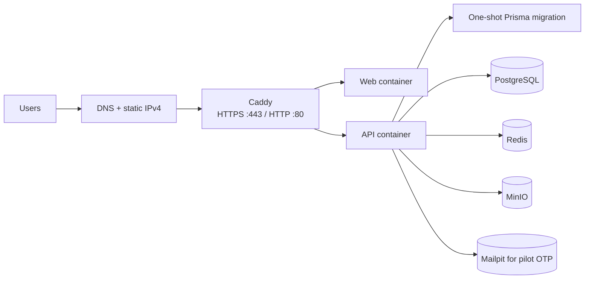
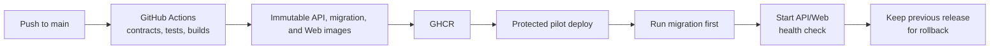

# Local Development and Lightsail Pilot

**Status:** Implemented development/deployment guidance
**Version:** 1.0

This document explains the two supported ways to run DataBreeze: the daily
host-watcher loop for fast frontend work, and the low-cost single-server
Lightsail pilot. They share the same API boundaries and persistence contracts,
but they have different runtime goals.

## Daily local development

Use three terminals from the repository root:

```powershell
corepack pnpm dev:infra
corepack pnpm dev:api
corepack pnpm dev:web
```

The dependency stack runs in Docker. The Web and API watchers run on the host
so source changes are visible immediately.



`dev:api` uses the local database-backed composition, generates Prisma client
code, applies migrations, and watches the API TypeScript build. `dev:web`
uses Vite HMR and proxies `/v1`, `/v3`, and `/health` to the watched API.
Therefore registration, OTP verification, sign-in, refresh, logout, and
durable data changes use the real local backend and database rather than an
in-memory mock.

Open the HMR application at:

```text
http://127.0.0.1:5173/vi-VN/sign-in
```

The loopback HMR profile is the only place where HTTP development cookies are
allowed. The exception is restricted to loopback origins and does not weaken
the built or deployed HTTPS profiles.

## Built local validation

For an image-based, production-shaped local run, use:

```powershell
corepack pnpm local:services app-start
```

That profile starts a one-shot migration, API and Web containers, Caddy, and
the same PostgreSQL, Redis, MinIO, Mailpit, and telemetry dependencies. Open:

```text
https://localhost:8443
```

This endpoint is HTTPS and serves built assets; it is intentionally not the
hot-reload endpoint. Opening `http://localhost:8443` sends plain HTTP to an
HTTPS listener and produces the expected protocol error.

## Lightsail pilot

The budget deployment is one Ubuntu Lightsail instance with a static IPv4 and
Docker Compose:



The instance runs Caddy, Web, API, the migration job, PostgreSQL, Redis,
MinIO, and Mailpit. PostgreSQL, Redis, and MinIO are not publicly exposed;
only the web ports are public. Mailpit is available through an SSH tunnel for
owner testing.

This is intentionally a low-cost validation pilot, not a highly available
production architecture. A single instance is a single failure domain. Before
real customers use it, create and verify backups of PostgreSQL and MinIO,
restrict SSH, use a real domain and TLS certificate, and decide whether Mailpit
must be replaced with a transactional email provider.

## CI/CD flow

The Lightsail workflow is:



Pull requests validate without connecting to the server. A protected push to
`main` publishes immutable image digests, deploys them over restricted SSH,
runs the migration before the API/Web services, checks `/health/ready`, and
retains the previous release manifest for rollback. Secrets stay on the
server/GitHub protected environment and are never put in the Web bundle.

## What is intentionally different

| Concern | Local HMR | Lightsail pilot |
|---|---|---|
| Web | Vite host watcher | Built Web container |
| API | Host TypeScript watcher | API container |
| Database | Docker PostgreSQL | PostgreSQL on the instance |
| Email | Mailpit | Mailpit or approved provider |
| Object storage | Local MinIO | MinIO on the instance |
| Browser endpoint | Loopback HTTP for HMR | Caddy HTTPS |
| Deployment | Local commands | GitHub Actions + protected SSH |
| Availability | Developer machine | One Lightsail failure domain |

Advanced cloud-worker execution, external provider integrations, and other
features without an approved local authority remain fail-closed. They must not
be represented as successful merely because the UI is running.
