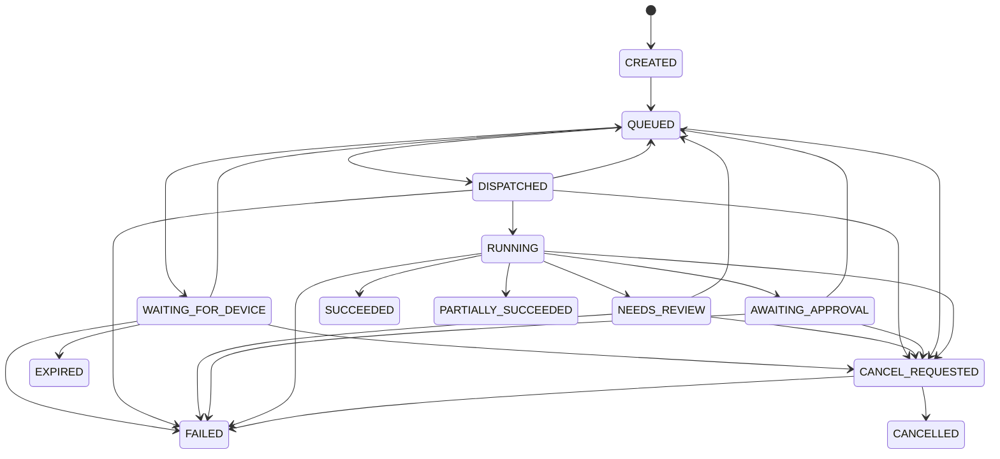

# Processing and Job System

**Status:** Product specification<br>
**Version:** 1.0

## 1. Purpose

The job system executes reliable, observable work across cloud workers and registered Desktop devices. It separates durable orchestration from resource-intensive processing and prevents a retry, reconnect, or duplicated request from producing duplicated business effects.

## 2. Job Contract

Every job declares:

- typed action and schema version
- workspace, actor, and authorized capability
- immutable artifact or dataset input versions
- processor or recipe version
- requested route or policy-based route
- data classification and allowed output locations
- idempotency key
- resource class and entitlement reservation
- timeout, priority, and safe cancellation policy
- declared possible effects

Workers never receive broad workspace credentials. A dispatch token is restricted to one job, its inputs, allowed result upload, and expiry.

## 3. Lifecycle



This diagram renders the canonical transition set. The normative transition table and enforcement rules are in the `JRA` foundation specification.

Terminal states are `SUCCEEDED`, `PARTIALLY_SUCCEEDED`, `FAILED`, `CANCELLED`, and `EXPIRED`. A terminal job is immutable except for retention metadata and administrative annotations.

The canonical states are `CREATED`, `QUEUED`, `WAITING_FOR_DEVICE`, `DISPATCHED`, `RUNNING`, `NEEDS_REVIEW`, `AWAITING_APPROVAL`, `SUCCEEDED`, `PARTIALLY_SUCCEEDED`, `FAILED`, `CANCEL_REQUESTED`, `CANCELLED`, and `EXPIRED`.

## 4. Durable Creation and Dispatch

1. API validates authorization, policy, inputs, schema compatibility, and entitlement.
2. One transaction creates the job, reserves applicable usage, and writes an outbox record.
3. The dispatcher publishes to the appropriate Redis Stream after transaction commit.
4. A cloud worker consumer group or connected Desktop claims the job through a lease.
5. The claimant exchanges its dispatch token for time-limited input access.
6. Heartbeats extend the lease and report bounded progress.
7. Result acceptance validates lease, job version, input versions, output schema, and allowed effects.
8. A transaction stores the result, releases or commits usage, changes state, and emits events.

If Redis loses a dispatch message, the reconciler republishes nonterminal dispatchable jobs from PostgreSQL.

## 5. Routing

The router evaluates in order:

1. Workspace data mode and artifact location
2. Explicit “local only” or “cloud allowed” classification
3. Required processor version and device capability
4. Device online state and user policy
5. Resource and size limits
6. Entitlement and regional policy
7. Available worker capacity

Local originals cannot route to a cloud worker. A job that needs an unavailable authorized device becomes `WAITING_FOR_DEVICE`; it is not silently uploaded.

## 6. Processor Interface

A processor is a pure-looking versioned operation around controlled adapters:

```text
describe() -> supported schemas, capabilities, limits
validate(request) -> validation result
execute(context, inputs, checkpoint) -> result envelope
cancel(checkpoint) -> safe stop behavior
```

The result envelope includes:

- processor name, version, build digest, and configuration digest
- input artifact/dataset versions and hashes
- structured outputs with schema versions
- evidence references and lineage
- findings, confidence, warnings, and review suggestions
- derivative manifests
- metrics, resource usage, and checkpoints
- deterministic/reproducibility flags

Processor code cannot directly publish reports, approve findings, change memberships, or charge a customer.

## 7. Steps and Checkpoints

Long jobs are decomposed into restartable steps such as acquisition, parse, classify, extract, normalize, validate, compare, render, and finalize.

- A checkpoint is written only after its output is durable.
- A retry resumes from the latest compatible checkpoint.
- A processor upgrade does not resume an incompatible checkpoint; it restarts a new attempt or job.
- Progress is monotonic within an attempt and identifies the current stage without exposing sensitive content.

## 8. Idempotency and Effects

- API mutation idempotency keys are scoped to actor, workspace, and operation.
- Job result acceptance is idempotent by job and attempt.
- Derivative object keys include job and output IDs, not mutable filenames.
- Usage records use stable measurement IDs.
- Notifications and webhooks use event-derived deduplication keys.
- File mutations use a staged output, hash verification, atomic move where supported, and a recovery manifest.

Exactly-once execution is not assumed. Exactly-once business effects are achieved through idempotency and transactional state.

## 9. Retry and Failure Classes

| Class | Behavior |
|---|---|
| Validation or unsupported format | Fail without retry and explain remediation. |
| Temporary storage/network/provider failure | Exponential backoff with bounded attempts and jitter. |
| Worker crash or expired lease | Requeue from compatible checkpoint. |
| Resource limit exceeded | Stop safely, retain diagnostics, suggest another route or limit. |
| Input changed | Create or request a new artifact version; never continue against changed bytes. |
| Authorization or device revocation | Stop and reject result upload immediately. |
| Partial batch errors | Preserve accepted item results and produce an explicit partial outcome when the module permits it. |

Retry policy is processor-specific within platform maximums. Poison jobs enter a controlled failed state; they do not loop indefinitely.

## 10. Human Review and Approval

Review gates may pause an individual record, a batch subset, or the full job. Corrections create versioned review decisions and may resume only affected downstream steps.

Approval evaluates:

- action type and declared effects
- finding severity or financial threshold
- source and destination
- actor separation requirements
- workspace policy and entitlement

An approver cannot approve their own action when separation-of-duties policy forbids it.

## 11. Cancellation

- Queued jobs cancel immediately.
- Running jobs receive a cancellation request and stop at the next declared safe boundary.
- Noninterruptible external operations are not reported cancelled until their outcome is reconciled.
- Completed durable outputs are retained or removed according to the processor’s cancellation contract.
- Cancellation never removes original inputs.

## 12. AI-Assisted Steps

AI adapters receive the minimum necessary data and an explicit task schema. Provider, model, prompt template, parameters, region, and response digest are recorded.

AI-assisted output:

- is schema validated
- carries confidence or abstention
- retains supporting evidence
- cannot bypass a deterministic rule or approval
- has a deterministic or manual fallback for required workflows

Workspace policy may disable cloud AI, require a local model, or prohibit particular data classes.

## 13. Concurrency and Backpressure

Limits apply by organization, workspace, device, processor, and resource class. Interactive review work is isolated from large batch work.

The dispatcher stops leasing new work when storage, database, queue, worker memory, or provider health crosses a safety threshold. Jobs remain durably queued and users receive a truthful delayed state.

## 14. Observability

Every job carries correlation, trace, workspace, processor, and attempt identifiers. Metrics include queue delay, runtime, retry rate, success rate, review rate, cancellation latency, result size, and resource usage.

Logs never contain raw document content, access tokens, or complete extracted records. Support diagnostics use redacted manifests and explicit user-authorized evidence access.
