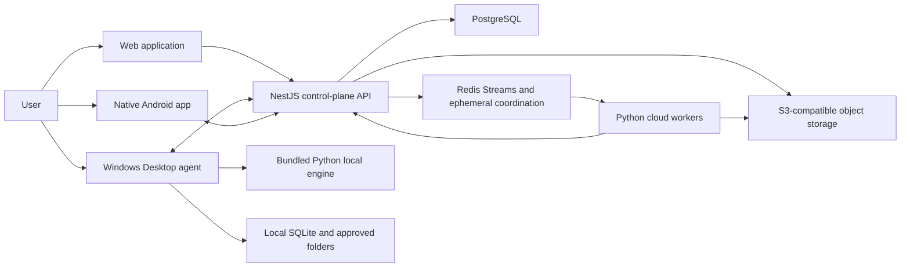
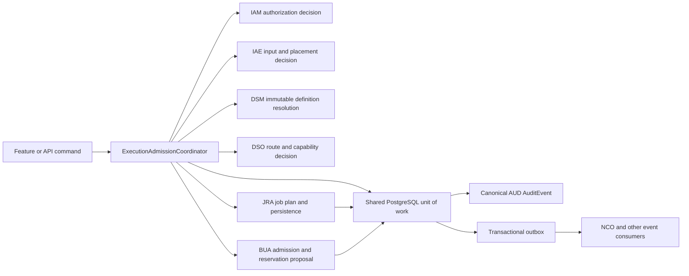

# DataBreeze System Architecture

**Status:** Product specification<br>
**Version:** 2.0<br>
**Related decisions:** [Clean monorepo](../decisions/0001-clean-monorepo.md), [technology stack](../decisions/0002-technology-stack.md), [data-to-dashboard direction and materialized refresh](../decisions/0004-data-to-dashboard-direction.md)

## 1. Architectural Outcome

DataBreeze is a local-first and cloud-capable data-to-dashboard product with a cloud control plane, a shared processing engine, and three purpose-built clients. The architecture must support governed Web intake/dashboard authoring, Hybrid Desktop folder processing, cloud-connected Android capture, intermittent connectivity, and cloud/local execution without creating separate product models.

The initial backend is a modular monolith. Processing workers are a separate runtime because document and tabular work has different libraries, resource limits, and deployment characteristics. This is a deliberate boundary, not an invitation to create many services.

## 2. Runtime Context



## 3. Deployable Components

### Web application

A React and TypeScript single-page application for cloud intake, ETL review, governed analysis, dashboard canvas authoring, interactive publication, collaboration, and administration. It communicates only through published API contracts and never reads storage or database state directly.

### Desktop application

An Electron application with three boundaries:

- **Renderer:** React interface without Node privileges.
- **Preload bridge:** Narrow, schema-validated IPC capabilities.
- **Main process:** Device-key custody and IAM enrollment client, DSO approved-folder handles, file watching, updates, secure storage, and Python sidecar lifecycle.

The bundled Python engine runs as a child process and communicates through versioned JSON-RPC over standard input/output. It does not expose a network port by default.

### Android application

A native Kotlin and Jetpack Compose application. Room owns local app records, WorkManager owns durable synchronization, CameraX and Android intents own capture/intake, and Android Keystore protects device credentials.

### Control-plane API

A NestJS modular monolith running on an Active LTS Node.js line with the Fastify adapter. It owns:

- Identity, sessions, organizations, memberships, and authorization
- Workspaces, projects, policies, devices, and synchronization
- Artifacts, evidence metadata, schemas, datasets, and retention
- Jobs, recipes, approvals, notifications, and audit events
- Dashboard drafts/versions, pages/widgets, materialization definitions/runs, refresh projections, snapshots, and publication grants
- Module-specific transactional state
- Billing, entitlements, usage, API keys, and webhooks
- OpenAPI, event schemas, and compatibility enforcement

Modules communicate through public application services and domain events. Direct cross-module table access is prohibited.

### Processing engine

A versioned Python package used by both cloud workers and Desktop. It owns:

- Document, image, spreadsheet, and tabular parsing
- OCR adapters and evidence coordinates
- Profiling, mapping, normalization, comparison, and reconciliation
- Deterministic rule execution
- Typed analysis, dashboard materialization, and report data preparation
- Provider-neutral assisted classification and narrative adapters

The engine has no authority to decide tenant access, billing, approval, or publication. It receives capability-scoped jobs and emits validated results.

Cloud workers do not connect to PostgreSQL. Redis carries non-authoritative dispatch hints; a mutually authenticated internal worker API owns lease claims, heartbeats, scoped input grants, result validation, and durable commits. Object access uses short-lived job-bound grants. This keeps workers unable to enumerate a workspace or bypass application authorization.

## 4. Durable Data Ownership

| Store | Owns | Must not own alone |
|---|---|---|
| PostgreSQL | Tenancy, metadata, jobs, versions, findings, approvals, audit, entitlements, sync changes, dashboard definitions/snapshots, and durable feature state | Original file bytes or large materialized result partitions |
| Object storage | Cloud artifact versions, derivatives, materialized result bundles, dashboard snapshot manifests, report files, and large result bundles | Authorization or the only copy of job/snapshot state |
| Redis | Dispatch streams, short locks, rate-limit counters, cache, and ephemeral progress | Critical job, billing, audit, or financial state |
| Desktop SQLite | Local artifact metadata, mirrored canonical jobs, provisional offline executions, recipes, sync cursors, grants, and recoverable queue state | Canonical Job, approval, billing, or cloud workspace authority |
| Android Room | Offline assignments, captures, review drafts, notification state, and sync queue | Organization authority or final approval history |
| Approved folders | User-owned originals and outputs in Local or Hybrid mode | Hidden application metadata |

## 5. Canonical Data Flow

1. A client creates an intake request with workspace, project, source, intended data mode, and idempotency key.
2. The intake layer creates an `Artifact` and immutable `ArtifactVersion`.
3. Content is stored locally or in object storage according to policy; its hash and one or more typed ContentPlacement records are registered and verified.
4. The application layer resolves the pinned typed action or recipe definitions and immutable input versions.
5. The `ExecutionAdmissionCoordinator` obtains authorization and input decisions from `IAM`/`IAE`, definition references from `DSM`, an execution-route and capability decision from `DSO`, and an entitlement/reservation proposal from `BUA`.
6. One modular-monolith transaction creates the canonical `JRA` Job and ready steps, persists any `BUA` quota reservation, appends the canonical `AUD` AuditEvent, and writes delivery/dispatch outbox records. The outbox is never the audit authority. No foundation domain imports another foundation domain service to perform this composition.
7. Processing returns structured outputs, evidence references, confidence, warnings, and processor metadata.
8. The control plane validates result schemas and creates findings, derivatives, datasets, or review tasks.
9. Approval policy blocks consequential actions until an authorized decision exists.
10. Accepted changes are recorded in the audit log and sync change log.
11. For an accepted governed DatasetVersion, DDA resolves versioned dashboard dependencies and JRA executes only affected compatible materializations or a bounded full refresh.
12. The control plane verifies one compatible input/definition/permission set and publishes a complete immutable DashboardSnapshot atomically; a partial refresh leaves the prior snapshot active.

## 6. Foundation Composition and Dependency Direction

The foundation specifications describe contracts that are often used together; their dependency metadata does not authorize circular source-code imports. Cross-foundation commands are composed by an application-layer coordinator above the domain modules.



`IAM`, `IAE`, `DSM`, `DSO`, `BUA`, and `JRA` expose typed application contracts. The coordinator passes immutable IDs, revisions, hashes, decisions, and proposals between them; the domains do not call each other's application services or read each other's tables. The shared unit of work is an application-infrastructure facility in the modular monolith, not a new domain. If these modules are separated into services later, the same boundary becomes a reservation/saga protocol with compensating release rather than a distributed database transaction.

## 7. Modular-Monolith Boundaries

Initial API modules:

```text
identity
organizations
workspaces
projects
devices
artifacts
datasets
evidence
jobs
recipes
reviews
approvals
notifications
reports
billing
audit
integrations
modules/
  quote-intelligence
  spreadsheet-auditor
  invoice-leak-detector
  embedded-importer
  client-report-factory
  migration-ready
  folder-autopilot
  data-quality-guard
  private-data-analyst
  operations-capture
```

Each module contains domain, application, adapter, and API layers. Shared modules expose stable interfaces; feature modules cannot import another feature module’s persistence adapter.

## 8. Trust Boundaries

- Every API request is authenticated or explicitly public and rate-limited.
- Workspace and resource authorization is evaluated after authentication and before data access.
- A registered device is not trusted merely because a user logged in; device keys, status, workspace grants, and job signatures are checked.
- Renderer, preload, main process, and Python sidecar are separate Desktop trust zones.
- Worker outputs are untrusted until schema, job identity, input versions, and permitted effects are validated.
- Webhook destinations receive signed, minimal payloads and are isolated from synchronous transactions.

## 9. Deployment Topology

Early production uses:

- CDN/static hosting for Web
- At least two stateless API instances
- Managed PostgreSQL with point-in-time recovery
- S3-compatible object storage with lifecycle rules and versioning where available
- Managed Redis with persistence configured for dispatch recovery, while PostgreSQL remains authoritative
- Independently scalable Python worker pools by workload class
- Transactional email and push adapters, plus an optional commercial payment adapter behind interfaces; private/noncommercial entitlement operation requires no payment provider

Regional or dedicated deployments may be added without changing domain contracts. Kubernetes is not required initially.

## 10. Architectural Constraints

- No production database credentials in clients or processing workers; only the control-plane persistence adapters own database roles.
- No synchronous API request waits for unbounded document processing.
- No processor mutates an original artifact version.
- No module publishes external output without entitlement, authorization, and policy checks.
- No provider-specific identifier becomes a core domain primary key.
- No breaking external API or stored-job schema change without a version and migration.
- No new service boundary without measured scaling, isolation, ownership, or compliance need.
