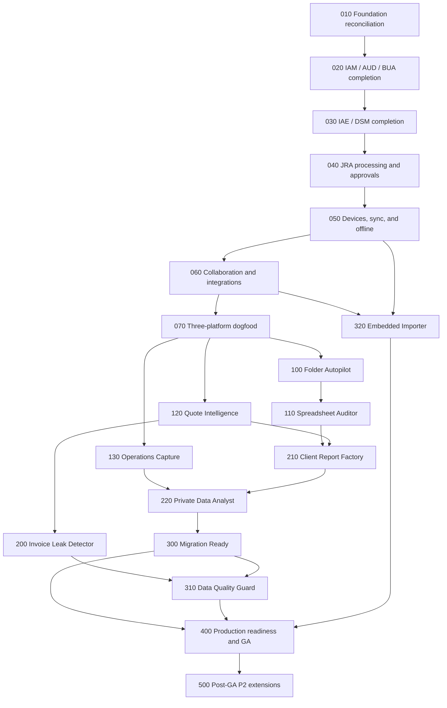

# Complete Platform Execution and Luna Handoff Implementation Plan

> **For agentic workers:** REQUIRED SUB-SKILL: Use `superpowers:subagent-driven-development` (recommended when delegation is authorized) or `superpowers:executing-plans` to implement this plan task-by-task. Steps use checkbox (`- [ ]`) syntax for tracking.

**Goal:** Finish all 611 DataBreeze requirements through dependency-ordered, independently reversible tasks and preserve enough verified state that a new model can resume without guessing.

**Architecture:** The numbered child plans remain the requirement owners. This document adds the execution DAG, atomic task boundaries, parallel-work rules, cross-plan gates, failure handling, and handoff contract that bind those child plans into one program. `004-luna-max-execution-plan.md` packages unfinished tasks into reviewable delivery batches, `execution-orchestration.json` is the machine-readable control record, and `requirement-traceability.json` remains the requirement-to-code-and-evidence authority.

**Tech Stack:** pnpm/Turborepo and strict TypeScript, NestJS/Fastify, PostgreSQL 17 with Prisma, Redis 7.4, S3-compatible storage, Electron, Kotlin/Compose, Python 3.13, OpenAPI/JSON Schema, OpenTofu/AWS Singapore, GitHub Actions, and CodeRabbit.

## Global Constraints

- Preserve the DataBreeze name and the three checksum-pinned legacy logo sources; generated assets may resize or crop only through the approved reproducible pipeline.
- Keep one monorepo with independently buildable Web, Windows Desktop, Android, API, and Python engine deployables.
- PostgreSQL is authoritative. Redis is disposable and must never become the only source of jobs, quotas, cursors, locks, or delivery state.
- Every repository query and mutation carries exact organization/workspace/project scope. A caller-supplied identifier never expands authority.
- Local mode sends no source paths, original bytes, previews, OCR text, source values, or reconstructable chunks to the cloud. Hybrid sends only policy-approved payload classes.
- Originals, evidence coordinates, recipes, rules, processors, datasets, reports, results, approvals, and releases are immutable versions. Corrections create successors.
- Workers and devices accept signed, typed, allowlisted actions only. They never receive database credentials, remote shell commands, arbitrary scripts, or unrestricted filesystem paths.
- Vietnamese is the complete default locale and English is complete. Partial fallback copy is a release failure.
- P0 is the production-capable gate, P1 completes GA, and the 13 P2 requirements remain disabled until plan 500.
- No requirement becomes `verified` until linked tests pass, evidence paths exist, restoration/rollback obligations are satisfied, and the applicable release gate approves it.
- Preserve unrelated user changes. Never commit credentials, customer data, runtime databases, generated reports, Office lock files, or local tool state.

---

## 1. Authority and status semantics

Read sources in this order when they disagree:

1. `AGENTS.md` and current user instructions.
2. Accepted ADRs under `docs/decisions/`.
3. Normative requirements under `docs/specs/` and `docs/specs/requirement-index.json`.
4. Product and architecture documents under `docs/product/` and `docs/architecture/`.
5. The requirement-owning child plan under `docs/plans/`.
6. This orchestration plan.
7. `004-luna-max-execution-plan.md` and `execution-orchestration.json`.
8. Existing code and historical implementation reports.

Code is evidence of work, not evidence of full requirement completion. Use these states consistently:

| State | Meaning | Allowed next state |
|---|---|---|
| `planned` | No accepted implementation evidence has been reconciled. | `partial` or `implemented` |
| `partial` | Some behavior exists, but at least one implementation obligation remains. | `implemented`, or `planned` after an invalid implementation is removed through a reviewed change |
| `implemented` | The complete scoped behavior and tests exist, but cross-platform, security, recovery, or release evidence is incomplete. | `verified` or `partial` after a discovered gap |
| `verified` | All requirement-linked tests and release evidence pass at an immutable commit. | `released` in a release manifest |
| `released` | A coordinated signed release contains the verified requirement. | A later version; never silently reverted in the ledger |
| `blocked` | External authority or state is required after safe alternatives are exhausted. | `planned` or `partial` after the blocker is resolved |

The ledger also uses these plan/task states; they are not requirement statuses and must not be copied into a requirement record:

| Plan/task state | Meaning | Allowed next state |
|---|---|---|
| `partial-needs-reconciliation` | Existing code or historical evidence exists, but the current checkpoint still needs an explicit reconciliation task. | `in-progress`, `planned`, or `blocked` |
| `in-progress` | The selected task is actively being delivered on one branch/worktree. | `implemented`, `verified`, or `blocked` |
| `post-ga-planned` | An opt-in P2 plan is intentionally held until GA release. | `in-progress` after GA, or `blocked` |

Never infer `verified` from a merged PR, a green unit test, file existence, or a previous model's prose.

The numbered child plans own requirement scope and release obligations. Their early generated `Paths` examples are not repository path authority. Section 4 of this document supersedes generic aggregate names such as `identity-audit-entitlements`, `production-readiness`, or hyphenated Python processor directories; use the module-owned roots and deterministic platform keys below.

## 2. Recorded checkpoint

This plan was reconciled on 2026-08-02 from remote `dev` at `783a4710c0aa2a2808d78ad7f0643e6731150bd7` and remote `main` at `3ed3d77d0281ef239d0509c81ded447d8fffd213`; promotion PR 20 had merged and no PR was open. The requirement manifest contained 611 records: 444 P0, 154 P1, 13 P2; 608 were `planned` and 3 were `partial`.

Merged PRs 1–23 establish substantial engineering, IAM/AUD/BUA, IAE/DSM, JRA, and DSO code. PR 19 delivered the normal 73-commit foundation batch to `dev`; PR 20 promoted it to `main`; PRs 21–23 carried validated promotion-review fixes back through `dev`. Plans 010–050 must therefore start with evidence reconciliation, not blind reimplementation. Plans 060–500 remain unverified and must be treated as planned until their gates pass.

The active execution packet is `B01` in `004-luna-max-execution-plan.md`, starting with `FND-003` on `feat/foundation-identity-completion`. The packet preserves the requested 30–99 commit rule, targets about 70 commits, and carries the implementation forward without opening a documentation-only PR.

The hashes above are an audit anchor, not a branch lock. Every session must fetch and recompute live state; update the ledger checkpoint only as part of a committed task/PR handoff so session-local observations do not create meaningless dirty files.

## 3. Execution dependency graph



Parallel execution is allowed only when all of these are true:

- Dependency nodes are verified for the interfaces consumed by both tasks.
- Branches do not edit the same Prisma schema, canonical contract, migration order, shared export map, or generated artifact.
- Each branch owns disjoint requirement IDs and a disjoint primary feature directory.
- One integration owner resolves contract/migration ordering before either branch merges.
- The combined `dev` to `main` promotion remains below 280 changed files, leaving margin under CodeRabbit's 300-file limit.

Safe parallel lanes after dogfood are FA→SA, QI, and OC. CRF/PDA and MR/DQG remain serial by default. EI may overlap with those later plans only when both control records declare the matching interface-level entry gates, contract/migration reservations, and integration owner; otherwise they remain serial too. The foundation spine 010→070 stays serial.

## 4. Repository path contract

Every feature uses these exact roots; use the module key in the final column rather than the prose plan name.

| Plan | API feature and Prisma schema | Web/Desktop/Android/engine key |
|---|---|---|
| 020 | `services/api/src/features/{iam,aud,bua}` and `services/api/prisma/schema/{iam,aud,bua}.prisma` | `identity`, `audit`, `entitlements` |
| 030 | `services/api/src/features/{iae,dsm}` and `services/api/prisma/schema/{iae,dsm}.prisma` | `artifacts`, `datasets` |
| 040 | `services/api/src/features/jra` and `services/api/prisma/schema/jra.prisma` | `jobs` |
| 050 | `services/api/src/features/dso` and `services/api/prisma/schema/dso.prisma` | `devices` |
| 060 | `services/api/src/features/{nco,int}` and `services/api/prisma/schema/{nco,int}.prisma` | `collaboration`, `integrations` |
| 100 | `services/api/src/features/fa` and `services/api/prisma/schema/fa.prisma` | `folder-autopilot` |
| 110 | `services/api/src/features/sa` and `services/api/prisma/schema/sa.prisma` | `spreadsheet-auditor` |
| 120 | `services/api/src/features/qi` and `services/api/prisma/schema/qi.prisma` | `quote-intelligence` |
| 130 | `services/api/src/features/oc` and `services/api/prisma/schema/oc.prisma` | `operations-capture` |
| 200 | `services/api/src/features/ild` and `services/api/prisma/schema/ild.prisma` | `invoice-leak-detector` |
| 210 | `services/api/src/features/crf` and `services/api/prisma/schema/crf.prisma` | `client-report-factory` |
| 220 | `services/api/src/features/pda` and `services/api/prisma/schema/pda.prisma` | `private-data-analyst` |
| 300 | `services/api/src/features/mr` and `services/api/prisma/schema/mr.prisma` | `migration-ready` |
| 310 | `services/api/src/features/dqg` and `services/api/prisma/schema/dqg.prisma` | `data-quality-guard` |
| 320 | `services/api/src/features/ei` and `services/api/prisma/schema/ei.prisma` | `embedded-importer` |

Feature clients live under `apps/web/src/features/<key>` and `apps/desktop/src/features/<key>`. Android package directories use the deterministic `android-key`; engine processor directories use the deterministic `python-key`:

| Derived key | Transformation | Example |
|---|---|---|
| `android-key` | Start with the lowercase ASCII module key, replace separators (`-` and `_`) with boundaries, remove all non-alphanumeric characters, and require the first character to be a letter. | `folder-autopilot` → `folderautopilot`; `private-data-analyst` → `privatedataanalyst` |
| `python-key` | Start with the lowercase ASCII module key, replace every separator or invalid character with one underscore, collapse repeated underscores, and require the first character to be a letter. | `folder-autopilot` → `folder_autopilot`; `private-data-analyst` → `private_data_analyst` |

Thus Android paths are `apps/android/app/src/main/kotlin/com/databreeze/<android-key>` and deterministic processors are `services/engine/src/databreeze_engine/processors/<python-key>`. Canonical schemas live under `packages/contracts/schemas/v1/<key>`; pure domain types live under `packages/domain/src/<key>/v1.ts`. Do not create aggregate prose-named modules such as `identity-audit-entitlements` or `production-readiness` in application code.

## 5. Atomic task execution contract

Every task ID below uses the same non-negotiable loop:

Task IDs are orchestration batches, not one-to-one requirement IDs even when they share a domain prefix. The child plan and traceability manifest remain authoritative for the individual requirements owned by each batch.

- [ ] Read the owning specification sections, exact requirement rows, accepted ADRs, dependency interfaces, and existing tests before editing.
- [ ] Create a short-lived `feat/<task-key>` or `fix/<task-key>` branch from the live integration branch in an ignored worktree; verify a clean baseline.
- [ ] Add or revise canonical OpenAPI/JSON Schema first when the public interface changes; run `corepack pnpm contracts:check` and record the expected red drift or failing consumer test.
- [ ] Add a requirement-linked failing domain/policy/state-machine test. The failure must prove missing behavior, not a fixture or compilation mistake.
- [ ] Add a centrally ordered migration and real PostgreSQL repository test before persistence implementation. Use expand→migrate→verify→contract; rollback uses a forward compensating migration.
- [ ] Implement domain then application then adapter then API/client behavior through published ports. Cross-foundation coordination belongs under `services/api/src/orchestration`.
- [ ] Add content-safe telemetry, timeout/cancellation behavior, idempotency, recovery, and rollback evidence in the same task.
- [ ] Run the narrow test, the owning package tests, `corepack pnpm repo:check`, and `corepack pnpm repo:build`.
- [ ] Update `requirement-traceability.json` only for IDs actually evidenced; update `execution-orchestration.json` with the immutable commit and next task.
- [ ] Commit one reversible outcome. A task may have several commits when contract, domain, migration, adapter, client, or verification outcomes are independently reversible.

Expected commands at every task boundary:

```powershell
git status --short --branch
corepack pnpm contracts:check
corepack pnpm --filter @databreeze/domain test
corepack pnpm --filter @databreeze/api test
corepack pnpm repo:check
corepack pnpm repo:build
git diff --check
```

Android tasks additionally run `apps/android/gradlew.bat test` and the applicable instrumentation suite. Engine tasks run `uv sync --locked --offline`, `uv run pytest`, `uv run ruff check .`, and `uv run mypy src`. Web/Desktop interaction tasks run the applicable Vitest and Playwright suites.

## 6. Foundation and dogfood task catalog

### Plan 010 — Engineering foundation reconciliation

#### FND-001 — Reconcile merged foundation evidence

Audit Tasks 1–23 in `010-engineering-foundation.md` against code, tests, runbooks, and PRs 1–3. Record missing evidence without marking requirements verified. Test clean checkout, generated-contract drift, brand hashes, dependency boundaries, and all five deployable builds.

#### FND-002 — Close Android shell gaps

Verify Compose navigation, Room, WorkManager, Keystore, bilingual resources, network security, backup exclusions, generated contracts/tokens, instrumentation smoke, process death, account isolation, and supported API levels under `apps/android`.

#### FND-003 — Close local infrastructure gaps

Verify pinned PostgreSQL 17, Redis 7.4, MinIO, Mailpit, and OpenTelemetry health checks, credential-free bootstrap, module-schema creation, non-destructive start/stop/reset commands, port collisions, missing Docker, disk pressure, and restart persistence under `infrastructure/local`.

#### FND-004 — Close portable AWS foundation gaps

Validate, without applying, OpenTofu networking, CloudFront/S3, ECS API/workers, RDS, ElastiCache, KMS, Secrets Manager, logs, and GitHub OIDC in `ap-southeast-1`. Test plan-time validation, least privilege, private subnets, encryption, secret indirection, provider pinning, and destroy protection.

#### FND-005 — Close telemetry and diagnostics gaps

Verify correlation propagation and allowlisted records across TypeScript, Kotlin, and Python. Test secrets, paths, source values, evidence excerpts, exception messages, high-cardinality identifiers, malformed trace headers, and provider causes are dropped.

#### FND-006 — Close CI and supply-chain gaps

Verify path-aware jobs, pinned actions, least-privilege tokens, contract drift, SBOM, license/secret/SAST/container scans, provenance, protected release environments, fork safety, and failure on missing outputs.

#### FND-007 — Publish foundation reconciliation evidence

Update development/deployment/rollback/secret/provider/support runbooks, traceability, and a clean-checkout evidence record. Keep every unresolved item partial and make the next foundation plan executable from a clean clone.

### Plan 020 — Identity, audit, and entitlements

#### IAM-001 — Tenant transaction and authority base

Complete module schemas, tenant-scoped repository bases, application transaction context, authorization/security epochs, and atomic mutation-plus-audit behavior. Test sibling tenants, ancestor/descendant scope, rollback, stale epoch, missing context, and concurrent writes.

#### IAM-002 — Credentials, sessions, CSRF, and PKCE

Complete Argon2id credentials, verification/recovery challenges, personal-organization bootstrap, 15-minute access sessions, rotating single-use refresh families, reuse detection, CSRF, and system-browser PKCE. Test normalization, timing-safe failures, stolen refresh races, redirect mismatch, verifier replay, session fixation, and clock skew.

#### IAM-003 — Organizations, workspaces, projects, and roles

Complete organization/workspace/project lifecycle, memberships, six role bundles, deny-by-default authorization, ancestry checks, and project narrowing. Test last-owner invariants, bulk changes, deleted parents, stale cached authority, vertical privilege escalation, and every resource family's horizontal isolation.

#### IAM-004 — Invitations, MFA, recovery, and ownership

Complete invitations, ownership transfer, TOTP/WebAuthn ports, recovery codes, step-up assertions, and account recovery. Test expired/consumed invitations, factor replacement, recovery-code reuse, lost-factor recovery, step-up expiry, self-approval boundaries, and two owners racing to leave.

#### IAM-005 — Service and device identities

Complete IAM-owned service accounts and device identities, proof-of-possession enrollment, activation, key rotation, permanent revocation, epochs, and signed offline authorization snapshots. Test cloned keys, replaced devices, reinstall, revoked snapshots, stale clocks, and unavailable authority.

#### AUD-001 — Immutable action registry and append ledger

Complete the closed action registry, per-scope sequences, safe summaries, idempotent transactional append, privileged-access audit, and signed offline-fragment acceptance/quarantine. Test sequence contention, replay with changed content, unsafe summary keys, cross-scope fragments, missing signatures, and transaction rollback.

#### AUD-002 — Audit seals, retention, export, and restoration

Complete Merkle seals, independent signed seal storage, verification, legal holds, retention classes, signed JSONL/CSV export, restoration verification, and administration. Test tampered leaves/roots, missing ranges, seal-key rotation, export truncation, hold conflicts, and restore to a clean database.

#### BUA-001 — Plans, subscriptions, entitlements, and offline leases

Complete immutable plan versions, provider-independent subscriptions, entitlement snapshots, quotas, signed offline leases, and stable admission reason codes. Test plan supersession, suspension, clock skew, revoked leases, feature downgrade, and provider absence.

#### BUA-002 — Reservation and append-only usage accounting

Complete quota reservation, append-only usage ledgers, concurrency control, correction entries, reconciliation, export, and suspension preservation through `ExecutionAdmissionCoordinator`. Test double reservation, finalize/release races, negative corrections, lost dispatch, and inherited organization quotas.

#### IAM-006 — Security and administration clients

Build complete Web organization/session/MFA/device/audit/entitlement administration and focused Desktop/Android session/device security views with complete Vietnamese/English copy, keyboard/TalkBack behavior, and no client-side authority assumptions.

#### IAM-007 — Identity/audit/entitlement release proof

Run tenant-escape, token-family race, MFA expiry, last-owner, audit immutability, seal tamper, entitlement race, backup/restore, accessibility, performance, and fail-closed provider tests. Update only requirement records with exact evidence.

### Plan 030 — Artifacts, evidence, datasets, and definitions

#### IAE-001 — Immutable artifact and dataset records

Add artifact, artifact-version, placement, inbox, evidence, lineage, retention, dataset, schema, mapping, rule, metric, and reference-entity records in the owning module schemas with tenant keys, revisions, hashes, and immutable publication identifiers.

#### IAE-002 — Cloud multipart intake and quarantine

Implement multipart intake with size/hash/media verification, immutable object keys, resumable parts, malware scan states, idempotent finalization, quarantine, and job-bound grants. Test aborted parts, digest mismatch, content-type spoofing, duplicate finalization, scan timeout, archive traversal, decompression bombs, and object-store retry.

#### IAE-003 — Local and Hybrid intake registration

Implement Desktop/Android registration through opaque placements. Prove Local never sends paths, bytes, previews, OCR, values, or reconstructable chunks; Hybrid sends only approved classes. Test path-like handles, symlinks, source replacement, device offline, and policy narrowing mid-transfer.

#### IAE-004 — Evidence resolution and preview grants

Implement typed coordinates, exact-version resolution, device-open descriptors, `SOURCE_OFFLINE`, scoped preview grants, and coordinate lineage. Test stale evidence, hidden/renamed sheets, removed pages, revoked devices, expired grants, and sibling-tenant hashes.

#### IAE-005 — Derivation, staleness, retention, and deletion

Implement correction/derived versions, source-change staleness, manifests, legal-hold-aware retention, authoritative deletion eligibility, and verified cloud deletion. Test shared placements, failed object deletion, restore-before-delete, conflicting holds, and immutable lineage.

#### DSM-001 — Governed datasets and semantic definitions

Complete immutable datasets/versions, schema compatibility, semantic definitions, metrics, canonical parties, and immutable merge/split history. Test missing versus null, incompatible field changes, unit/grain mismatch, merge cycles, and stale publications.

#### DSM-002 — Deterministic mappings, rules, and drift

Complete mapping/rule registries, typed transformations, compatibility/drift review, and publication. Reject executable code, non-determinism, unbounded expressions, duplicate targets, locale-sensitive ambiguity, and changed reference bundles.

#### DSM-003 — Profiling, validation, quality gates, and lineage

Implement deterministic profiling/validation, findings, reproducible lineage, governed exports, and local/cloud parity. Test malformed encodings, formula injection, large cardinalities, invalid dates/currencies, resource limits, and partial outcomes.

#### IAE-006 — Artifact and dataset clients

Build Web Inbox/catalog/evidence/governance screens, Desktop local evidence navigation, Android capture/share intake, and complete Vietnamese/English empty/offline/error/conflict states without exposing local paths to Web.

#### IAE-007 — Artifact/dataset release proof

Run hostile upload, cross-tenant, source-change, retention/deletion, recovery, parity, accessibility, and performance suites. Verify exact content immutability and publish evidence per requirement.

### Plan 040 — Jobs, processing, findings, reviews, and approvals

#### JRA-001 — Canonical job and review state machines

Complete recipe, job, step, attempt, lease, checkpoint, result, effect receipt, finding, review, and approval schemas/state machines with immutable versions and optimistic revisions.

#### JRA-002 — Typed actions and signed recipe publication

Complete action manifests, risk/effect classes, handler/schema digests, triggers, compatibility validation, resource bounds, data modes, and signed recipe envelopes. Reject arbitrary scripts, shell commands, unknown schemas, expired signatures, and digest drift.

#### JRA-003 — Atomic execution admission

Complete `ExecutionAdmissionCoordinator` so authorization, IAE inputs, DSM definitions, DSO routing, BUA reservation, JRA creation, AUD append, and outbox insertion commit atomically. Test every dependency rejection and rollback point.

#### JRA-004 — Authoritative scheduling and dispatch recovery

Implement PostgreSQL-authoritative scheduling, Redis hints, outbox delivery, lost-message reconstruction, leases, heartbeats, progress, and stale-attempt rejection. Test Redis loss, duplicate delivery, scheduler failover, clock skew, and lease contention.

#### JRA-005 — Authenticated cloud worker execution

Implement internal worker APIs and job-bound object grants without database credentials. Test grant expiry, worker impersonation, changed inputs, network partitions, resource exhaustion, and result-schema mismatch.

#### JRA-006 — Desktop sidecar execution boundary

Implement signed-envelope verification, attempt-scoped handles, encrypted temporary workspaces, framed bounded JSON-RPC, supervision, provisional offline execution, reconnect acceptance/quarantine, and cleanup. Test crashes, oversized frames, traversal, stale approvals, revoked devices, and disk-full cleanup.

#### JRA-007 — Canonical findings and review queues

Complete actionable findings, feature-owned diagnostic details, review tasks, immutable resolutions, evidence links, assignments, and authorization-safe transitions. Test deleted evidence, duplicate resolution, reassignment races, and unauthorized deep links.

#### JRA-008 — Exact approvals and separation of duties

Complete approval policies, subject/effect hashes, separation of duties, MFA, expiry, invalidation, and append-only decisions. Test self-approval, changed subjects, stale source, revoked approver, clock skew, and forged decision payloads.

#### JRA-009 — Retry, cancellation, effects, and quota settlement

Complete retry/cancellation/compensation, partial outcomes, effect idempotency, cleanup, quota finalization, and crash reconciliation. Test ambiguous external writes, cleanup failure, cancellation races, and stale workers.

#### JRA-010 — Job/review/approval clients

Build full Web queues and focused Desktop/Android progress, finding, review, and online approval surfaces with accessible Vietnamese/English states and no cached-authority decisions.

#### JRA-011 — Processing release proof

Run lost-message, worker-crash, stale-lease, duplicate-effect, changed-input, revocation, cleanup, parser-security, parity, performance, accessibility, and restoration suites.

### Plan 050 — Devices, synchronization, and offline operation

#### DSO-001 — Immutable workspace data-mode policy

Complete signed Local/Hybrid/Cloud policy manifests with Hybrid default and narrowing-only descendants. Test stale policy, unauthorized broadening, revoked signatures, schema version mismatch, and policy changes during work.

#### DSO-002 — Device capabilities, grants, health, and revocation

Complete IAM-backed capabilities/grants, opaque folder handles, expected digests, health projections, key epochs, and immediate revocation. Test grant substitution, action escalation, path leakage, replaced folders, revoked keys, and unavailable IAM authority.

#### DSO-003 — Change logs, snapshots, cursors, and resnapshot

Complete workspace change logs, consistent snapshots, opaque scope-bound cursors, schema negotiation, epoch invalidation, tombstones, and resnapshot. Test cursor corruption, scope reduction/expansion, compaction gaps, reinstall, and server rollback.

#### DSO-004 — Durable client mutations and explicit conflicts

Complete encrypted dependency-aware mutation queues and typed conflicts without last-write-wins for protected state. Test replay, reordering, duplicates, dependency cycles, concurrent revisions, and conflict resolution retries.

#### DSO-005 — Resumable blob transfer

Complete chunked upload/download, hash verification, placement publication, retries, ranges, and abandoned-transfer cleanup. Test changed blobs, overlapping ranges, missing chunks, expiry, disk pressure, and cross-tenant transfer IDs.

#### DSO-006 — Strict-Local user-carried packages

Complete encrypted packages with exact signed manifests, recipient/passphrase envelopes, expiry, isolated import, placement lineage, receipts, and quarantine. Test wrong recipient, weak/truncated envelope, replay, tampering, expired package, and partial import.

#### DSO-007 — Windows offline runtime

Complete encrypted SQLite state, background sync, pause controls, watcher persistence, restart recovery, Windows-protected keys, and safe diagnostics. Test OS restart, database corruption, credential loss, long paths, case collisions, network shares, and updater rollback.

#### DSO-008 — Android offline runtime

Complete Room account/workspace isolation, WorkManager queues/constraints, Keystore identities, sign-out cleanup, scoped storage, share intents, and Local package export. Test process death, clock skew, revoked keys, permission changes, storage pressure, duplicate work, and reinstall.

#### DSO-009 — Web device and conflict administration

Build device, grant, health, conflict, data-location, and migration administration without revealing filesystem paths. Test stale UI state, removed administrators, accessible tables, and bilingual errors.

#### DSO-010 — Sync/offline release proof

Run interruption, replay, cursor, tombstone, device-loss, revocation, reinstall, disk-pressure, policy-expiry, content-leak, parity, performance, and recovery suites; reconcile DSO/DSK/AND evidence conservatively.

### Plan 060 — Notifications, collaboration, public API, and integrations

#### NCO-001 — Notification and collaboration records

Add notification intent/delivery/preference, thread, comment, revision, mention, reaction, assignment, and tombstone records with tenant scope and stable anchors.

#### NCO-002 — In-app notification delivery

Implement outbox delivery, deterministic deduplication, SSE, polling fallback, read/archive state, quiet hours, mandatory notices, and digests. Test reconnect, duplicate outbox rows, preference races, removed users, and backpressure.

#### NCO-003 — Comments, mentions, evidence anchors, and assignments

Implement comments/revisions/tombstones, evidence anchors, mentions, reactions, resolution, assignments, and safe deep links. Test unauthorized mentions, revoked evidence, deleted entities, concurrent edits, and cross-tenant identifiers.

#### NCO-004 — Replaceable email, push, and Desktop notifications

Add SMTP/SES, FCM, Desktop local-notification, and polling adapters with minimized templates. Test provider outage, suppression, invalid tokens, credential rotation, locale/time-zone formatting, and mandatory-notice rules.

#### INT-001 — Public API and service-account boundary

Complete `/v1` service-account authentication, cursor/idempotency/rate-limit/problem conventions, capability discovery, versioning, and deprecation metadata. Test replay, stale cursors, rate-limit races, removed scopes, and downgrade behavior.

#### INT-002 — Governed connector lifecycle

Implement connector definitions/connections, encrypted credential references, capability drift, checkpoints, governed import/export, and degraded/reauthorization states. Test credential expiry, scope loss, provider schema drift, ambiguous writes, and provider exit.

#### INT-003 — Signed outbound webhooks

Implement durable minimal payloads, HMAC rotation overlap, replay protection, retries, delivery inspection, and manual replay. Test SSRF, DNS rebinding, redirects, private addresses, clock skew, secret rollover, and receiver outage.

#### INT-004 — Verified inbound callbacks and reconciliation

Implement signature/timestamp/replay checks, durable inboxes, normalized failures, idempotent processing, and reconciliation. Test duplicate/out-of-order callbacks, missing provider events, forged timestamps, and ambiguous terminal states.

#### NCO-005 — Collaboration and integration clients

Build complete Web administration and focused Desktop/Android notification/collaboration views with safe deep links, bilingual copy, accessibility, and offline/read-state reconciliation.

#### INT-005 — Collaboration/integration release proof

Run mention authorization, removed-user, webhook replay/SSRF/DNS, credential rotation, provider outage, backlog recovery, rate-limit, tenant-escape, accessibility, and provider-exit tests.

### Plan 070 — Three-platform dogfood walking skeleton

#### DOG-001 — Licensed deterministic acceptance fixtures

Create synthetic Vietnamese workbooks and a cross-runtime harness with fixed hashes, formulas, encodings, dates, currencies, hidden sheets, malformed inputs, and explicit licensing/provenance.

#### DOG-002 — Desktop folder enrollment and exactly-once intake

Enroll Desktop, grant one opaque folder capability, stabilize/hash a workbook, and register exactly one Local artifact without cloud path or bytes. Test partial writes, locks, rename storms, duplicate watcher events, restart, symlinks, and source replacement.

#### DOG-003 — Read-only local spreadsheet audit

Run inventory, formula-family and anomaly processing locally with exact sheet/cell evidence. Disable macros, add-ins, queries, links, and external execution. Test corrupt/huge workbooks, unsupported formulas, 1900/1904 dates, and locale separators.

#### DOG-004 — Hybrid-minimal synchronization

Synchronize only policy-approved metadata, findings, coordinates, job state, and bounded excerpts. Prove the cloud cannot reconstruct the workbook and rejects broader payloads after policy narrowing.

#### DOG-005 — Web review and Android exact approval

Review on Web and approve/reject the exact repair-plan hash on Android with online authority and MFA. Test stale plans, changed evidence, revoked approvers, duplicate decisions, and offline approval attempts.

#### DOG-006 — Safe derivative and undo receipt

Validate against an isolated copy, recheck source/capability/policy/approval, create a separately named derivative, and persist effect/undo receipts. Test collisions, disk full, antivirus locks, source changes, compensation, and undo conflicts.

#### DOG-007 — Dogfood chaos and acceptance record

Prove network loss, restart, duplicate delivery, Redis loss, changed source, stale approval, and device revocation never duplicate effects or mutate the original. Publish one release record covering all ten dogfood acceptance conditions.

### Plan 100 — Folder Autopilot

**Requirement owner:** `100-folder-autopilot.md` (34 requirements). **Entry gate:** DOG-007 accepted. **Exit gate:** governed file actions are previewable, approval-bound, idempotent, reversible where declared, and incapable of escaping an opaque folder capability.

#### FA-001 — Folder bindings and assignments

Model Autopilot bindings as projections over DSO grants and JRA recipe versions. Add tenant-scoped contracts, migrations, repository tests, and authorization checks for create, pause, rebind, retire, and revoked-folder behavior.

#### FA-002 — Recipe preview, validation, and routing

Implement bounded previews, schema/capability validation, deterministic matcher priority, collision/resource estimates, confidence review, and routing to registered processors only. Reject ambiguous matches, unsupported effects, missing placement, and stale recipes before a job is admitted.

#### FA-003 — Stable watchers and reconciliation

Complete Windows watcher persistence, periodic reconciliation scans, content-hash deduplication, deterministic matching, and output-lineage recursion prevention. Test partial writes, exclusive locks, rename storms, network-share disconnects, junction/symlink escape, case-insensitive aliases, clock skew, and restart between observation and registration.

#### FA-004 — Staged actions, compensation, and undo

Implement constrained rename/copy/move/convert actions through typed sidecar handles. Stage outputs, revalidate digest/capability/policy, fsync where supported, commit atomically where possible, journal effects, and expose explicit compensation/undo conflicts. Test disk full, antivirus locks, destination replacement, cross-volume moves, name collisions, and crash at each boundary.

#### FA-005 — Findings, review, approval, and exact execution

Project diagnostics into canonical JRA findings/reviews, hash the exact proposed effect, apply risk-specific approval policy, and recheck source, device, grant, policy, recipe, and approval immediately before execution. Reject stale approvals and duplicate/replayed effect attempts.

#### FA-006 — Autopilot clients

Build Web authoring/monitoring, Desktop execution/evidence/health, and Android alert/approval/pause views. Include Vietnamese/English parity, accessible error recovery, safe diagnostics, and zero disclosure of local paths outside the enrolled Desktop.

#### FA-007 — Autopilot scale and release proof

Add bounded bulk operations, concurrency/throughput controls, redacted execution export, folder-health dashboards, soak tests, interruption recovery, tenant-escape tests, and release evidence for FA P0/P1 requirements.

### Plan 110 — Spreadsheet Auditor

**Requirement owner:** `110-spreadsheet-auditor.md` (27 requirements). **Entry gate:** DOG-007 accepted. **Exit gate:** audits and repairs are deterministic, evidence-addressable, macro-safe, and never mutate the original workbook.

#### SA-001 — Safe workbook inventory

Implement bounded XLSX/XLS/CSV inventory and parsing with macros, add-ins, queries, external links, and external execution disabled. Record supported/unsupported features without evaluating them. Test corrupt ZIP/XML, encrypted files, hidden and very-hidden sheets, merged cells, shared formulas, locale formats, and resource limits.

#### SA-002 — Formula families and anomaly detection

Normalize formula families and detect outliers, gaps, overwrites, broken ranges, and inconsistent references with exact workbook/sheet/cell coordinates. Handle 1900/1904 date systems, array/dynamic formulas, unsupported functions, and cached-value disagreement explicitly.

#### SA-003 — Profiles, rules, findings, and suppressions

Bind immutable DSM audit profiles and deterministic rules to canonical JRA findings/reviews. Preserve immutable diagnostic details, comparison baselines, suppression scope/expiry/reason, and evidence version. Prevent a suppression from hiding new rule or source versions silently.

#### SA-004 — Exact repair proposals and validation

Define allowlisted repair operations, before/after diffs, isolated-copy validation, selective acceptance, plan hashes, stale-plan rejection, and derived output registration. Test formula injection, changed source, unsupported calculation, overlapping repairs, validation failure, and crash before/after output publication.

#### SA-005 — Recurrence and evidence clients

Add recurring folder audits, Web triage/trends, Desktop safe local evidence navigation, and focused Android review. Preserve Local/Hybrid constraints and display `SOURCE_OFFLINE` rather than substituting newer or unauthorized content.

#### SA-006 — Governed audit reports

Generate HTML, PDF, JSON, and XLSX reports containing immutable manifest IDs and evidence references. Escape spreadsheet formulas in exports, disclose incomplete calculations, and verify renderer/version reproducibility with golden fixtures.

#### SA-007 — Auditor safety and release proof

Prove malicious-workbook containment, decompression and XML bounds, large-workbook budgets, local/cloud result parity, original immutability, bilingual/accessibility completion, recovery, and all SA P0/P1 evidence.

### Plan 120 — Quote Intelligence

**Requirement owner:** `120-quote-intelligence.md` (27 requirements). **Entry gate:** DOG-007 accepted. **Exit gate:** every comparison value has source evidence or an explicit missing-input state, and no vendor API is required.

#### QI-001 — RFQ, quote, and business-party model

Implement RFQ requirements, comparisons, immutable quote versions, supplier/customer bindings through DSM reference entities, correction lineage, tenant isolation, and source-version pinning.

#### QI-002 — Document and scan extraction

Add bounded PDF/image/DOCX/XLSX/CSV extraction with local Tesseract OCR for scans, normalized candidates, confidence, and exact evidence. Test rotated/low-resolution scans, Vietnamese diacritics, multi-page tables, password protection, malformed office archives, and OCR timeout/fallback.

#### QI-003 — Normalization and line matching

Implement versioned unit, pack-size, currency, tax, and date normalization plus exact/tolerance/partial/split/merge/unmatched workflows. Require review for ambiguous mappings and preserve override history. Test inconsistent units, aliases, missing rates, inclusive/exclusive tax, and duplicate lines.

#### QI-004 — Landed cost, scenarios, and eligibility

Implement deterministic landed-cost calculations, rate sources/effective dates, rounding policy, freight/duty/tax components, missing-input states, scenarios, scores, and eligibility gates. Property-test currency conversion, rounding, zero/negative values, and incomplete comparisons.

#### QI-005 — Review, approval, and immutable release

Implement questions, overrides, canonical review/approval, exact comparison hashes, superseded-quote detection, immutable release, and safe comparison copying. Changed source, assumptions, rates, or formulas invalidate approval.

#### QI-006 — Quote clients

Build Web comparison workspaces, Desktop batch/local evidence tools, and Android scan/share/correction/approval flows with offline capture but online consequential approval, bilingual copy, and accessible tables.

#### QI-007 — Decision packs and release proof

Generate XLSX/PDF/Web decision packs with evidence manifests; add comparison history, duplicate/superseded detection, performance/parity fixtures, tenant/security tests, and QI P0/P1 release evidence.

### Plan 130 — Operations Capture

**Requirement owner:** `130-operations-capture.md` (40 requirements). **Entry gate:** DOG-007 accepted. **Exit gate:** field work survives process/network failure, preserves operator values, and synchronizes immutable submissions exactly once.

#### OC-001 — Versioned form definitions

Implement stable field IDs, immutable form versions, declarative visibility/calculation logic, validation, compatibility diffs, and Web/Android previews. Reject cycles, nondeterministic expressions, incompatible published changes, and executable customization.

#### OC-002 — Assignments and offline bundles

Implement assignments, checksummed reference bundles, availability windows, retention/offline policy, authorization epochs, and pinned definition delivery. Handle clock skew, expired assignments, policy narrowing, missing references, and bundle corruption deterministically.

#### OC-003 — Native Android capture

Implement text/numeric/choice/repeating fields, CameraX document/photo capture, barcode/QR, voice, signature, consented location, permissions, and immutable media placement. Test permission revocation, activity/process death, orientation, font scaling, low storage, background limits, and consent withdrawal.

#### OC-004 — Drafts, submission, and resumable sync

Implement encrypted autosaved drafts, local validation, immutable submission versions, idempotent mutation IDs, resumable attachments, durable acknowledgement, and safe sign-out isolation. Test duplicate taps, app reinstall, interrupted upload, changed form revision, revoked device, and server receipt lost after commit.

#### OC-005 — OCR/transcription candidates and corrections

Store OCR/transcription as confidence-bearing candidates with evidence; never overwrite operator values. Corrections create versions with actor/reason lineage. Test conflicting candidates, unsupported language, partial media, provider timeout, and offline local processing.

#### OC-006 — Supervision, returns, and approval

Implement canonical reviews, returns, correction requests, approval facades, comments, mentions, and notifications. Preserve submitted history, prevent self-approval where policy forbids it, and invalidate decisions after material correction.

#### OC-007 — Desktop scanner reconciliation

Implement scanner-folder intake, deterministic assignment/submission matching, ambiguity queues, duplicate handling, batch evidence, and reconciliation. Test repeated scans, filename reuse, partial files, clock mismatch, unreadable media, and cross-workspace collision.

#### OC-008 — Capture exports and release proof

Add governed exports/module intake, admin limits, storage/sync health, Web supervision, accessibility, process-death/reinstall scenarios, local/cloud parity, performance budgets, and OC P0/P1 release evidence.

### Plan 200 — Invoice Leak Detector

**Requirement owner:** `200-invoice-leak-detector.md` (27 requirements). **Entry gate:** QI-007 complete. **Exit gate:** deterministic invoice findings are evidence-backed and categorically cannot pay or contact suppliers.

#### ILD-001 — Invoice and governing-document model

Implement immutable invoices, contracts, amendments, rate cards, purchase orders, receipts, DSM supplier bindings, effective periods, version lineage, and tenant-scoped repository/migration tests.

#### ILD-002 — Invoice extraction and evidence

Reuse bounded document/OCR ports for header and line extraction with confidence and exact evidence. Test credit notes, multi-page tables, rotated scans, duplicated pages, locale numbers/dates, malformed files, and local/cloud parity.

#### ILD-003 — Candidate matching and allocation

Implement deterministic invoice-to-document candidates, one-to-many allocations, conflicts, low-confidence review, and immutable manual override history. Prevent over-allocation, stale match reuse, and silent matching across supplier/business-unit boundaries.

#### ILD-004 — Expected-charge calculations

Implement effective-dated rates, discounts, fees, freight, tax, periods, caps, conversions, receipts, and explicit incomplete states. Property-test partial receipts, amendments, rate gaps/overlap, multi-currency, rounding, negative adjustments, and tax-inclusive terms.

#### ILD-005 — Findings and amount categories

Store immutable leak details linked to canonical findings/reviews and separate exposure, validated, disputed, recovered, and dismissed amounts. A status change never rewrites the original calculation or evidence.

#### ILD-006 — Cases and approval-bound evidence packages

Implement cases, redaction preview, exact approval hashes, immutable closure, and evidence packages. Enforce in contracts and effects that the module cannot initiate payment, mutate accounting systems, or contact suppliers.

#### ILD-007 — Leak clients and release proof

Build Web investigations/dashboards, Desktop local batches, Android capture/review, recurring intake, exports, performance fixtures, duplicate/superseded invoice tests, tenant/security recovery tests, and ILD P0/P1 evidence.

### Plan 210 — Client Report Factory

**Requirement owner:** `210-client-report-factory.md` (27 requirements). **Entry gates:** SA-007 and QI-007. **Exit gate:** every published output is reproducible, evidence-linked, format-specific, reviewed, and revocable where shared.

#### CRF-001 — Templates, definitions, and renderer capabilities

Implement immutable templates, report definitions, stable block IDs, dataset/schema/metric bindings, parameters, locales, brands, and versioned renderer capability declarations. Reject unsupported block/format combinations before execution.

#### CRF-002 — Deterministic preflight

Validate tenant scope, schema compatibility, data freshness/quality, evidence availability, parameter completeness, renderer support, and output policy. Produce explicit blocked/warning states without silently omitting failed content.

#### CRF-003 — Evidence-linked tables, charts, and metrics

Render deterministic tables/charts/metrics from governed definitions and record value-to-evidence lineage. Test sorting/ties, nulls, units, locales, chart accessibility, overly large result sets, and schema drift.

#### CRF-004 — Multi-format rendering

Implement HTML/Web, Chromium PDF, DOCX, PPTX, and XLSX renderer adapters with isolated temporary workspaces and per-format result states. Use golden visual/structural fixtures for fonts, page breaks, charts, time zones, renderer upgrades, and partial format failure.

#### CRF-005 — Report review, approval, and release

Implement immutable report versions, stable block comments, material-change hashes, canonical approval, release policy, and immutable output manifests. Any material template, dataset, evidence, parameter, or renderer change invalidates approval.

#### CRF-006 — Revocable Web sharing

Implement expiring/revocable share grants, authentication/download policy, viewer auditing, content security headers, and source-access isolation. Test leaked links, removed users, revocation races, clock skew, crawler previews, and attachment caching.

#### CRF-007 — Scheduling, clients, and release proof

Add schedules, tenant/client-isolated batches, cloning, Desktop rendering, Android review, retry/rollback, complete Web administration, parity/performance/accessibility tests, and CRF P0/P1 evidence.

### Plan 220 — Private Data Analyst

**Requirement owner:** `220-private-data-analyst.md` (37 requirements). **Entry gates:** OC-008 and CRF-007. **Exit gate:** numeric truth is deterministic and reproducible; optional AI can propose but never fabricate or execute truth.

#### PDA-001 — Governed analysis bindings

Implement analysis dataset/semantic bindings over DSM definitions, relationships, metrics, compatibility diffs, policy, freshness, and quality validation. Reject ambiguous grain, unit, ownership, and relationship definitions.

#### PDA-002 — Typed analysis plan AST

Define a versioned, bounded AST for projections, filters, joins, aggregates, comparisons, shares, cohorts, sorting, and supported statistics. Generate all runtime models and reject unknown nodes, unbounded joins, executable expressions, and schema/version mismatch.

#### PDA-003 — Vietnamese/English question interpretation

Implement question intake, ambiguity prompts, explicit assumptions, editable governed plans, and Android transcript confirmation. Preserve the original question and chosen interpretation. Never imply certainty when multiple grains, units, dates, or entities match.

#### PDA-004 — Deterministic execution

Compile the validated AST to Polars/DuckDB with row/column/time/memory limits, permissions, cardinality estimates, grain/unit checks, and quality gates. Test join explosion, integer/decimal precision, time zones, division by zero, unsupported statistics, cancellation, and disk pressure.

#### PDA-005 — Results, provenance, and non-answers

Persist immutable result/provenance manifests, evidence drill-down, coverage/freshness disclosure, stable non-answer reasons, accessible tables, and valid chart selection. Results without source support state `UNSUPPORTED_BY_SOURCE` rather than inventing a value.

#### PDA-006 — Saved, certified, and scheduled analyses

Implement saved plans, frozen-versus-rerun behavior, parameters, sharing, JRA certification, schedules, and blocked occurrences. Changed definitions, permissions, data quality, or parameters visibly invalidate or block certification.

#### PDA-007 — Optional AI planning boundary

Add disabled-by-default local/provider-neutral adapters that may propose an AST or narrative over already computed facts. Enforce egress policy, prompt minimization, provider timeout/exit, schema validation, explanation labels, and deterministic re-execution; never accept provider numbers as truth.

#### PDA-008 — Analyst clients and release proof

Build Web/Desktop/Android surfaces, snapshot comparison, report embedding, governed exports, egress administration, bilingual/accessibility flows, adversarial prompt tests, local/cloud parity, and PDA P0/P1 evidence.

### Plan 300 — Migration Ready

**Requirement owner:** `300-migration-ready.md` (32 requirements). **Entry gate:** PDA-008 complete. **Exit gate:** export-first migration packages reconcile exactly; no destination write occurs without a separately reviewed adapter.

#### MR-001 — Migration projects and sources

Implement migration projects, immutable source versions, parsing profiles, capacity policy, and explicit Desktop grants. Test encoding/BOM/delimiter variance, malformed rows, archive limits, Local/Hybrid placement, and changed source during intake.

#### MR-002 — Profiling, target schema, and mapping

Bind DSM target schemas, mappings, rules, lookups, and immutable plans with compatibility validation. Surface locale dates/numbers, missing/null distinctions, unknown columns, duplicate keys, target drift, and destructive mappings before a run.

#### MR-003 — Cleaning, duplicate review, and survivorship

Implement deterministic cleaning/normalization, duplicate blocking/matching, survivorship rules, exact evidence, and ambiguous-cluster review. Property-test stable ordering, transitive clusters, conflicting identifiers, Unicode normalization, and override history.

#### MR-004 — Dry runs, dispositions, and exceptions

Implement dry runs, per-row dispositions, corrections, exception review, comparisons, and immutable output candidates. Reprocessing the same input/plan is deterministic and does not reuse stale exception decisions.

#### MR-005 — Reconciliation and approval

Implement count/control-total reconciliation, release gates, separation-of-duties approval, source/plan hashes, and stale-source blocking. Test partial rows, aggregation precision, late corrections, mismatched totals, duplicate approval, and revoked approvers.

#### MR-006 — Export-first release packages

Generate UTF-8 CSV/JSON plus optional Parquet/JSONL, rejected rows, checksums, manifests, reason summaries, and stable ordering. Neutralize spreadsheet formula injection and prove package verification/recovery without destination effects.

#### MR-007 — Incremental migration and release proof

Add incremental batches, migration books, Desktop/cloud parity, Web administration, Android review, performance/security/recovery tests, and MR P0/P1 evidence. The base module cannot accept arbitrary destination commands or credentials.

### Plan 310 — Data Quality Guard

**Requirement owner:** `310-data-quality-guard.md` (35 requirements). **Entry gates:** ILD-007 and MR-007. **Exit gate:** monitored quality failures, repairs, waivers, and scores are versioned, explainable, evidence-backed, and replayable.

#### DQG-001 — Quality contracts and policy

Implement DSM-backed dataset bindings, immutable quality contracts, ownership, fitness, incident, and waiver policy with activation validation. Reject incomplete ownership, incompatible schemas, unbounded rules, and policy cycles.

#### DQG-002 — Deterministic rules and reconciliation

Implement schema/value/reference/cross-field rules plus count/sum/balance/group reconciliation with typed outcomes and evidence. Property-test null/missing distinctions, decimals, Unicode, time zones, duplicate keys, and partial datasets.

#### DQG-003 — Baselines and drift

Implement versioned baselines and volume/schema/category/numeric/null/freshness drift. Address seasonality, low sample size, baseline poisoning, categorical churn, schema evolution, and backfilled observations explicitly.

#### DQG-004 — Monitors and exact runs

Implement schedules/triggers, late-arrival policy, run manifests, deterministic/statistical states, idempotent occurrences, and backpressure. Test overlapping schedules, clock/DST changes, late partitions, restart, Redis loss, and source version changes.

#### DQG-005 — Findings, incidents, and escalation

Project immutable details into canonical findings/reviews, group incidents deterministically, escalate by policy, and notify without storms. Test regrouping, repeated failures, removed owners, quiet hours, redaction, and incident reopen behavior.

#### DQG-006 — Repairs and verified closure

Implement typed repair proposals, bounded previews, canonical approval, derived datasets, verification runs, and verified closure. Never alter source versions; reject stale approvals and preserve failed repair attempts/effects.

#### DQG-007 — Waivers, scorecards, and signed reports

Implement time-bound waivers, compensating controls, visible waived failures, scorecards, trends, backfills, and signed evidence reports. Test expiry during a run, overlapping waivers, retroactive edits, score denominator changes, and signature verification.

#### DQG-008 — Quality clients and release proof

Build Web governance, Desktop local repair/evidence, Android incident/approval, scale/parity/recovery/accessibility tests, and DQG P0/P1 evidence.

### Plan 320 — Embedded Importer

**Requirement owner:** `320-embedded-importer.md` (27 requirements). **Entry gates:** DSO-010 and INT-005. This plan may run parallel to Plans 100–310 after its entry gates. **Exit gate:** hostile embed/upload tests pass and all local access remains outbound-only, signed, scoped, and non-programmable.

#### EI-001 — Customer partitions and environments

Implement tenant-isolated customer partitions, sandbox/production environments, DSM schema bindings, limits, credentials, and support visibility. Prove no partition/environment/resource ID can escape tenant ancestry.

#### EI-002 — Hosted session and browser boundary

Implement short-lived hosted sessions, exact origin/frame/message restrictions, CSP, localization, accessibility, tokenized theming, and no executable customization. Test origin confusion, wildcard subdomains, clickjacking, postMessage forgery, expired sessions, referrer leakage, and third-party cookie loss.

#### EI-003 — Upload, mapping, and correction

Implement resumable bounded uploads, immutable sources, DSM mapping, structured validation issues, correction overlays, and virus/archive/formula protections. Test upload bombs, malformed office files, interrupted parts, stale schemas, duplicate files, and client retry after server commit.

#### EI-004 — Idempotent import commit

Implement accepted/rejected/skipped accounting, consequential approval, asynchronous JRA status, downloadable errors, immutable result manifests, and idempotent commits. Replays return the original outcome and cannot duplicate downstream rows.

#### EI-005 — Service accounts and webhooks

Use IAM service-account credentials and INT-owned subscriptions, delivery history, rotation, and replay. Test leaked/rotated secrets, signed replay, DNS rebinding, provider downtime, customer endpoint slowness, and customer deletion.

#### EI-006 — Outbound-only Desktop local gateway

Implement signed typed jobs, DSO grants, approved schemas, bounded object handles, and Android safe-status alerts. Reject arbitrary paths, commands, scripts, inbound listeners, unsigned jobs, expired grants, and result exfiltration beyond data-mode policy.

#### EI-007 — Importer clients and release proof

Add admin/support/usage/policy views, SDK integration harness, branding, local/cloud parity, hostile embed/upload/gateway tests, accessibility/performance checks, and EI P0/P1 evidence without adding a third-party runtime.

### Plan 400 — Production readiness and GA

**Requirement owner:** `400-production-readiness.md` (23 requirements). **Entry gates:** MR-007, DQG-008, and EI-007. **Exit gate:** all P0/P1 records are verified with durable evidence, coordinated artifacts are signed, restoration and rollback are exercised, and no critical/high security finding remains.

#### GA-001 — Reviewed AWS environments

Provision alpha, staging, and production in `ap-southeast-1` through reviewed OpenTofu: CloudFront/S3 Web, at least two ECS API tasks, worker pools, RDS HA/PITR, ElastiCache, KMS, Secrets Manager, versioned buckets, private networking, budgets, and GitHub OIDC. Apply only from protected environments with recorded plans and drift detection.

#### GA-002 — Runtime and supply-chain hardening

Harden non-root containers, read-only filesystems where possible, capabilities, egress, job-bound object grants, secret injection/rotation, image signing, SBOMs, provenance, pinned dependencies, and regional recovery configuration. Test expired/rotated credentials and registry/provider unavailability.

#### GA-003 — Database, object, and regional recovery

Exercise expand/migrate/verify/contract migrations, five-minute-or-better regional RPO, four-hour RTO, point-in-time restore, object-version recovery, audit/seal verification, and quarterly restoration records. Cover partial migrations, schema skew, bad backfills, KMS access loss, and restore to isolated accounts.

#### GA-004 — Capacity, latency, and SLO proof

Load-test API latency, admission, sync, worker throughput, storage, webhooks, provider adapters, and backpressure against published budgets and 99.9% objectives. Establish saturation signals, queue limits, degradation modes, cost guards, and noisy-neighbor/tenant fairness tests.

#### GA-005 — Signed Windows release

Package and code-sign the installer, executables, sidecar, update manifest, and packages. Prove clean install, upgrade, interrupted update, corrupted signature, downgrade rejection, rollback, revocation, least privilege, Windows Defender compatibility, and retained encrypted state.

#### GA-006 — Signed Android release

Produce signed internal/closed builds, protect signing keys, test supported API levels, backup exclusions, exported components, deep links, scoped storage, WorkManager recovery, startup/scroll/capture macrobenchmarks, staged rollout, crash thresholds, halt, and rollback-forward procedures.

#### GA-007 — Security assessment and finding closure

Complete threat models, horizontal/vertical tenant escape, parser fuzz/abuse, archive/XML/formula/macro attacks, SSRF/DNS/webhook, IPC/RPC, Android intents/storage, dependency/container/secret scans, and independent assessment. Track every finding; no critical/high finding may be waived into release.

#### GA-008 — Operations, alerts, and kill switches

Add content-safe SLO dashboards/alerts, processor/provider/connector kill switches, incident response, time-bound support access, device revocation, capacity, regional/provider outage, and customer communication runbooks. Drill false-positive alerts and kill-switch recovery.

#### GA-009 — Provider-independent billing readiness

Keep production on Free/Development/Admin-granted immutable plan versions and entitlements unless a separate approved ADR enables commercial billing. Prove suspension, overage, corrections, export, reconciliation, and preserved customer access to mandated data/audit functions without payment-provider dependence.

#### GA-010 — Privacy, accessibility, localization, and support

Complete export/deletion/retention/legal-hold flows, safe support diagnostics, Vietnamese/English catalog parity, WCAG 2.2 AA, Desktop keyboard/screen reader/scaling, Android TalkBack/font/touch targets, consent notices, and customer-facing data-location/mode guidance.

#### GA-011 — Failure and rollback drills

Run release halt, API/worker rollback, Redis loss, database failover, object recovery, identity-provider independence, email/push/OCR/AI outage, Desktop updater rollback, Android rollout halt, device compromise/revocation, sync rebuild, and provider-exit drills. Record owners, timestamps, measured RPO/RTO, defects, and remediation.

#### GA-012 — Coordinated GA release

Validate every P0/P1 trace record is `verified`, paths and evidence exist, checks are green from a clean checkout, migrations/feature flags are ordered, artifacts have checksums/provenance, restoration is current, support is staffed, and rollback targets are usable. Publish one signed release manifest linking Web/API/worker/Desktop/Android/engine/contracts/database versions; mark records `released` only after observed rollout gates pass.

### Plan 500 — Post-GA P2 extensions

**Requirement owner:** `500-post-ga-extensions.md` (13 requirements). **Entry gate:** GA-012 released. **Exit gate:** every extension is opt-in, disabled by default, independently revocable, provider-exitable, and unable to execute arbitrary customer code.

#### P2-001 — Sanitized cross-workspace draft packs

Implement DSM-024, FA-035, and OC-041 as versioned export/import drafts with explicit field allowlists, origin provenance, compatibility review, tenant-safe identifier remapping, secret/content stripping, and no automatic activation. Test malicious packs, schema collisions, old versions, local-content leakage, and partial import rollback.

#### P2-002 — Optional AI suggestions and explanations

Implement SA-028, QI-028, ILD-028, CRF-028, PDA-038, DQG-036, and EI-028 through the same provider-neutral/local boundary. Require egress policy, minimized inputs, output schemas, labels, evidence-backed deterministic verification, cost/rate limits, provider kill switch, deletion/retention handling, and a complete non-AI path.

#### P2-003 — Declarative destination adapters

Implement MR-033 using reviewed versioned manifests, approved fields/effects, job-bound credentials, dry-run/reconciliation, exact approval, idempotency, checkpoints, compensation, and provider-exit export. No arbitrary destination code, SQL, shell, or undocumented endpoint is allowed.

#### P2-004 — Generated SDKs and connector program

Implement INT-023 and INT-024 with generated versioned SDKs, conformance fixtures, signed connector packages, sandboxing, declared scopes/egress/resources, review/revocation, compatibility windows, telemetry minimization, and incident response. Third-party code never runs inside the API, Desktop renderer, Android process, or unrestricted customer filesystem context.

## Cross-plan verification matrix

Before a plan may move from `planned` or `partial-needs-reconciliation` to `verified`, its owner must attach all applicable evidence below to every owned requirement record:

| Boundary | Mandatory evidence | Failure that blocks promotion |
|---|---|---|
| Contracts | Canonical schema diff, generated TypeScript/Kotlin/Python parity, compatibility result | Drift, unversioned breaking change, hand-edited generated output |
| Database | Ordered migration, real PostgreSQL transaction/tenant tests, recovery or compensating rollback | Cross-module table read, unscoped query, destructive irreversible backfill |
| Domain | Unit/property/state-machine tests with stable reason codes | Nondeterministic outcome, implicit last-write-wins, mutable history |
| Runtime | Adapter integration, retry/idempotency/crash tests, resource bounds | Arbitrary shell/path access, database credentials in worker, Redis authority |
| Privacy | Local/Hybrid/Cloud negative tests and telemetry snapshot | Path, secret, source bytes, or reconstructable content crosses policy |
| Security | Horizontal/vertical tenant escape and attack-family coverage | Unresolved critical/high finding or authorization inferred from UI/cache |
| Clients | Web/Desktop/Android scope, offline behavior, bilingual and accessibility evidence | Partial locale, inaccessible consequential flow, offline privilege escalation |
| Operations | Metrics/alerts/runbook/rollback and safe diagnostics | Content-bearing telemetry, absent kill/recovery path, unverifiable restoration |

## Stop conditions and escalation

Stop the active task without widening scope when any of these occurs: authoritative specs conflict; a migration would destroy non-reconstructable data; an action requires new vendor/business authorization; signing or production credentials are missing; user-owned dirty changes overlap the task; a security boundary cannot fail closed; or a required test cannot be made deterministic. Record the exact blocker, preserved state, attempted safe alternatives, and the smallest decision needed. Difficulty, test duration, and a large remaining roadmap are not blockers.

## Definition of complete

The program is complete only after GA-012 is released and, when post-GA scope is requested, P2-004 is verified. A merged branch, green unit test, created UI, or requirement marked `implemented` is not equivalent to `verified` or `released`. The authoritative count remains 611 requirements: 444 P0, 154 P1, and 13 P2.
