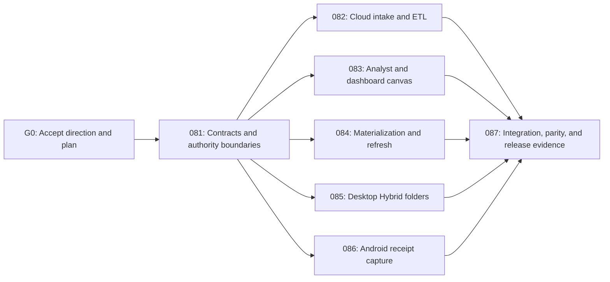

# Data-to-Dashboard V1 Implementation Program

> **For agentic workers:** REQUIRED SUB-SKILL: Use `superpowers:subagent-driven-development` (recommended) or `superpowers:executing-plans` to execute an approved child plan. Use `superpowers:test-driven-development` for each behavior change and `superpowers:verification-before-completion` before every handoff.

**Status:** Approved 
**Decision authorities:** [ADR-0004](../decisions/0004-data-to-dashboard-direction.md), [ADR-0005](../decisions/0005-openai-ai-ocr-on-aws-hosting.md) 
**Product authority:** [DDA specification](../specs/features/data-to-dashboard-agent.md) 
**Machine-readable DAG:** [`data-to-dashboard-orchestration.json`](data-to-dashboard-orchestration.json) 
**Agent handoff:** [`CURSOR-HANDOFF.md`](CURSOR-HANDOFF.md)

**Goal:** Deliver DataBreeze V1 as one Vietnamese-first data-to-dashboard agent across Web, Windows Desktop, and Android while preserving the platform's existing identity, evidence, dataset, job, device, data-mode, usage, and audit authorities.

**Architecture:** A contract-first DDA module composes existing foundation APIs. Web owns cloud intake, review, analyst, canvas, and publication. The Python engine owns deterministic ETL and materialization processors. Desktop owns approved local folder paths and Local/Hybrid execution. Android owns active receipt capture and durable upload. Server-side provider-neutral ports use OpenAI as the initial receipt-extraction and optional AI provider; AWS remains the hosting and authoritative-data platform. Dashboard views read permission-scoped immutable materializations; accepted data-version events trigger dependency-aware refresh and atomic snapshot publication.

**Tech Stack:** React 19/TypeScript/Vite; Electron with a signed Python sidecar; native Kotlin/Compose, Room, WorkManager, and CameraX; NestJS/Fastify/Prisma/PostgreSQL; Python 3.13 with Pydantic and bounded Polars/DuckDB additions when a processor needs them; JSON Schema-generated TypeScript/Kotlin/Python contracts; S3-compatible object storage; Redis only for non-authoritative coordination.

## Global Constraints

- `DDA-001` through `DDA-051` are governed by the canonical specification. P0 is the first production release gate, P1 completes GA, and `DDA-051` remains a designed but unimplemented streaming seam.
- IAM, IAE, DSM, JRA, DSO, NCO, BUA, and AUD remain the authorities named in their specifications. DDA composes public contracts and never reads another feature's persistence.
- Originals and accepted versions are immutable. Every derivative, rejection bundle, materialization, and snapshot retains TenantScope, policy, version, hash, lineage, evidence, retention, and audit bindings.
- Source content is untrusted data. No source cell, filename, comment, OCR text, or metadata may authorize code, tools, publication, permission changes, or egress.
- Vietnamese is the default complete locale and English is a complete secondary locale on all delivered surfaces.
- Hybrid remains the default. Cloud cannot receive local paths or Local-only bytes; any Hybrid publication requires an explicit previewed projection.
- AI may propose typed plans and narratives but never authoritative numbers, arbitrary SQL/code, silent publication, permission expansion, or policy transfer.
- OpenAI calls are server-side only, egress-policy checked, schema validated, cost admitted, and audited. Production receipt extraction uses an evaluated pinned model snapshot and never treats model output as accepted data.
- Delivery is task- and evidence-gated. No deadline, parallel execution, or successful fixture journey changes the definition of done.
- Each agent works in a separate `codex/dda-<lane>` worktree/branch. Agents may edit only their declared ownership paths. The integration owner alone changes root composition files after the contract gate.

## Delivery DAG

`082` and `084` both touch the API and engine, so their file ownership is separated by feature folder and processor name. `083` owns shared Web dashboard UI files after `081` lands. `085` and `086` are independent application lanes. `087` is the only lane allowed to reconcile root composition, generated outputs, golden fixtures, and cross-platform end-to-end tests after parallel work begins.

## Complete task-driven program

| Task gate | Work | Dependency | Exit evidence |
|---|---|---|---|
| T0 | Confirm ADR-0004/0005, the DDA specification, foundation authorities, OpenAI/AWS boundary, file ownership, and the orchestration ledger. | Approved product direction | Authorities agree; orchestration validation passes. |
| T1 | Execute `081` and freeze DDA domain, wire, persistence, policy, AI-egress, and golden-fixture contracts. | T0 | Generated TypeScript/Kotlin/Python contracts and contract tests pass; the frozen commit is recorded. |
| T2 | Execute `082` for immutable Web CSV/XLSX intake, visible typed ETL, separate quality dimensions, rejects, lineage, and governed DatasetVersion acceptance. | T1 | Focused API/engine/Web tests and the lane handoff pass. |
| T3 | Execute `083` for typed deterministic analysis, accessible dashboard canvas, publication, sharing, comparison, templates, export, and recommendations. | T1 | Focused API/Web/e2e tests and the lane handoff pass. |
| T4 | Execute `084` for dependency-aware refresh, complete cache identity, idempotency, atomic snapshots, SSE reconciliation, budgets, and the reference performance harness. | T1 | Focused API/engine/performance tests and the lane handoff pass. |
| T5 | Execute `085` for approved Desktop folders, local manifests/paths, stable-file processing, drift/quarantine, Local/Hybrid projection, offline recovery, and security bridge. | T1 | Desktop security/type/test, engine tests, and the lane handoff pass. |
| T6 | Execute `086` for Android capture, encrypted staging, WorkManager upload, the OpenAI receipt adapter, structured candidate review, deterministic validation, deduplication, and governed acceptance. | T1 plus approved OpenAI project configuration for live evidence | Android/API tests, provider contract/eval evidence, and the lane handoff pass. |
| T7 | Execute `087`; integrate lanes in order `082`, `084`, `083`, `085`, `086`, reconcile migrations/contracts/root composition, prove Local/Cloud parity, and run the golden cross-platform journey. | T2-T6 | Clean integration ledger, parity report, end-to-end runbook, repeatable fixtures, and honest traceability. |
| T8 | Complete all P0 and P1 DDA behavior, then run `401-dda-production-readiness.md` for tenant isolation, signing, backup/restore, security, accessibility, load, retention/deletion, OpenAI retention/egress, observability, support, and staged rollout. | T7 | Every production-gating requirement has existing evidence and fresh passing checks. |
| T9 | Freeze release manifests, deploy through staged environments, run synthetic and real-device smoke tests, verify alarms/rollback, and approve the production release. | T8 | Signed release artifacts, deployment/rollback evidence, monitored staged rollout, and owner approval. |

Tasks T2-T6 may run in parallel only after T1 is green and only under their exclusive ownership paths. A blocked lane remains blocked; no fixture, fake adapter, skipped device test, or unavailable credential is treated as production evidence.

## Shared-file lock table

| Path | Exclusive owner until integration | Rule |
|---|---|---|
| `packages/contracts/schemas/v1/`, generated contract trees, and compatibility baseline | `081` | No lane edits generated files by hand. Lanes consume the `081` commit. |
| `packages/domain/src/v1.ts` | `081`, then `087` | Child lanes add implementation under their feature paths but request export changes through the integration owner. |
| `services/api/src/app.module.ts` | `087` | Lanes expose module registration but do not compose it at the root. |
| `services/api/prisma/schema/platform.prisma` and migration ordering | `081`, then `087` | Feature lanes may own `dda.prisma` additions described by their plan; integration resolves schema registry and migration order. |
| `apps/web/src/app/router.tsx`, navigation/messages, and shared stylesheet | `083`, then `087` | Other lanes expose leaf components and typed clients; they do not edit Web shell composition. |
| `apps/desktop/src/main/ipc-registry.ts` and preload bridge | `085` | Security review is required before integration; no other lane adds IPC. |
| Android manifest, Gradle catalog, and runtime composition | `086` | Only the Android lane changes camera/network/work dependencies. |
| `docs/plans/requirement-traceability.json` and DDA orchestration status | Primary/integration owner | Workers return evidence paths; they do not self-certify requirements. |

## Delegation protocol

1. The primary agent creates isolated worktrees only after G1 is committed and green.
2. Give each worker exactly one child plan plus its dispatch packet below. Do not assign two agents to one child plan.
3. Every worker starts by confirming its dependency commit and printing `git status --short`. A dirty or wrong-base worktree stops that lane.
4. Every worker writes a failing requirement-linked test first, makes the smallest implementation pass, runs focused and package-level checks, and commits coherent units.
5. Workers must not modify another lane's ownership paths, root composition, generated contracts, traceability verification status, or the canonical specification.
6. A handoff contains: commit hash, requirements attempted, files changed, commands and results, migrations/rollback, known limitations, and any contract change request.
7. The integration owner reviews diffs, merges one lane at a time, reruns the receiving branch checks, and reverts the lane merge if the gate fails. Do not repair a lane by silently changing its contract.
8. Only the integration owner changes a trace record from `planned` to `partial` or `verified`, and only with existing evidence paths and passing tests.

## Copy/paste worker packets

### Contract owner — plan 081

> Execute `docs/plans/081-dda-contracts-and-authorities.md` only. Base on the approved DDA planning commit. You exclusively own DDA domain/schema contracts, generated outputs, `dda.prisma` foundation, and golden contract fixtures. Do not implement UI or platform workflows. Use test-first changes, preserve all foundation authorities, run the plan's focused checks plus contract parity, and return a handoff containing the frozen commit hash and fixture IDs. No other lane starts until this handoff is green.

### Cloud ETL owner — plan 082

> Execute `docs/plans/082-dda-cloud-intake-etl.md` only, based on the frozen `081` commit. Own Web upload/ETL review leaf components, DDA intake/ETL application paths, and ETL/profile processors named by the plan. Do not edit contract schemas, generated files, root API/Web composition, refresh processors, Desktop, or Android. Demonstrate immutable source, visible before/after/reject accounting, separated quality dimensions, and accepted DatasetVersion registration through public ports.

### Analyst/canvas owner — plan 083

> Execute `docs/plans/083-dda-analyst-dashboard-canvas.md` only, based on the frozen `081` commit. Own typed analyst/dashboard application paths and the Web dashboard feature, including shell composition paths explicitly granted by plan 080. Do not edit generated contracts, ETL/refresh processors, Desktop, or Android. All numbers must come from deterministic result fixtures/processors; AI may only propose. Return accessibility, authorization, and publication evidence with the handoff.

### Refresh owner — plan 084

> Execute `docs/plans/084-dda-materialization-refresh.md` only, based on the frozen `081` commit. Own dependency-index, materialization-cache, refresh, snapshot-commit, and SSE paths named by the plan. Do not edit Web canvas composition, ETL processors, generated contracts, Desktop, or Android. Prove complete cache keys, idempotency, atomic publication, last-good snapshot behavior, content-safe events, admission denial, and reference-profile measurement hooks.

### Desktop owner — plan 085

> Execute `docs/plans/085-dda-desktop-hybrid-folders.md` only, based on the frozen `081` commit. Own Desktop folder-binding, IPC/preload, local manifest, stable-file detection, local processing orchestration, and projection UI paths. The real path must remain local; no arbitrary filesystem browsing or command channel is allowed. Do not edit cloud API composition or shared generated contracts. Return security-bridge, replay, path-escape, drift, offline, and projection evidence.

### Android owner — plan 086

> Execute `docs/plans/086-dda-android-receipts.md` only, based on the frozen `081` commit. Own native Android receipt capture, encrypted staging, WorkManager upload, server-side OpenAI receipt extraction behind the provider-neutral port, OCR review, and dashboard-consumption leaf paths plus Android dependency/runtime composition. Capture is user-initiated and Hybrid/Cloud only. Never expose the OpenAI key to a client or treat model output as accepted data. Do not implement general document understanding or edit shared generated contracts. Return unit/instrumented/provider-eval evidence for idempotent upload, workspace isolation, structured-output validation, correction versioning, duplicate review, offline recovery, and provider failure.

### Integration owner — plan 087

> Execute `docs/plans/087-dda-integration-readiness.md` after all available lane handoffs. Own root composition, migration ordering, generated-output reconciliation, golden fixtures, cross-platform tests, performance harness, evidence status, and demo runbook. Merge lanes one at a time in the declared order and rerun gates after each. Do not mark production requirements verified from a fixture-only demo. Keep `DDA-051` deferred.

## Program tasks

### Task 1: Accept the direction and freeze delegation scope

**Files:** `docs/decisions/0004-data-to-dashboard-direction.md`, this program, child plans `081`-`087`, and the DDA orchestration ledger.

- [x] Confirm DDA as V1 and the specialist modules as post-V1 extensions.
- [x] Replace timeboxing with one dependency-ordered task program whose final gates include production readiness and release.
- [x] Record OpenAI as the initial server-side OCR/AI provider while AWS remains hosting and domain contracts remain provider-neutral.
- [x] Define exclusive file ownership, dependency order, dispatch packets, and stop conditions.

### Task 2: Land the contract gate before parallel execution

Execute `081-dda-contracts-and-authorities.md`. No parallel product lane may invent or merge a conflicting payload while G1 is open.

### Task 3: Dispatch independent product lanes

After G1, run `082`, `083`, `084`, `085`, and `086` in isolated worktrees. Use the machine-readable DAG to confirm dependencies and path locks before dispatch.

### Task 4: Integrate, verify, and demonstrate

Execute `087-dda-integration-readiness.md`; then run the relevant requirements, contracts, tenant, parity, package, and repository gates. Production release still requires plan `400`.

### Task 5: Complete production readiness and release

Execute `401-dda-production-readiness.md` (agent-first via `402-dda-code-first-completion.md`), close every applicable P0/P1 evidence gap, configure the production OpenAI project and pinned evaluated model snapshot, sign Desktop/Android releases, prove backup/restore and rollback, deploy through staged environments, and approve the monitored production rollout. After the unified-workspace specification gate, execute `406-unified-data-workspace-implementation.md` with next package `UDW-CONTRACTS`; keep `productionReady` false until G5 has real owner evidence.

## Program stop conditions

- Stop dispatch if ADR-0004/0005, the DDA spec, child plans, traceability manifest, and orchestration ledger disagree.
- Stop a lane on contract drift, ownership overlap, cross-tenant access, raw-content telemetry, arbitrary-code execution, silent omission, original mutation, unreviewed projection, or fake freshness/correctness claims.
- Stop integration on a failing migration, generated-contract mismatch, permission-projection cache collision, mixed-version snapshot, or non-reproducible golden fixture.
- Record unfinished functionality as blocked or partial with its exact dependency and evidence gap. Never bypass an authority, replace a required review with silent automation, or lower a production gate to make the program appear complete.

## Program definition of done

- All 51 DDA requirements have exactly one primary plan/task in `requirement-traceability.json`.
- The DDA orchestration DAG is acyclic, all plan/task/file references resolve, and writable ownership paths do not overlap across parallel lanes.
- Contract generation and TypeScript/Kotlin/Python fixture parity pass.
- Focused lane tests plus API, engine, Web, Desktop, Android, tenant, authorization, data-mode, retention, audit, and end-to-end gates pass in proportion to the claimed release state.
- The golden cross-platform journey is reproducible from a clean checkout; fixture-backed or incomplete behavior remains partial and cannot satisfy a production gate.
- P0/P1 records become verified only with existing evidence paths; `DDA-051` remains `post-ga` and unimplemented.
