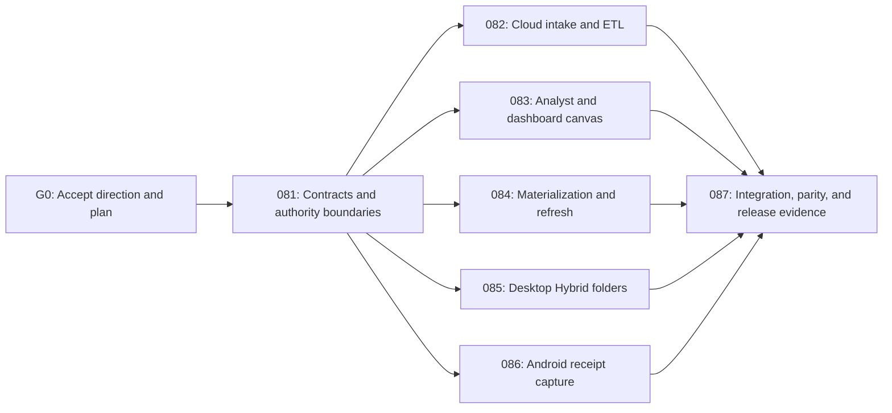

# Data-to-Dashboard V1 Implementation Program

> **For agentic workers:** REQUIRED SUB-SKILL: Use `superpowers:subagent-driven-development` (recommended) or `superpowers:executing-plans` to execute an approved child plan. Use `superpowers:test-driven-development` for each behavior change and `superpowers:verification-before-completion` before every handoff.

**Status:** Approved 
**Decision authority:** [ADR-0004](../decisions/0004-data-to-dashboard-direction.md) 
**Product authority:** [DDA specification](../specs/features/data-to-dashboard-agent.md) 
**Machine-readable DAG:** [`data-to-dashboard-orchestration.json`](data-to-dashboard-orchestration.json) 
**Agent handoff:** [`CURSOR-HANDOFF.md`](CURSOR-HANDOFF.md)

**Goal:** Deliver DataBreeze V1 as one Vietnamese-first data-to-dashboard agent across Web, Windows Desktop, and Android while preserving the platform's existing identity, evidence, dataset, job, device, data-mode, usage, and audit authorities.

**Architecture:** A contract-first DDA module composes existing foundation APIs. Web owns cloud intake, review, analyst, canvas, and publication. The Python engine owns deterministic ETL and materialization processors. Desktop owns approved local folder paths and Local/Hybrid execution. Android owns active receipt capture and durable upload. Dashboard views read permission-scoped immutable materializations; accepted data-version events trigger dependency-aware refresh and atomic snapshot publication.

**Tech Stack:** React 19/TypeScript/Vite; Electron with a signed Python sidecar; native Kotlin/Compose, Room, WorkManager, and CameraX; NestJS/Fastify/Prisma/PostgreSQL; Python 3.13 with Pydantic and bounded Polars/DuckDB additions when a processor needs them; JSON Schema-generated TypeScript/Kotlin/Python contracts; S3-compatible object storage; Redis only for non-authoritative coordination.

## Global Constraints

- `DDA-001` through `DDA-051` are governed by the canonical specification. P0 is the first production release gate, P1 completes GA, and `DDA-051` remains a designed but unimplemented streaming seam.
- IAM, IAE, DSM, JRA, DSO, NCO, BUA, and AUD remain the authorities named in their specifications. DDA composes public contracts and never reads another feature's persistence.
- Originals and accepted versions are immutable. Every derivative, rejection bundle, materialization, and snapshot retains TenantScope, policy, version, hash, lineage, evidence, retention, and audit bindings.
- Source content is untrusted data. No source cell, filename, comment, OCR text, or metadata may authorize code, tools, publication, permission changes, or egress.
- Vietnamese is the default complete locale and English is a complete secondary locale on all delivered surfaces.
- Hybrid remains the default. Cloud cannot receive local paths or Local-only bytes; any Hybrid publication requires an explicit previewed projection.
- AI may propose typed plans and narratives but never authoritative numbers, arbitrary SQL/code, silent publication, permission expansion, or policy transfer.
- The 24-hour outcome is a mentor-demo prototype gate. It is not a production, security, scale, recovery, parity, or compliance claim.
- Each agent works in a separate `codex/dda-<lane>` worktree/branch. Agents may edit only their declared ownership paths. The integration owner alone changes root composition files after the contract gate.

## Delivery DAG

`082` and `084` both touch the API and engine, so their file ownership is separated by feature folder and processor name. `083` owns shared Web dashboard UI files after `081` lands. `085` and `086` are independent application lanes. `087` is the only lane allowed to reconcile root composition, generated outputs, golden fixtures, and cross-platform end-to-end tests after parallel work begins.

## 24-hour prototype clock

| Timebox | Gate | Parallel work | Exit evidence |
|---|---|---|---|
| Hour 0-2 | G0/G1 | Primary agent accepts ADR, lands `081` contract vocabulary, publishes golden fixture IDs, and freezes file ownership. | Generated contracts pass; agents can build without inventing payloads. |
| Hour 2-10 | G2 | Agents execute `082`, `083`, `084`, `085`, and `086` in isolated worktrees. | Each lane has focused red-to-green tests and a handoff commit. |
| Hour 10-16 | G3 | Integration owner merges one lane at a time in dependency order: `082`, `084`, `083`, `085`, `086`. | Contracts, type checks, migrations, and focused integration tests remain green after every merge. |
| Hour 16-21 | G4 | Integration owner executes `087` golden journey and fixes only integration defects. | Messy sales CSV becomes a reviewed dashboard; one accepted file change refreshes affected widgets; one reviewed receipt reaches the expense view. |
| Hour 21-24 | G5 | Demo hardening, bilingual copy, reset script/fixtures, evidence capture, and mentor rehearsal. | Reproducible demo from a clean checkout with limitations shown explicitly. |

If G1 is not green by hour 2, do not dispatch all lanes. If any platform lane cannot consume the frozen contracts by hour 10, keep its UI as an honest fixture-backed prototype and record the missing integration instead of bypassing contracts or security.

## Production sequence after the prototype

1. Complete all P0 behavior and requirement-linked tests in `081`-`086`.
2. Prove Local/Cloud deterministic parity and the 60-second reference profile in `087`.
3. Complete P1 snapshot comparison, safe templates, permission-filtered export, and recommendations.
4. Run `400-production-readiness.md` gates for tenant isolation, signing, backup/restore, security, accessibility, load, retention/deletion, observability, support, and staged rollout.

The prototype may constrain fixture sizes, chart count, one workspace persona, and one OCR adapter. It may not weaken the production requirements or mark them verified without evidence.

## Shared-file lock table

| Path | Exclusive owner until integration | Rule |
|---|---|---|
| `packages/contracts/schemas/v1/`, generated contract trees, and compatibility baseline | `081` | No lane edits generated files by hand. Lanes consume the `081` commit. |
| `packages/domain/src/v1.ts` | `081`, then `087` | Child lanes add implementation under their feature paths but request export changes through the integration owner. |
| `services/api/src/app.module.ts` | `087` | Lanes expose module registration but do not compose it at the root. |
| `services/api/prisma/schema/platform.prisma` and migration ordering | `081`, then `087` | Feature lanes may own `dda.prisma` additions described by their plan; integration resolves schema registry and migration order. |
| `apps/web/src/app/router.tsx`, navigation/messages, and shared stylesheet | `083`, then `087` | Other lanes expose leaf components and typed clients; they do not edit Web shell composition. |
| `apps/desktop/src/main/ipc-registry.ts` and preload bridge | `085` | Security review is required before integration; no other lane adds IPC. |
| Android manifest, Gradle catalog, and runtime composition | `086` | Only the Android lane changes camera/network/work dependencies. |
| `docs/plans/requirement-traceability.json` and DDA orchestration status | Primary/integration owner | Workers return evidence paths; they do not self-certify requirements. |

## Delegation protocol

1. The primary agent creates isolated worktrees only after G1 is committed and green.
2. Give each worker exactly one child plan plus its dispatch packet below. Do not assign two agents to one child plan.
3. Every worker starts by confirming its dependency commit and printing `git status --short`. A dirty or wrong-base worktree stops that lane.
4. Every worker writes a failing requirement-linked test first, makes the smallest implementation pass, runs focused and package-level checks, and commits coherent units.
5. Workers must not modify another lane's ownership paths, root composition, generated contracts, traceability verification status, or the canonical specification.
6. A handoff contains: commit hash, requirements attempted, files changed, commands and results, migrations/rollback, known limitations, and any contract change request.
7. The integration owner reviews diffs, merges one lane at a time, reruns the receiving branch checks, and reverts the lane merge if the gate fails. Do not repair a lane by silently changing its contract.
8. Only the integration owner changes a trace record from `planned` to `partial` or `verified`, and only with existing evidence paths and passing tests.

## Copy/paste worker packets

### Contract owner — plan 081

> Execute `docs/plans/081-dda-contracts-and-authorities.md` only. Base on the approved DDA planning commit. You exclusively own DDA domain/schema contracts, generated outputs, `dda.prisma` foundation, and golden contract fixtures. Do not implement UI or platform workflows. Use test-first changes, preserve all foundation authorities, run the plan's focused checks plus contract parity, and return a handoff containing the frozen commit hash and fixture IDs. No other lane starts until this handoff is green.

### Cloud ETL owner — plan 082

> Execute `docs/plans/082-dda-cloud-intake-etl.md` only, based on the frozen `081` commit. Own Web upload/ETL review leaf components, DDA intake/ETL application paths, and ETL/profile processors named by the plan. Do not edit contract schemas, generated files, root API/Web composition, refresh processors, Desktop, or Android. Demonstrate immutable source, visible before/after/reject accounting, separated quality dimensions, and accepted DatasetVersion registration through public ports.

### Analyst/canvas owner — plan 083

> Execute `docs/plans/083-dda-analyst-dashboard-canvas.md` only, based on the frozen `081` commit. Own typed analyst/dashboard application paths and the Web dashboard feature, including shell composition paths explicitly granted by plan 080. Do not edit generated contracts, ETL/refresh processors, Desktop, or Android. All numbers must come from deterministic result fixtures/processors; AI may only propose. Return accessibility, authorization, and publication evidence with the handoff.

### Refresh owner — plan 084

> Execute `docs/plans/084-dda-materialization-refresh.md` only, based on the frozen `081` commit. Own dependency-index, materialization-cache, refresh, snapshot-commit, and SSE paths named by the plan. Do not edit Web canvas composition, ETL processors, generated contracts, Desktop, or Android. Prove complete cache keys, idempotency, atomic publication, last-good snapshot behavior, content-safe events, admission denial, and reference-profile measurement hooks.

### Desktop owner — plan 085

> Execute `docs/plans/085-dda-desktop-hybrid-folders.md` only, based on the frozen `081` commit. Own Desktop folder-binding, IPC/preload, local manifest, stable-file detection, local processing orchestration, and projection UI paths. The real path must remain local; no arbitrary filesystem browsing or command channel is allowed. Do not edit cloud API composition or shared generated contracts. Return security-bridge, replay, path-escape, drift, offline, and projection evidence.

### Android owner — plan 086

> Execute `docs/plans/086-dda-android-receipts.md` only, based on the frozen `081` commit. Own native Android receipt capture, encrypted staging, WorkManager upload, OCR review, and dashboard-consumption leaf paths plus Android dependency/runtime composition. Capture is user-initiated and Hybrid/Cloud only. Do not implement general document understanding or edit server/generated contracts. Return unit/instrumented evidence for idempotent upload, workspace isolation, correction versioning, duplicate review, and offline recovery.

### Integration owner — plan 087

> Execute `docs/plans/087-dda-integration-readiness.md` after all available lane handoffs. Own root composition, migration ordering, generated-output reconciliation, golden fixtures, cross-platform tests, performance harness, evidence status, and demo runbook. Merge lanes one at a time in the declared order and rerun gates after each. Do not mark production requirements verified from a fixture-only demo. Keep `DDA-051` deferred.

## Program tasks

### Task 1: Accept the direction and freeze delegation scope

**Files:** `docs/decisions/0004-data-to-dashboard-direction.md`, this program, child plans `081`-`087`, and the DDA orchestration ledger.

- [x] Confirm DDA as V1 and the specialist modules as post-V1 extensions.
- [x] Separate the 24-hour prototype gate from production release gates.
- [x] Define exclusive file ownership, dependency order, dispatch packets, and stop conditions.

### Task 2: Land the contract gate before parallel execution

Execute `081-dda-contracts-and-authorities.md`. No parallel product lane may invent or merge a conflicting payload while G1 is open.

### Task 3: Dispatch independent product lanes

After G1, run `082`, `083`, `084`, `085`, and `086` in isolated worktrees. Use the machine-readable DAG to confirm dependencies and path locks before dispatch.

### Task 4: Integrate, verify, and demonstrate

Execute `087-dda-integration-readiness.md`; then run the relevant requirements, contracts, tenant, parity, package, and repository gates. Production release still requires plan `400`.

## Program stop conditions

- Stop dispatch if ADR-0004, the DDA spec, child plans, traceability manifest, and orchestration ledger disagree.
- Stop a lane on contract drift, ownership overlap, cross-tenant access, raw-content telemetry, arbitrary-code execution, silent omission, original mutation, unreviewed projection, or fake freshness/correctness claims.
- Stop integration on a failing migration, generated-contract mismatch, permission-projection cache collision, mixed-version snapshot, or non-reproducible golden fixture.
- Timebox unfinished functionality by narrowing the prototype and recording the limitation. Never bypass an authority or turn a required review into a silent automatic action.

## Program definition of done

- All 51 DDA requirements have exactly one primary plan/task in `requirement-traceability.json`.
- The DDA orchestration DAG is acyclic, all plan/task/file references resolve, and writable ownership paths do not overlap across parallel lanes.
- Contract generation and TypeScript/Kotlin/Python fixture parity pass.
- Focused lane tests plus API, engine, Web, Desktop, Android, tenant, authorization, data-mode, retention, audit, and end-to-end gates pass in proportion to the claimed release state.
- The golden demo is reproducible from a clean checkout and labels fixture-backed or unimplemented behavior honestly.
- P0/P1 records become verified only with existing evidence paths; `DDA-051` remains `post-ga` and unimplemented.
