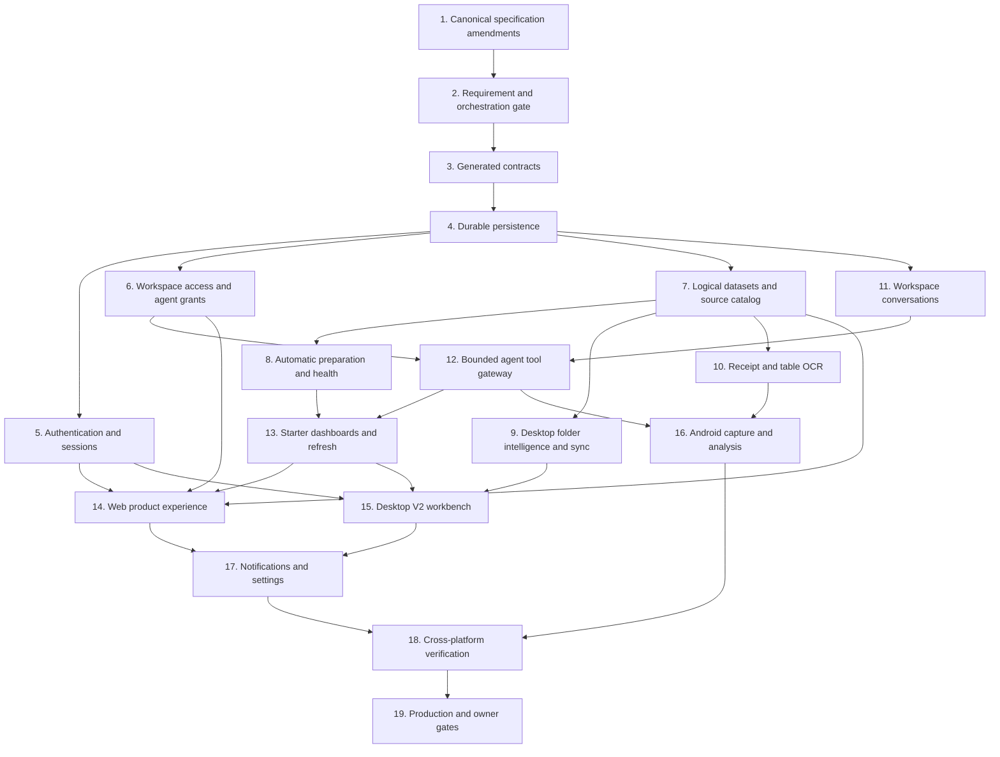

# Unified Data Workspace Implementation Plan

> **For agentic workers:** REQUIRED SUB-SKILL: Use `superpowers:subagent-driven-development` (recommended) or `superpowers:executing-plans` to implement this plan task-by-task. Steps use checkbox (`- [ ]`) syntax for tracking.

**Status:** Approved for implementation. Task 1 may reconcile documentation. Product code in Task 3 and later may start only after Task 2 records the approved canonical requirement gate.

**Design authority:** [`../superpowers/specs/2026-08-12-unified-data-workspace-experience-design.md`](../superpowers/specs/2026-08-12-unified-data-workspace-experience-design.md)

**Existing implementation authorities:** [`080-data-to-dashboard-program.md`](080-data-to-dashboard-program.md), [`402-dda-code-first-completion.md`](402-dda-code-first-completion.md), and [`405-dashboard-workspace-redesign-implementation.md`](405-dashboard-workspace-redesign-implementation.md)

**Goal:** Deliver the approved DataBreeze unified data workspace as production-ready Web and Windows Desktop experiences first, followed by the bounded Android capture and analysis experience, without rebuilding the governed DDA foundation that already exists.

**Architecture:** Extend the existing NestJS/Fastify modular monolith, Python deterministic engine, generated contracts, React Web application, Electron workbench, and Kotlin/Compose Android client. IAE remains the byte, evidence, retention, and deletion authority; DSM remains the governed dataset authority; IAM remains the identity and authorization authority; DDA owns typed analysis, conversations, dashboard definitions, and refresh composition. AI calls stay behind server-side provider-neutral ports while calculations, ETL, refresh, and dashboard values remain deterministic.

**Tech Stack:** Node.js 24.17.0, pnpm 11.18.0, TypeScript 5.9.2, React 19.2.8, Vite 8.2.0, Electron 43.2.0, NestJS 11, Fastify 5, Prisma 7/PostgreSQL, Python 3.13/Pydantic, Kotlin/Compose/Room/WorkManager/CameraX, generated JSON Schema contracts, S3-compatible object storage, OpenAI through existing server-side ports, and AWS infrastructure already defined in `infrastructure/aws/`.

## Global Constraints

- Vietnamese (`vi-VN`) is the default complete locale and English (`en`) is a complete secondary locale.
- Product copy must not use em dash characters.
- The normal customer navigation has exactly `Bảng điều khiển`, `Phân tích`, and `Dữ liệu`.
- Web uses the approved premium three-section shell; Desktop uses the distinct approved V2 native workbench.
- Web and Desktop may share React/TypeScript packages; Android remains native Kotlin and Compose.
- The API remains a NestJS/Fastify modular monolith; deterministic processing remains in the Python engine.
- Clients consume generated contracts and never import service implementation code.
- Feature modules use foundation contracts and never read another feature's persistence directly.
- IAE owns originals, derived bytes, evidence, retention, legal hold, deletion, and recovery.
- DSM owns logical datasets, immutable DatasetVersions, definitions, mappings, quality, and lineage.
- IAM owns identities, sessions, tenant scope, device identity, and deny-by-default authorization.
- DSO owns data-mode, device capability, synchronization, and transfer policy; `LOCAL` bytes never enter cloud storage.
- Originals and accepted versions are immutable. Corrections, transformations, moves, analyses, and dashboard changes create auditable versions or receipts.
- Source content, filenames, OCR text, spreadsheet cells, comments, and metadata are untrusted data and cannot authorize tools, egress, code, publication, or permission changes.
- AI proposes typed work and explanatory text. It never supplies authoritative numbers, arbitrary SQL, Python, JavaScript, shell, or silent shared-canvas mutations.
- Dashboard views, filters, compatible refreshes, and cached accepted results do not call an AI provider.
- Shared dashboard changes require a preview and explicit confirmation. Accepted changes autosave as immutable DashboardVersions.
- The first production sharing surface is workspace-member-only. No public, anonymous, external guest, or bearer-link access is enabled.
- Every task links tests and evidence to stable requirement IDs and preserves tenant isolation, authorization, evidence, data mode, retention, approval, usage, and audit behavior.
- Do not stage, overwrite, or reformat unrelated owner or Cursor changes in the current dirty worktree.

---

## Delivery map and retained work

This plan is a delta program. It does not duplicate completed or in-flight DDA production work.

| Deliverable | Authority | Treatment |
|---|---|---|
| Durable DDA runtime, ETL, analysis, refresh, receipt OCR, infrastructure, production gates | Plans 401, 402, 403 and current branch work | Finish and verify; do not rebuild. |
| Premium dashboard canvas, immutable commands, history, chart picker, Recharts renderer, responsive Web shell | Plans 404 and 405 | Execute unfinished tasks, then adapt the shell to this plan's final three-section information architecture. |
| Unified product requirements and new contracts | Tasks 1 through 4 below | New work. |
| Authentication, workspace presets, agent grants | Tasks 5 and 6 | Extend existing IAM implementation. |
| Logical source catalog, automatic preparation, folder intelligence, table OCR | Tasks 7 through 10 | Extend existing IAE, DSM, DDA, Desktop, and engine ports. |
| Workspace conversations and one bounded agent | Tasks 11 and 12 | New DDA slices over existing typed analysis and dashboard services. |
| Automatic starter dashboards and deterministic refresh | Task 13 | Extend existing DDA dashboard and refresh services. |
| Final Web and Desktop experiences | Tasks 14 and 15 | Compose approved product surfaces over the new APIs. |
| Android bounded experience | Task 16 | Extend existing receipt workflow after Web and Desktop gates pass. |
| Notifications, integration, production release | Tasks 17 through 19 | Complete verification and owner-controlled release gates. |

## Dependency graph



Tasks 5, 6, 7, and 11 may run in isolated worktrees after Task 4. Tasks 8, 9, and 10 may run after Task 7. Task 14 and Task 15 may run in parallel after their dependencies. Task 16 begins only after the Web and Desktop release candidate is green.

## File and responsibility map

| Area | Files | Responsibility |
|---|---|---|
| Canonical authority | `docs/specs/**`, `docs/product/**`, `docs/decisions/0004-data-to-dashboard-direction.md` | Convert the approved design deltas into stable requirements before conflicting code begins. |
| Contracts | `packages/contracts/schemas/v1/dda-*.schema.json`, generated outputs, fixtures, `packages/domain/src/data-to-dashboard/v1.ts` | Bound source catalogs, preparation summaries, conversation context, agent grants, extraction candidates, and starter-dashboard events. |
| IAM | `services/api/src/features/iam/**`, `services/api/prisma/schema/iam.prisma` | OTP verification, OIDC linking, persistent rotating sessions, personal workspace bootstrap, visible access presets, and independent agent grants. |
| Source catalog | `services/api/src/features/dda/source-catalog/**`, IAE/DSM public ports | List logical datasets and sources, resolve safe original views, and avoid alternate byte or dataset authority. |
| Preparation | `services/api/src/features/dda/etl/**`, `services/engine/src/databreeze_engine/processors/dda_*` | Create bounded automatic prepared candidates, health dimensions, review items, and immutable accepted versions. |
| Desktop source intelligence | `apps/desktop/src/application/**`, `apps/desktop/src/main/**`, `apps/desktop/src/renderer/features/sources/**` | Classify stable files, show mismatch review, perform collision-safe reversible moves, and synchronize only approved projections. |
| OCR | `services/api/src/features/dda/receipt/**`, new `table-extraction/**`, Android capture files | Preserve originals, validate structured receipt/table candidates, retain coordinates, and require review for uncertainty. |
| Conversations | `services/api/src/features/dda/conversation/**`, `services/api/prisma/schema/dda.prisma` | Workspace-owned threads, version-bound messages, summaries, context events, retrieval windows, retention, and permission-safe history. |
| Agent | `services/api/src/features/dda/agent/**` plus existing analyst/dashboard/ETL services | Enforce grants and expose typed deterministic tools with bounded context and evidence. |
| Dashboard | Existing `services/api/src/features/dda/dashboard/**` and `refresh/**` | Build private deterministic starter versions, handle proposals, materialize values, and publish atomic last-good snapshots. |
| Web | `apps/web/src/features/auth/**`, `workspace/**`, `data/**`, `analysis/**`, `agent/**`, existing `dashboards/**` | Deliver the three-section premium Web product. |
| Desktop V2 | `apps/desktop/src/renderer/workbench/**`, shared bridge contracts, existing folder application services | Deliver the distinct cobalt rail, source explorer, tabbed work area, docked agent, and status bar. |
| Android | `apps/android/app/src/main/java/com/databreeze/android/**` | Capture and review OCR, choose datasets, view dashboards, ask the agent, and synchronize durably. |
| Verification | focused unit/contract/e2e tests, `docs/evidence/dda/**`, runbooks | Prove security, parity, accessibility, performance, recovery, and release readiness. |

---

### Task 1: Reconcile the canonical product specifications

**Primary requirements:** IAM-001 through IAM-025; IAE-001 through IAE-025; DSM-001 through DSM-027; DSO-001 through DSO-026; NCO-001 through NCO-024; DDA-001 through DDA-060; WEB-001 through WEB-024; DSK-001 through DSK-027; AND-001 through AND-024

**Files:**

- Modify: `docs/specs/foundation/identity-workspaces-permissions.md`
- Modify: `docs/specs/foundation/inbox-artifacts-evidence.md`
- Modify: `docs/specs/foundation/datasets-schemas-rules-mappings.md`
- Modify: `docs/specs/foundation/devices-sync-offline.md`
- Modify: `docs/specs/foundation/notifications-collaboration.md`
- Modify: `docs/specs/features/data-to-dashboard-agent.md`
- Modify: `docs/specs/platforms/web.md`
- Modify: `docs/specs/platforms/desktop.md`
- Modify: `docs/specs/platforms/android.md`
- Modify: `docs/product/product-definition.md`
- Modify: `docs/product/platform-feature-matrix.md`
- Modify: `docs/product/roadmap.md`
- Modify: `docs/decisions/0004-data-to-dashboard-direction.md`
- Modify: `docs/superpowers/specs/2026-08-12-unified-data-workspace-experience-design.md`

**Interfaces:**

- Produces the following exact additive requirements. Existing IDs retain their original meaning unless the canonical document explicitly increments its version and records a compatible clarification.
- `IAM-022`: email/password registration uses a six-digit OTP that expires in 10 minutes, permits five failed attempts, permits resend after 60 seconds, stores only protected challenge material, avoids account enumeration, and atomically activates the user, personal organization, personal workspace, Owner membership, and session after verification.
- `IAM-023`: access tokens remain at most 15 minutes; rotating refresh families expire after 30 days of Web inactivity and 180 days absolute, or 90 days of Desktop/Android inactivity and 365 days absolute; reuse, recovery, suspension, logout-all, device revocation, or compromise revokes the family; browser credentials remain `HttpOnly`, `Secure`, and `SameSite=Lax`.
- `IAM-024`: agent authority is an independent workspace-member grant with `NONE`, `ANALYZE`, `PROPOSE_CHANGES`, or `APPLY_CONFIRMED_CHANGES`; Viewer defaults to `NONE`; grants never expand dataset or action permission.
- `IAM-025`: the normal UI exposes Owner, Editor, and Viewer access presets while the six canonical server roles and versioned permission constants remain available to policy enforcement; preset mapping is explicit, versioned, and deny-by-default.
- `DDA-052`: every logical dataset exposes a permission-filtered source catalog with opaque source ID, safe display label, type, version, status, health, transformations, refresh history, and authorized original/evidence action without transferring a Local path.
- `DDA-053`: first-run preparation may create an automatically accepted version only under an approved `SAFE_NON_LOSSY` policy, with no omitted rows, no ambiguity, no incompatible drift, no blocked quality gate, complete before/after accounting, immutable original, reversible derived steps, and an immediately visible summary; all other plans remain review candidates.
- `DDA-054`: an eligible accepted DatasetVersion may receive a private starter DashboardVersion from a deterministic allowlisted template without an AI call; AI-authored or shared-canvas changes remain proposals requiring confirmation.
- `DDA-055`: conversations are workspace-owned, permission-filtered, dataset-scoped records containing version-bound messages, bounded summaries, retrieved evidence references, context events, retention state, and audit history; history never embeds unrestricted source content.
- `DDA-056`: opening an old conversation restores its recorded dataset/dashboard/filter context; old answers retain original provenance; a new request uses the latest compatible authorized DatasetVersion only after recording and displaying a typed context-change event and never rewrites prior answers.
- `DDA-057`: versioned receipt/invoice and generic table extraction profiles declare supported media, page/pixel/cell/row/column bounds, output schema, confidence, evidence coordinates, validation, duplicate behavior, review policy, cost admission, and immutable original retention.
- `DDA-058`: V1 DashboardSnapshot audiences are Owner, Workspace members, or Project members only; public, anonymous, bearer-link, and external guest resolution are rejected.
- `DDA-059`: a Desktop folder can be Web-usable only through an explicitly consented Cloud or Hybrid projection whose preview declares original transfer, safe label metadata, bytes, classification, destination, and evidence consequences; `LOCAL` remains non-transferable.
- `DDA-060`: the workspace agent may invoke only registered typed tools over authorized resource IDs; each tool resolves tenant scope server-side, enforces the independent agent grant, admits usage, returns bounded structured results and evidence, and audits proposals or effects.
- `WEB-024`: the signed-in product exposes exactly three primary destinations and uses one shared workspace-agent store, with the compact agent on Dashboard/Data and the full thread/history surface in Analysis.
- `DSK-027`: Desktop provides the V2 workbench with activity rail, source explorer, tabbed governed work area, context-aware docked agent, full Analysis view, and sync/engine/review status bar while retaining preload and IPC security. (`DSK-024` through `DSK-026` remain the offline recipe/package requirements.)
- `AND-024`: Android supports user-initiated receipt/invoice/table capture, uncertain-field review, logical-dataset selection, responsive dashboard viewing, evidence drill-down, and permitted agent analysis without complex canvas authoring. (`AND-023` remains the offline-package exporter requirement.)

- [x] **Step 1: Amend the exact workflows, contracts, requirements, non-goals, platform matrix, and acceptance sections**

Copy the requirement statements above into the applicable canonical tables. Update the related workflow and contract prose so the requirement is defined once and references the owning foundation. Keep `LOCAL` behavior, IAE ownership, six server role bundles, MFA, tenant checks, and explicit AI canvas acceptance intact.

- [x] **Step 2: Record the session and automatic-action security decisions**

Add a decision note to ADR-0004 with these fixed values and boundaries:

```text
Web refresh family: 30-day inactivity, 180-day absolute
Desktop/Android refresh family: 90-day inactivity, 365-day absolute
Access token: maximum 15 minutes on every platform
Automatic ETL: SAFE_NON_LOSSY policy only
Automatic starter canvas: private deterministic template only
AI-authored mutation: explicit preview and confirmation
Connected folder cloud use: explicit Cloud/Hybrid projection consent
```

- [x] **Step 3: Update acceptance criteria and deferred scope**

Add exact acceptance scenarios for OTP expiry/attempt/resend limits, OIDC linking, refresh reuse, role-preset mapping, Viewer agent default, source catalog path redaction, safe automatic preparation, starter canvas creation, conversation version transitions, table OCR bounds, workspace-only sharing, Desktop V2 keyboard flow, and Android table capture. Keep Slack, Discord, public sharing, arbitrary code, streaming, broad connectors, and complex Android authoring deferred.

- [x] **Step 4: Run documentation validation**

Run:

```powershell
corepack pnpm exec prettier --check docs/specs docs/product docs/decisions docs/plans/406-unified-data-workspace-implementation.md
corepack pnpm requirements:generate
corepack pnpm requirements:check
git diff --check
```

Expected: every new requirement ID is unique and indexed; no authority conflict remains; formatting and whitespace checks pass.

- [x] **Step 5: Commit the canonical specification gate**

```powershell
git add docs/specs docs/product docs/decisions docs/specs/requirement-index.json docs/superpowers/specs/2026-08-12-unified-data-workspace-experience-design.md
git commit -m "docs(product): approve unified data workspace requirements"
```

---

### Task 2: Update execution authority and freeze the integration base

**Primary requirements:** New IDs from Task 1 plus DDA-001, IAM-019, WEB-003, DSK-002, AND-003

**Files:**

- Modify: `docs/plans/README.md`
- Modify: `docs/plans/080-data-to-dashboard-program.md`
- Modify: `docs/plans/CURSOR-HANDOFF.md`
- Modify: `docs/plans/data-to-dashboard-orchestration.json`
- Modify: `docs/plans/requirement-traceability.json`
- Modify: `docs/specs/requirement-index.json`
- Create: `docs/evidence/dda/unified-workspace-baseline.md`

**Interfaces:**

- Produces one frozen base commit containing all accepted work from plans 402 and 405 that is safe to retain.
- Produces machine-readable work packages `UDW-CONTRACTS`, `UDW-IAM`, `UDW-DATA`, `UDW-CONVERSATION`, `UDW-WEB`, `UDW-DESKTOP`, `UDW-ANDROID`, and `UDW-INTEGRATION` with non-overlapping write ownership.
- Makes this plan the current product-owner entry point without deleting historical plans or claiming unfinished requirements are verified.

- [ ] **Step 1: Audit the dirty worktree without changing it**

Run:

```powershell
git status --short
git diff --name-only
git diff --check
corepack pnpm orchestration:check
```

Record in `docs/evidence/dda/unified-workspace-baseline.md` the current branch, HEAD, modified/untracked paths by owner, completed plan tasks with evidence, failing commands, environment-only gates, and the exact commits retained. Do not stage runtime artifacts, secrets, screenshots, generated reports, Office locks, or unrelated changes.

- [ ] **Step 2: Integrate or isolate the in-flight work**

Process the existing slices in this exact order: durable DDA/API/engine work from plan 402, OpenAI adapters from plan 403, dashboard workspace work from plan 405, Desktop folder work, Android receipt work, then documentation/evidence. Run the focused commands named by each plan, commit only that slice's declared paths, and record the commit in `docs/evidence/dda/unified-workspace-baseline.md`. If a slice is not green, leave it on its existing branch and record the failing command instead of folding it into the UDW base.

- [ ] **Step 3: Add the new work packages and dependencies**

Add the dependency order from this plan to `data-to-dashboard-orchestration.json`. Assign every new requirement once in `requirement-traceability.json`; use `planned` until the named test and evidence path exist. Extend the checker expectation from DDA-001..051 to the final accepted DDA range from Task 1.

- [ ] **Step 4: Validate the frozen base**

Run:

```powershell
corepack pnpm orchestration:check
corepack pnpm requirements:check
corepack pnpm contracts:check
corepack pnpm --filter @databreeze/api typecheck
corepack pnpm --filter @databreeze/web typecheck
corepack pnpm --filter @databreeze/desktop typecheck
```

Expected: orchestration and requirement ownership are consistent. Any product test failure is listed in `docs/evidence/dda/unified-workspace-baseline.md` with its owning existing plan and is not relabeled as a new UDW regression.

- [ ] **Step 5: Commit the execution gate**

```powershell
git add docs/plans docs/specs/requirement-index.json docs/evidence/dda/unified-workspace-baseline.md
git commit -m "docs(plan): activate unified workspace execution"
```

No Task 3 product code starts before this commit exists and the product owner approves the amended requirements.

---

### Task 3: Add generated unified-workspace contracts

**Primary requirements:** IAM-024, DDA-003, DDA-052 through DDA-060, WEB-003, DSK-002, AND-003

**Files:**

- Create: `packages/contracts/schemas/v1/dda-source-catalog.schema.json`
- Create: `packages/contracts/schemas/v1/dda-preparation-summary.schema.json`
- Create: `packages/contracts/schemas/v1/dda-conversation.schema.json`
- Create: `packages/contracts/schemas/v1/dda-conversation-context-event.schema.json`
- Create: `packages/contracts/schemas/v1/dda-agent-grant.schema.json`
- Create: `packages/contracts/schemas/v1/dda-table-extraction-candidate.schema.json`
- Create: `packages/contracts/schemas/v1/dda-starter-dashboard-event.schema.json`
- Create: valid and hostile fixtures under `packages/test-fixtures/contracts/v1/payloads/<schema-id>/`
- Modify: `packages/contracts/manifest.json`
- Modify: `packages/contracts/test/schemas.test.mjs`
- Modify: `packages/test-fixtures/contracts/v1/manifest.json`
- Modify: `packages/domain/src/data-to-dashboard/v1.ts`
- Modify: `packages/domain/src/v1.ts`
- Regenerate: `packages/contracts/generated/**`
- Regenerate: `packages/contracts/compatibility/v1/baseline.json`

**Interfaces:**

- Produces generated `DdaSourceCatalog`, `DdaPreparationSummary`, `DdaConversation`, `DdaConversationContextEvent`, `DdaAgentGrant`, `DdaTableExtractionCandidate`, and `DdaStarterDashboardEvent` types.
- `DdaAgentGrant.level` is exactly `NONE | ANALYZE | PROPOSE_CHANGES | APPLY_CONFIRMED_CHANGES`.
- `DdaConversationContextEvent.kind` is exactly `CONTEXT_RESTORED | DATASET_VERSION_ADVANCED | DATASET_ATTACHED | DATASET_DETACHED | DASHBOARD_VERSION_ADVANCED | FILTER_CONTEXT_CHANGED`.
- `DdaSourceCatalog` carries opaque source IDs and safe display labels but rejects `path`, `localPath`, `absolutePath`, and reconstructable Local content.
- `DdaPreparationSummary` carries exact input/output/rejected counts, six named quality dimensions, transformation receipts, review reasons, and `automaticPolicy: SAFE_NON_LOSSY | NONE`.
- `DdaTableExtractionCandidate` is bounded to 20 pages, 100 columns, 10,000 candidate cells, and evidence coordinates per non-empty cell; larger files return a typed limit problem before provider submission.
- `DdaConversation` contains at most 50 history entries in a page, message text at most 16,000 characters, at most 8 active datasets, and content-safe cursors.

- [ ] **Step 1: Add failing registration, bound, and hostile-content tests**

Add every schema ID to `packages/contracts/test/schemas.test.mjs`. Add invalid fixtures for a local path, 51 history items, 16,001-character message, ninth active dataset, unknown agent level, missing evidence coordinate, 101st table column, embedded tool instruction, cross-workspace ID, and authoritative numeric AI result.

- [ ] **Step 2: Run the focused tests and verify failure**

```powershell
corepack pnpm --filter @databreeze/contracts test
corepack pnpm --filter @databreeze/contracts fixtures:check
corepack pnpm --filter @databreeze/domain test
```

Expected: the new schema IDs and constructors do not exist.

- [ ] **Step 3: Implement closed schemas and immutable domain constructors**

Every schema uses `additionalProperties: false`, UUID identifiers, strict UTC timestamps, bounded arrays/strings, `TenantScope`, and explicit enums. Add constructors that parse, normalize, freeze, and reject cross-scope references. Use this exact grant vocabulary:

```ts
export type DdaAgentGrantLevelV1 =
  | 'NONE'
  | 'ANALYZE'
  | 'PROPOSE_CHANGES'
  | 'APPLY_CONFIRMED_CHANGES';
```

- [ ] **Step 4: Generate all runtimes and compatibility baselines**

```powershell
corepack pnpm --filter @databreeze/contracts generate
corepack pnpm --filter @databreeze/contracts compatibility:baseline
```

Inspect the generated TypeScript, Kotlin, and Python names and update plan interfaces only if the generator deterministically chooses a different documented name.

- [ ] **Step 5: Run contract parity and commit**

```powershell
corepack pnpm --filter @databreeze/contracts contract:check
corepack pnpm --filter @databreeze/contracts test
corepack pnpm --filter @databreeze/contracts fixtures:check
corepack pnpm --filter @databreeze/domain test
git add packages/contracts packages/domain packages/test-fixtures/contracts/v1
git commit -m "feat(contracts): add unified workspace contracts"
```

---

### Task 4: Add durable records and tenant constraints

**Primary requirements:** IAM-001, IAM-019, IAM-022 through IAM-025, IAE-003, DSM-001, DSM-002, DDA-003, DDA-004, DDA-045, DDA-052 through DDA-059

**Files:**

- Modify: `services/api/prisma/schema/iam.prisma`
- Modify: `services/api/prisma/schema/dda.prisma`
- Create: `services/api/prisma/migrations/20260812010000_unified_workspace/migration.sql`
- Modify: `services/api/src/features/dda/adapter/dda-database.client.ts`
- Create: `services/api/test/features/dda/unified-workspace-migration.test.ts`
- Create: `services/api/test/features/dda/unified-workspace-tenant-constraints.test.ts`
- Modify: `tools/recovery/verify-dda-restore.mjs`

**Interfaces:**

- Adds `IamEmailVerificationChallenge`, `IamOidcIdentityLink`, and `WorkspaceAgentGrant` under IAM authority.
- Adds `DdaDatasetSource`, `DdaSourceAssignment`, `DdaFolderPlacementReview`, `DdaFolderMoveReceipt`, `DdaConversation`, `DdaConversationMessage`, `DdaConversationContextEvent`, `DdaConversationSummary`, `DdaExtractionCandidate`, and `DdaNamedDashboardView`.
- Every workspace-owned record stores `organizationId` and `workspaceId`; project-scoped records also store `projectId`; composite foreign keys reject cross-tenant ancestry.
- Conversation messages are immutable. Mutable thread metadata and summaries use revision preconditions.
- Original bytes remain IAE references. Dataset records remain DSM references. DDA tables do not copy source bytes or establish a second retention authority.

- [ ] **Step 1: Write failing migration and tenant tests**

Cover duplicate active OTP purpose, cross-workspace source assignment, cross-workspace message/context linkage, duplicate message idempotency key, invalid agent grant level, move receipt without review, conversation deletion without retention state, and source original reference without IAE scope.

- [ ] **Step 2: Run Prisma and focused tests to verify failure**

```powershell
corepack pnpm --filter @databreeze/api prisma:validate
corepack pnpm --filter @databreeze/api test -- unified-workspace-migration unified-workspace-tenant-constraints
```

Expected: missing models, columns, and constraints.

- [ ] **Step 3: Implement the additive schema and migration**

Use UUID primary keys, UTC timestamps, explicit enums or checked text columns, unique idempotency keys scoped by workspace/operation, append-only message/context/move receipt tables, and indexes for `(organizationId, workspaceId, updatedAt, id)`. Store OTP digests and provider subject hashes, never raw OTPs, refresh tokens, local paths, or source content.

- [ ] **Step 4: Extend restore verification**

Add restore assertions for one conversation with messages/context, one source assignment, one agent grant, one extraction candidate, and one dashboard view. Verify IAE references resolve after restore and revoked/deleted records retain their governed state.

- [ ] **Step 5: Validate and commit**

```powershell
corepack pnpm --filter @databreeze/api prisma:generate
corepack pnpm --filter @databreeze/api prisma:validate
corepack pnpm --filter @databreeze/api test -- unified-workspace-migration unified-workspace-tenant-constraints
node tools/recovery/verify-dda-restore.mjs --fixture-only
git add services/api/prisma services/api/src/features/dda/adapter/dda-database.client.ts services/api/test/features/dda tools/recovery/verify-dda-restore.mjs
git commit -m "feat(api): persist unified workspace state"
```

---

### Task 5: Complete email OTP, Google OIDC, and persistent sessions

**Primary requirements:** IAM-005, IAM-006, IAM-008, IAM-012, IAM-015, IAM-022, IAM-023; WEB-004; DSK-002; AND-003

**Files:**

- Create: `services/api/src/features/iam/application/email-verification.service.ts`
- Create: `services/api/src/features/iam/application/email-verification-repository.port.ts`
- Create: `services/api/src/features/iam/application/identity-linking.service.ts`
- Create: `services/api/src/features/iam/application/oidc-identity.port.ts`
- Create: `services/api/src/features/iam/adapter/prisma-email-verification-repository.adapter.ts`
- Create: `services/api/src/features/iam/adapter/oidc-google-identity.adapter.ts`
- Create: `services/api/src/features/iam/api/email-verification.controller.ts`
- Create: `services/api/src/features/iam/api/oidc.controller.ts`
- Modify: existing registration, authentication, session, bootstrap, cookie, and module files under `services/api/src/features/iam/`
- Create: `services/api/test/features/iam/email-verification.service.test.ts`
- Create: `services/api/test/features/iam/oidc-linking.test.ts`
- Create: `services/api/test/features/iam/persistent-session-policy.test.ts`
- Modify: `services/api/openapi/v1.json` through the generator
- Create: `docs/operations/iam-email-oidc-runbook.md`

**Interfaces:**

- `requestEmailVerification({ email, passwordProofId, locale, correlationId })` always returns the same public accepted shape and never reveals account existence.
- `verifyEmailRegistration({ challengeId, code, idempotencyKey })` atomically activates the account, personal organization/workspace, Owner membership, and refresh family.
- `OidcIdentityPort.verifyAuthorizationCode({ code, codeVerifier, redirectUri, nonce })` returns a provider-verified issuer, subject, normalized email, email-verification flag, and authentication time. It never returns provider access tokens to clients.
- Matching an existing password identity requires a current authenticated session, correct password, or valid email OTP before link creation.
- `SessionPolicyV1` uses the exact durations accepted in Task 1 and rotates every refresh token once.
- Web refresh uses a secure cookie. Desktop and Android receive only device-bound refresh material through their authenticated native flow.

- [ ] **Step 1: Write failing OTP, enumeration, linking, rotation, and expiry tests**

Cover six digits only, 10-minute expiry boundary, five failures, 60-second resend, HMAC-digested challenges, generic public response, activation idempotency, personal workspace creation, Google nonce/PKCE verification, unsafe silent merge denial, refresh reuse family revocation, Web 30/180-day policy, native 90/365-day policy, logout-current, and logout-all.

- [ ] **Step 2: Run focused IAM tests and verify failure**

```powershell
corepack pnpm --filter @databreeze/api test -- email-verification oidc-linking persistent-session-policy
```

Expected: the new services and ports are missing.

- [ ] **Step 3: Implement verification, linking, and session policy**

Generate the OTP with a cryptographically secure integer in `[0, 999999]` and left-pad to six characters. Persist only the protected digest, expiry, attempt count, resend time, purpose, tenant-independent admission key, and correlation-safe metadata. Consume the challenge and create identity/workspace/session state in one database transaction. Validate OIDC issuer, audience, signature, nonce, PKCE, redirect URI, email verification, and authentication time through the adapter.

- [ ] **Step 4: Expose controllers and secure cookies**

Add request, verify, OIDC start/callback, session-list, logout-current, and logout-all routes. Apply CSRF protection to cookie-authenticated mutations, stable problem codes, rate limits by IP and protected email digest, and `HttpOnly; Secure; SameSite=Lax; Path=/api/iam/session` refresh cookies.

- [ ] **Step 5: Generate OpenAPI and run the IAM security suite**

```powershell
corepack pnpm --filter @databreeze/api openapi:generate
corepack pnpm --filter @databreeze/api openapi:check
corepack pnpm --filter @databreeze/api test -- registration authentication session email-verification oidc-linking
corepack pnpm --filter @databreeze/api typecheck
```

Expected: all tests pass; logs and OpenAPI examples contain no OTP, password, provider token, refresh token, or account-existence signal.

- [ ] **Step 6: Document configuration and commit**

The runbook names exact environment variables for the provider-neutral email delivery adapter, Google client ID/secret, approved redirect origins, cookie domain, HMAC key rotation, and local deterministic mail sink. It states that real credentials are owner-supplied secrets and never fixtures.

```powershell
git add services/api/src/features/iam services/api/test/features/iam services/api/openapi/v1.json docs/operations/iam-email-oidc-runbook.md
git commit -m "feat(iam): add verified registration and persistent sessions"
```

---

### Task 6: Add customer access presets, dataset restrictions, and agent grants

**Primary requirements:** IAM-002 through IAM-004, IAM-009, IAM-017, IAM-019, IAM-024, IAM-025; DSM-018; DDA-026, DDA-036, DDA-060

**Files:**

- Create: `services/api/src/features/iam/application/access-preset.service.ts`
- Create: `services/api/src/features/iam/application/agent-grant.service.ts`
- Create: `services/api/src/features/iam/application/agent-grant-repository.port.ts`
- Create: `services/api/src/features/iam/adapter/prisma-agent-grant-repository.adapter.ts`
- Create: `services/api/src/features/iam/api/agent-grant.controller.ts`
- Modify: `services/api/src/features/iam/application/membership-authority.ts`
- Modify: `services/api/src/features/iam/api/membership.dto.ts`
- Modify: `services/api/src/features/iam/api/membership.controller.ts`
- Modify: `packages/domain/src/permissions/v1.ts`
- Create: `services/api/test/features/iam/access-preset.service.test.ts`
- Create: `services/api/test/features/iam/agent-grant.service.test.ts`
- Create: `services/api/test/features/iam/agent-grant-tenant-isolation.e2e.test.ts`

**Interfaces:**

- `MembershipAccessPresetV1` is `OWNER | EDITOR | VIEWER` and maps to explicit versioned permission bundles. It is presentation metadata, not the authorization decision.
- Default mapping: Owner uses canonical Owner; Editor uses canonical Analyst plus governed dashboard/data mutation permissions and no security/billing/ownership permission; Viewer uses canonical Viewer.
- `AgentGrantService.authorize({ tenantScope, memberId, requestedLevel, resourceIds })` returns the lesser of the stored agent level and the member's current action/resource authority.
- A missing grant resolves to `NONE` for Viewer and `ANALYZE` for Owner/Editor only when the accepted workspace policy says so.
- Dataset restrictions are explicit deny scopes. No agent grant, organization role, conversation history, dashboard binding, or cached materialization bypasses them.

- [ ] **Step 1: Write failing preset, default, downgrade, and isolation tests**

Prove that Viewer defaults to no chat, Viewer may receive `ANALYZE` without edit permission, Editor may be denied agent access, `PROPOSE_CHANGES` cannot apply, `APPLY_CONFIRMED_CHANGES` still requires a user confirmation command, restricted datasets return non-enumerating denial, role downgrade takes effect within 60 seconds, and cross-workspace member/resource IDs resolve as not found.

- [ ] **Step 2: Run focused tests and verify failure**

```powershell
corepack pnpm --filter @databreeze/domain test -- permissions
corepack pnpm --filter @databreeze/api test -- access-preset agent-grant
```

Expected: access presets and agent grants are not implemented.

- [ ] **Step 3: Implement versioned mappings and effective-level calculation**

Use this exact monotonic order and never compare raw strings:

```ts
const AGENT_LEVEL_ORDER = {
  NONE: 0,
  ANALYZE: 1,
  PROPOSE_CHANGES: 2,
  APPLY_CONFIRMED_CHANGES: 3,
} as const;
```

Resolve resource ancestry server-side before returning any decision. Increment the workspace authorization epoch after member, preset, agent grant, or dataset restriction changes.

- [ ] **Step 4: Expose mutation and read APIs**

Add owner-authorized endpoints to read/change access preset, agent level, and sensitive-dataset restrictions with idempotency keys, revision preconditions, exact before/after audit summary, and stable denial problems. Do not return inaccessible dataset names in member-access previews.

- [ ] **Step 5: Run authorization and tenant suites, then commit**

```powershell
corepack pnpm --filter @databreeze/api test -- membership access-preset agent-grant scoped-repository
corepack pnpm --filter @databreeze/api test -- agent-grant-tenant-isolation
corepack pnpm --filter @databreeze/api typecheck
git add packages/domain/src/permissions services/api/src/features/iam services/api/test/features/iam
git commit -m "feat(iam): add workspace agent grants"
```

---

### Task 7: Build logical datasets, source catalogs, and safe original views

**Primary requirements:** IAE-001, IAE-003, IAE-007, IAE-009, IAE-013; DSM-001 through DSM-003, DSM-014, DSM-018; DDA-003, DDA-004, DDA-008, DDA-043, DDA-046, DDA-052; WEB-005 through WEB-007, WEB-023

**Files:**

- Create: `services/api/src/features/dda/source-catalog/application/source-catalog.service.ts`
- Create: `services/api/src/features/dda/source-catalog/application/source-catalog-repository.port.ts`
- Create: `services/api/src/features/dda/source-catalog/application/original-view.service.ts`
- Create: `services/api/src/features/dda/source-catalog/application/original-preview.port.ts`
- Create: `services/api/src/features/dda/source-catalog/adapter/prisma-source-catalog-repository.adapter.ts`
- Create: `services/api/src/features/dda/source-catalog/api/source-catalog.controller.ts`
- Create: `services/api/src/features/dda/source-catalog/api/source-catalog.dto.ts`
- Create: `services/engine/src/databreeze_engine/processors/dda_original_preview.py`
- Create: `services/engine/tests/test_dda_original_preview.py`
- Create: `services/api/test/features/dda/source-catalog.service.test.ts`
- Create: `services/api/test/features/dda/source-catalog.controller.test.ts`
- Create: `services/api/test/features/dda/original-view-security.test.ts`
- Modify: `services/api/src/features/dda/dda.module.ts`

**Interfaces:**

- `listDatasetSources(context, datasetId, cursor)` returns a generated `DdaSourceCatalog` with stable cursor pagination and only authorized entries.
- `resolveOriginalView(context, sourceId)` returns `XLSX_SAFE_GRID | CSV_SAFE_GRID | IMAGE | PDF | OPEN_ON_SOURCE_DEVICE` plus an authorized IAE content/evidence reference, never raw storage credentials or a Desktop path.
- The XLSX preview returns worksheet names, cell display values, declared formula text, merged-cell metadata, and bounded row/column windows. It never executes macros, external links, formulas, embedded objects, or OLE packages.
- CSV preview returns detected encoding/delimiter, raw parsed cells, and bounded windows. Image/PDF viewing uses immutable IAE bytes and range-capable authorized delivery.
- Receipt/table originals include evidence overlays with page and coordinates.

- [ ] **Step 1: Write failing catalog, authorization, path-redaction, and preview tests**

Cover multiple files in one logical dataset, cursor stability, missing/restricted source non-enumeration, stale IAE reference, `LOCAL` open-on-device behavior, XLSX macro/external-link non-execution, CSV formula text preservation, image/PDF range reads, evidence coordinate clipping, and preview bounds.

- [ ] **Step 2: Run focused API and engine tests to verify failure**

```powershell
corepack pnpm --filter @databreeze/api test -- source-catalog original-view-security
uv run --project services/engine pytest services/engine/tests/test_dda_original_preview.py -q
```

Expected: services and preview processor are missing.

- [ ] **Step 3: Implement the source catalog over IAE and DSM ports**

Resolve dataset ownership through DSM, source/version/retention/evidence through IAE, and authorization through IAM. Store only DDA assignment metadata. Use opaque source IDs and a separately classified `safeDisplayLabel`; never serialize a local path or an unapproved source filename.

- [ ] **Step 4: Implement the bounded deterministic preview processor**

The processor accepts a signed typed job with exact artifact version and limits. It rejects password-protected or unsupported active content with stable codes, emits a sanitized derived preview through IAE, and records engine/profile hashes and lineage. Formula cells return formula text and cached display value as separate untrusted fields.

- [ ] **Step 5: Wire APIs, run security tests, and commit**

```powershell
corepack pnpm --filter @databreeze/api test -- source-catalog original-view-security
uv run --project services/engine pytest services/engine/tests/test_dda_original_preview.py -q
corepack pnpm --filter @databreeze/api openapi:check
git add services/api/src/features/dda/source-catalog services/api/src/features/dda/dda.module.ts services/api/test/features/dda/source-catalog* services/api/test/features/dda/original-view-security.test.ts services/engine/src/databreeze_engine/processors/dda_original_preview.py services/engine/tests/test_dda_original_preview.py
git commit -m "feat(dda): add governed source catalog"
```

---

### Task 8: Add automatic safe preparation and transparent health summaries

**Primary requirements:** DSM-002, DSM-009 through DSM-016, DSM-019, DSM-020; JRA-001, JRA-004, JRA-006; DDA-004 through DDA-011, DDA-036, DDA-045, DDA-053

**Files:**

- Create: `services/api/src/features/dda/etl/application/automatic-preparation-policy.ts`
- Create: `services/api/src/features/dda/etl/application/automatic-preparation.service.ts`
- Create: `services/api/src/features/dda/etl/application/preparation-summary.service.ts`
- Modify: existing ETL proposal, acceptance, repository, and intake services under `services/api/src/features/dda/etl/` and `intake/`
- Create: `services/engine/src/databreeze_engine/processors/dda_preparation_classify.py`
- Modify: existing `dda_etl_profile.py`, `dda_etl_preview.py`, and `dda_etl_execute.py`
- Create: `services/api/test/features/dda/automatic-preparation.service.test.ts`
- Create: `services/api/test/features/dda/preparation-summary.test.ts`
- Create: `services/engine/tests/test_dda_preparation_classify.py`
- Modify: `apps/web/src/features/data-intake/quality-dimensions.tsx`
- Modify: `apps/web/src/features/data-intake/data-pipeline-page.tsx`

**Interfaces:**

- `classifyAutomaticPreparation(plan, profile)` returns `AUTO_ACCEPT_SAFE | REVIEW_REQUIRED | BLOCKED` with exact reason codes.
- `AUTO_ACCEPT_SAFE` requires zero omitted rows, zero ambiguous mappings, zero incompatible types, zero unaccounted rejects, no source overlap, no changed duplicate key, no currency/timezone inference, no external enrichment, no blocked quality dimension, and only reversible allowlisted operations.
- `PreparationSummary` reports input/output/unchanged/changed/rejected/quarantined/unsupported counts, transformations, before/after samples, warnings, exclusions, lineage, version, undo target, and six separate named health dimensions.
- The UI never calls the summary a percentage correct. Any overall score discloses formula, coverage, weights, and limitations.

- [ ] **Step 1: Write failing policy matrix and accounting tests**

Use table-driven fixtures for safe header aliases, safe type annotations, whitespace-derived columns, ambiguous date, ambiguous currency, changed duplicate key, row filter, reject, overlap, sampled profile, source drift, and quality block. Assert that every input row is counted exactly once.

- [ ] **Step 2: Run focused tests and verify failure**

```powershell
corepack pnpm --filter @databreeze/api test -- automatic-preparation preparation-summary
uv run --project services/engine pytest services/engine/tests/test_dda_preparation_classify.py -q
```

Expected: automatic classification and summary services are missing.

- [ ] **Step 3: Implement policy classification before execution**

Keep the existing ETL plan immutable. Classify it from typed steps, exact profile findings, workspace policy version, and complete accounting. Route `REVIEW_REQUIRED` to the existing ETL review. Route `BLOCKED` to a stable review item. Only `AUTO_ACCEPT_SAFE` may enqueue the accepted typed JRA job automatically.

- [ ] **Step 4: Implement post-run verification and summary**

Recompute hashes/counts independently before DSM registration. If actual execution differs from preview, reject automatic acceptance and create a review item. On success, register a new DatasetVersion, save the summary, emit the accepted-version event, and leave the immutable original untouched.

- [ ] **Step 5: Update the visible summary and run tests**

Show the full summary for first import, a compact notification for compatible refresh, and the full review for ambiguity or drift. Each dimension shows numerator, denominator, coverage, rule/expectation, sample status, and limitation.

```powershell
corepack pnpm --filter @databreeze/api test -- automatic-preparation preparation-summary etl
uv run --project services/engine pytest services/engine/tests/test_dda_preparation_classify.py services/engine/tests/test_dda_etl_*.py -q
corepack pnpm --filter @databreeze/web exec vitest run test/data-pipeline-route.test.tsx test/etl-review-page.test.tsx
git add services/api/src/features/dda/etl services/api/src/features/dda/intake services/api/test/features/dda services/engine/src/databreeze_engine/processors services/engine/tests apps/web/src/features/data-intake apps/web/test
git commit -m "feat(dda): automate safe data preparation"
```

---

### Task 9: Add Desktop folder intelligence, placement review, and approved cloud sync

**Primary requirements:** DSO-002, DSO-004, DSO-006 through DSO-010, DSO-015, DSO-017, DSO-021; DDA-012 through DDA-014, DDA-037 through DDA-039, DDA-043, DDA-059; DSK-001 through DSK-005, DSK-010, DSK-014 through DSK-017

**Files:**

- Create: `apps/desktop/src/application/source-classification.service.ts`
- Create: `apps/desktop/src/application/file-placement.service.ts`
- Create: `apps/desktop/src/application/reversible-file-move.service.ts`
- Create: `apps/desktop/src/shared/source-review-contract-v1.ts`
- Modify: `apps/desktop/src/application/folder-intake.service.ts`
- Modify: `apps/desktop/src/application/folder-sync.service.ts`
- Modify: `apps/desktop/src/application/publication-projection.service.ts`
- Modify: `apps/desktop/src/main/folder-watcher-lifecycle.ts`
- Modify: `apps/desktop/src/main/ipc-registry.ts`
- Modify: `apps/desktop/src/preload/bridge-v1.ts`
- Create: `apps/desktop/src/renderer/features/sources/source-review-screen.tsx`
- Create: `apps/desktop/src/renderer/features/sources/source-sample-table.tsx`
- Create: `apps/desktop/test/source-classification.test.ts`
- Create: `apps/desktop/test/reversible-file-move.test.ts`
- Create: `apps/desktop/test/source-review-screen.test.tsx`
- Create: `services/api/src/features/dda/source-catalog/api/folder-projection.controller.ts`
- Create: `services/api/test/features/dda/folder-projection-consent.test.ts`

**Interfaces:**

- `classifyStableFile(input)` returns candidate logical dataset, intended folder, purpose, schema fingerprint, confidence, reasons, sample descriptor, and `MATCH | MISPLACED | AMBIGUOUS | UNSUPPORTED`.
- `planMove({ bindingId, relativeSource, relativeDestinationDirectory })` returns a preview with normalized relative paths, collision strategy, source fingerprint, and destination capability. It rejects absolute paths, traversal, symlink escape, changed source, and a destination outside the approved grant.
- `commitMove(planId, expectedFingerprint)` creates a collision-safe target, verifies written bytes, removes the source only after verification, and records a receipt sufficient for `undoMove(receiptId)`.
- Cloud receives opaque binding/source IDs and only metadata/content allowed by the accepted projection. `LOCAL` never uploads originals, previews, row values, filenames, or reconstructable content.

- [ ] **Step 1: Write failing classification, review, move, and projection tests**

Cover locked/partial files, debounce, duplicate filesystem events, identical content, store name in filename, schema/content mismatch, ambiguous dataset, outside-root path, symlink escape, case-insensitive collision, concurrent destination creation, source changed after preview, verified copy-before-delete, undo collision, offline queue, projection cancellation, and Local-mode transfer denial.

- [ ] **Step 2: Run Desktop security and focused tests to verify failure**

```powershell
corepack pnpm --filter @databreeze/desktop security:check
corepack pnpm --filter @databreeze/desktop exec vitest run test/source-classification.test.ts test/reversible-file-move.test.ts test/source-review-screen.test.tsx
corepack pnpm --filter @databreeze/api test -- folder-projection-consent
```

Expected: classification, move, review, and consent APIs are missing.

- [ ] **Step 3: Implement deterministic classification and rich review records**

Use the stable file fingerprint, extension/content profile, workbook sheet names, headers, schema fingerprint, folder manifest, and previously accepted assignments. Treat every source string as data. The review screen shows file label, current and suggested logical location, reasons, confidence, bounded sample, schema comparison, and warnings with actions `MOVE`, `KEEP`, `REASSIGN`, `VIEW_ALL`, and `LATER`.

- [ ] **Step 4: Implement the safe reversible move and cloud projection**

Keep raw paths exclusively in the main process. Expose only versioned schema-validated preview/commit/undo IPC. Use a same-volume atomic rename when available; otherwise copy to a unique temporary file, flush, fingerprint, atomically publish the collision-safe target, then remove the source. Never overwrite. Queue projection transfers resumably with content hash and idempotency key after explicit Cloud/Hybrid consent.

- [ ] **Step 5: Run Desktop, API, and replay verification, then commit**

```powershell
corepack pnpm --filter @databreeze/desktop test
corepack pnpm --filter @databreeze/desktop security:check
corepack pnpm --filter @databreeze/api test -- folder-projection-consent
corepack pnpm --filter @databreeze/desktop typecheck
git add apps/desktop/src apps/desktop/test services/api/src/features/dda/source-catalog services/api/test/features/dda/folder-projection-consent.test.ts
git commit -m "feat(desktop): add intelligent connected folders"
```

---

### Task 10: Generalize governed OCR to receipt, invoice, and table profiles

**Primary requirements:** IAE-003, IAE-007, IAE-009, IAE-013; DSM-002, DSM-014 through DSM-016; DDA-040 through DDA-046, DDA-057; AND-006 through AND-012, AND-023

**Files:**

- Create: `services/api/src/features/dda/table-extraction/application/table-extraction.service.ts`
- Create: `services/api/src/features/dda/table-extraction/application/table-extraction.port.ts`
- Create: `services/api/src/features/dda/table-extraction/application/table-validation.service.ts`
- Create: `services/api/src/features/dda/table-extraction/adapter/openai-table-extraction.adapter.ts`
- Create: `services/api/src/features/dda/table-extraction/adapter/openai-table-output.schema.ts`
- Create: `services/api/src/features/dda/table-extraction/api/table-extraction.controller.ts`
- Modify: receipt extraction services to share common media admission and evidence-coordinate validation without weakening receipt-specific rules
- Create: `services/api/test/features/dda/table-extraction.service.test.ts`
- Create: `services/api/test/features/dda/openai-table-extraction.adapter.test.ts`
- Create: `services/api/test/features/dda/table-extraction-tenant-isolation.e2e.test.ts`
- Create: `tools/fixture-validation/fixtures/dda/table-extraction/`
- Modify: `tools/fixture-validation/src/run-openai-receipt-eval.mjs` only by extracting shared evaluation utilities; keep receipt and table thresholds separate
- Create: `tools/fixture-validation/src/run-openai-table-eval.mjs`

**Interfaces:**

- `ExtractionProfileV1` is `RECEIPT_V1 | INVOICE_V1 | TABLE_V1` with independent bounds, schemas, confidence thresholds, validation, and cost policy.
- The provider receives only policy-approved media and metadata after MIME, pixel, page, byte, and decompression limits pass.
- Provider output remains an unaccepted candidate. Deterministic validation checks schema, coordinates, row/column shape, duplicate headers, typed cell candidates, totals where applicable, and formula-like injection strings.
- The original image/PDF stays encrypted under IAE for the dataset retention lifetime unless governed deletion removes it.
- Accepted cells retain page/polygon evidence so a dashboard value can drill to transaction, extracted field, and highlighted original.

- [ ] **Step 1: Write failing bounds, schema, confidence, evidence, and hostile-output tests**

Cover unsupported MIME, oversized bytes/pixels/pages/table, decompression bomb, provider timeout, malformed JSON, extra property, missing coordinate, off-page coordinate, prompt-injection text, CSV-formula cell, duplicate header, ragged row, low confidence, duplicate source, cross-tenant artifact, and provider disabled.

- [ ] **Step 2: Run focused tests and verify failure**

```powershell
corepack pnpm --filter @databreeze/api test -- table-extraction openai-table-extraction
corepack pnpm --filter @databreeze/fixture-validation test -- openai-table
```

Expected: the table profile and evaluator are missing.

- [ ] **Step 3: Implement media admission, adapter, and deterministic validator**

Reuse the existing server-side OpenAI Responses client and egress policy. Define a strict structured output schema from the generated table contract. Normalize no values in the adapter. The validation service emits typed candidates, warnings, review reasons, and evidence references; it never registers a DatasetVersion directly.

- [ ] **Step 4: Implement acceptance through existing IAE, DSM, and JRA ports**

User corrections create a new extraction candidate version with actor, reason, parent, and evidence. Acceptance creates or appends to the selected logical dataset only after deterministic validation, authorization, data-mode, usage, duplicate, retention, and audit checks succeed.

- [ ] **Step 5: Add synthetic offline evaluation and run all OCR tests**

Create Vietnamese, English, multi-column, low-contrast, rotated, hostile-text, and ragged-table fixtures. The offline recorded-response suite must be deterministic. The live evaluator remains request-capped, synthetic-only by default, explicitly acknowledges external egress, and does not promote a model unless the separately declared field/cell/evidence thresholds pass.

```powershell
corepack pnpm --filter @databreeze/api test -- receipt table-extraction openai
corepack pnpm --filter @databreeze/fixture-validation test
git add services/api/src/features/dda/receipt services/api/src/features/dda/table-extraction services/api/test/features/dda tools/fixture-validation
git commit -m "feat(dda): add governed table extraction"
```

---

### Task 11: Add workspace-owned conversations and version context

**Primary requirements:** IAM-002, IAM-008, IAM-009, IAM-019; IAE-012; DDA-003, DDA-015 through DDA-019, DDA-026, DDA-043 through DDA-046, DDA-055, DDA-056

**Files:**

- Create: `services/api/src/features/dda/conversation/application/conversation-repository.port.ts`
- Create: `services/api/src/features/dda/conversation/application/conversation.service.ts`
- Create: `services/api/src/features/dda/conversation/application/conversation-context.service.ts`
- Create: `services/api/src/features/dda/conversation/application/conversation-retention.port.ts`
- Create: `services/api/src/features/dda/conversation/adapter/prisma-conversation-repository.adapter.ts`
- Create: `services/api/src/features/dda/conversation/adapter/in-memory-conversation-repository.adapter.ts`
- Create: `services/api/src/features/dda/conversation/api/conversation.controller.ts`
- Create: `services/api/src/features/dda/conversation/api/conversation.dto.ts`
- Create: `services/api/test/features/dda/conversation.service.test.ts`
- Create: `services/api/test/features/dda/conversation-context.service.test.ts`
- Create: `services/api/test/features/dda/conversation-tenant-isolation.e2e.test.ts`
- Modify: `services/api/src/features/dda/dda.module.ts`

**Interfaces:**

- `createConversation(context, { title, datasetIds, dashboardId?, filterContext? }, idempotencyKey)` creates a workspace-owned thread after resolving every resource through server authority.
- `appendUserMessage(context, conversationId, { messageId, text, requestedDatasetIds? })` writes one immutable message and returns a queued turn ID. It does not call a provider inside the database transaction.
- `listConversations(context, cursor, limit)` returns at most 50 content-safe entries ordered by `(updatedAt DESC, id DESC)` with dataset labels/version IDs visible before open.
- `loadConversation(context, id, beforeCursor, limit)` reauthorizes the thread, every attached resource, and every returned evidence action.
- `resolveTurnContext` restores recorded context, compares current compatible versions, and appends a visible context event before a new message moves to a later version.
- Old messages retain exact input, plan, result, dashboard, and evidence versions and are never rewritten.

- [ ] **Step 1: Write failing history, append, context-transition, and isolation tests**

Cover stable pagination, workspace ownership, shared-member read, removed-member denial, restricted-dataset redaction, idempotent append, simultaneous append ordering, old-version restoration, compatible latest-version transition, incompatible drift clarification, additional dataset attachment, unauthorized attachment, summary revision conflict, retention hold, and cross-workspace non-enumeration.

- [ ] **Step 2: Run focused tests and verify failure**

```powershell
corepack pnpm --filter @databreeze/api test -- conversation
```

Expected: conversation services and routes are missing.

- [ ] **Step 3: Implement immutable thread operations and context events**

Messages and context events append under a unique `(conversationId, sequence)` transaction. The service resolves tenant and resource ancestry before reads. A compatible upgrade writes exactly one `DATASET_VERSION_ADVANCED` event with old/new version IDs and reason; an incompatible change leaves the active version unchanged and returns `CONTEXT_REVIEW_REQUIRED`.

- [ ] **Step 4: Implement bounded summary and retrieval records**

Store summary text at most 8,000 characters, recent-window pointers, evidence/result references, provider/configuration provenance, and revision. A summary is convenience context, not evidence. Deleting or restricting a dataset makes its details unavailable on future reads without modifying historical audit records.

- [ ] **Step 5: Wire routes, run tenant tests, and commit**

```powershell
corepack pnpm --filter @databreeze/api test -- conversation
corepack pnpm --filter @databreeze/api test -- conversation-tenant-isolation
corepack pnpm --filter @databreeze/api openapi:check
corepack pnpm --filter @databreeze/api typecheck
git add services/api/src/features/dda/conversation services/api/src/features/dda/dda.module.ts services/api/test/features/dda/conversation*
git commit -m "feat(dda): add workspace conversations"
```

---

### Task 12: Build the bounded workspace-agent tool gateway

**Primary requirements:** IAM-002, IAM-009, IAM-017, IAM-019, IAM-024; DSM-014, DSM-016, DSM-018; BUA-005, BUA-008; AUD-003; DDA-015 through DDA-019, DDA-024, DDA-036, DDA-043 through DDA-045, DDA-050, DDA-060

**Files:**

- Create: `services/api/src/features/dda/agent/application/agent-context-builder.service.ts`
- Create: `services/api/src/features/dda/agent/application/agent-tool-registry.ts`
- Create: `services/api/src/features/dda/agent/application/agent-turn.service.ts`
- Create: `services/api/src/features/dda/agent/application/agent-provider.port.ts`
- Create: `services/api/src/features/dda/agent/application/agent-tool.types.ts`
- Create: `services/api/src/features/dda/agent/adapter/openai-agent-provider.adapter.ts`
- Create: `services/api/src/features/dda/agent/api/agent-turn.controller.ts`
- Create: `services/api/src/features/dda/agent/api/agent-turn.dto.ts`
- Create: `services/api/test/features/dda/agent-context-builder.test.ts`
- Create: `services/api/test/features/dda/agent-tool-registry.test.ts`
- Create: `services/api/test/features/dda/agent-turn.service.test.ts`
- Create: `services/api/test/features/dda/agent-prompt-injection.e2e.test.ts`
- Modify: `services/api/src/features/dda/dda.module.ts`

**Interfaces:**

- Registered tool names are exactly `dataset.describe`, `dataset.sample`, `analysis.plan`, `analysis.execute`, `dashboard.propose`, `dashboard.applyConfirmed`, `dashboard.explainValue`, `evidence.resolve`, `source.open`, and `etl.proposeCorrection`.
- Each tool descriptor declares required agent level, required IAM action, input schema, output schema, maximum rows/bytes, cost class, side-effect class, timeout, and audit policy.
- `AgentContextPackageV1` contains one system policy, one workspace policy projection, at most 8 dataset bindings, at most 12 recent messages, one 8,000-character summary, at most 24 evidence/result references, current dashboard/filter context, locale, and a 24,000-token estimated provider ceiling.
- `dashboard.applyConfirmed` accepts only a previously previewed authoring command carrying user confirmation, expected version, revision, and idempotency key. The model cannot manufacture confirmation.
- Tool results contain typed values and evidence references. The provider may narrate them but never replaces their numeric values.

- [ ] **Step 1: Write failing registry, permission, bound, injection, and outage tests**

Cover unknown tool, insufficient agent level, insufficient dataset permission, restricted field/row, over-bound sample, stale context, budget denial, provider disabled, provider timeout, malformed provider tool call, repeated tool loop, source text requesting permission change, evidence not authorized, unconfirmed dashboard apply, and deterministic analysis during provider outage.

- [ ] **Step 2: Run focused tests and verify failure**

```powershell
corepack pnpm --filter @databreeze/api test -- agent-context-builder agent-tool-registry agent-turn
```

Expected: gateway, registry, and provider adapter are missing.

- [ ] **Step 3: Implement closed tool descriptors and server-owned resolution**

Tool inputs use opaque IDs only. Before invocation, resolve the authenticated principal, current workspace membership, agent grant, resource ancestry, dataset restrictions, data mode, usage admission, and required action. Reject unknown properties. Never pass a database client, storage credential, local path, arbitrary query, or executable text to the provider.

- [ ] **Step 4: Implement bounded turn orchestration**

Build context through conversation and authorized retrieval ports. Allow at most 8 tool calls per turn and at most 2 repeated calls with the same canonical input hash. Persist user message first, tool request/result envelopes second, assistant narrative last. On provider failure, append a stable failure event without losing the user message and expose deterministic tools through normal UI actions.

- [ ] **Step 5: Connect existing analyst, dashboard, source, evidence, and ETL services**

Adapters call the existing typed application services rather than repositories. `analysis.execute` returns deterministic result cells; `dashboard.propose` returns two to four compatible preview options; `source.open` returns an authorized view descriptor; `etl.proposeCorrection` creates a reviewable typed plan only.

- [ ] **Step 6: Run security/usage tests and commit**

```powershell
corepack pnpm --filter @databreeze/api test -- agent
corepack pnpm --filter @databreeze/api test -- agent-prompt-injection openai-egress-policy openai-provider-outage
corepack pnpm --filter @databreeze/api typecheck
git add services/api/src/features/dda/agent services/api/src/features/dda/dda.module.ts services/api/test/features/dda/agent*
git commit -m "feat(dda): add bounded workspace agent"
```

---

### Task 13: Generate private starter dashboards and refresh them deterministically

**Primary requirements:** DDA-015 through DDA-035, DDA-038, DDA-039, DDA-047 through DDA-050, DDA-054, DDA-058; DSM-007, DSM-014, DSM-020

**Files:**

- Create: `services/api/src/features/dda/dashboard/application/starter-dashboard-template.registry.ts`
- Create: `services/api/src/features/dda/dashboard/application/starter-dashboard.service.ts`
- Create: `services/api/src/features/dda/dashboard/application/personal-view.service.ts`
- Modify: existing dashboard repository, draft, publication, proposal, query, and refresh services under `services/api/src/features/dda/dashboard/` and `refresh/`
- Create: `services/api/test/features/dda/starter-dashboard.service.test.ts`
- Create: `services/api/test/features/dda/personal-view.service.test.ts`
- Create: `services/api/test/features/dda/workspace-only-dashboard.test.ts`
- Modify: `services/engine/src/databreeze_engine/processors/dda_materialize_query.py`
- Create: `services/engine/tests/test_dda_starter_materialization.py`

**Interfaces:**

- `StarterDashboardTemplateRegistry.match(profile)` returns a deterministic template ID/version or `NO_SAFE_TEMPLATE`; it does not call an AI provider.
- Supported starters use only allowlisted KPI, table, bar, line/area, donut, text/evidence widgets and published deterministic metrics compatible with field types, grain, units, and evidence.
- `createStarterDashboard(datasetVersionId, policyVersionId)` creates one private DashboardVersion idempotently and queues materialization. It never publishes or shares.
- Selecting a dataset loads that dataset's own active canvas. Cross-dataset comparison is an explicit typed analysis and compatibility check.
- Personal filters do not mutate the shared DashboardVersion. A named view belongs to its creator unless explicitly shared with workspace members.
- Audience creation or resolution rejects `PUBLIC`, `ANONYMOUS`, `EXTERNAL_GUEST`, and `SHARED_LINK`.

- [ ] **Step 1: Write failing template, idempotency, filter, audience, and refresh tests**

Cover sales/time-series, expense/receipt, inventory, generic-table, no-safe-metric, duplicate accepted event, restricted metric, dataset switch, explicit comparison, personal filter isolation, named-view revision, AI-free starter path, last-good snapshot, partial refresh, source unavailable, and all prohibited audiences.

- [ ] **Step 2: Run API and engine tests and verify failure**

```powershell
corepack pnpm --filter @databreeze/api test -- starter-dashboard personal-view workspace-only-dashboard
uv run --project services/engine pytest services/engine/tests/test_dda_starter_materialization.py -q
```

Expected: starter registry and personal views are missing.

- [ ] **Step 3: Implement deterministic template matching and creation**

Match only published semantic roles and metrics. A template declares required/optional roles, compatible units/grain, page layout at desktop/tablet/mobile breakpoints, evidence behavior, and accessible summary. If requirements do not match exactly, return `NO_SAFE_TEMPLATE` and show an empty canvas invitation rather than guessing.

- [ ] **Step 4: Integrate dependency-aware materialization and last-good publication**

Reuse the existing complete cache identity and refresh coordinator. Publish a snapshot atomically only when every required materialization verifies against one authorized version set. Keep the last complete snapshot with a typed stale/blocked/source reason when refresh fails.

- [ ] **Step 5: Implement personal views and workspace-only audience enforcement**

Store filter/parameter state separately from DashboardVersion. Reauthorize every view, filter, drill-down, export, SSE event, and evidence resolution. Remove shared-link options from V1 clients and reject them server-side even if an old client sends them.

- [ ] **Step 6: Run deterministic refresh and commit**

```powershell
corepack pnpm --filter @databreeze/api test -- starter-dashboard personal-view dashboard refresh workspace-only-dashboard
uv run --project services/engine pytest services/engine/tests/test_dda_starter_materialization.py services/engine/tests/test_dda_materialize*.py -q
git add services/api/src/features/dda/dashboard services/api/src/features/dda/refresh services/api/test/features/dda services/engine/src/databreeze_engine/processors/dda_materialize_query.py services/engine/tests
git commit -m "feat(dda): generate governed starter dashboards"
```

---

### Task 14: Deliver the final three-section Web product

**Primary requirements:** WEB-002 through WEB-016, WEB-020 through WEB-024; IAM-022 through IAM-025; DDA-006, DDA-009, DDA-016 through DDA-026, DDA-033, DDA-045, DDA-052 through DDA-060

**Prerequisite:** Complete all unfinished tasks in plan 405. Keep its generated authoring contracts, immutable command API, responsive grid, Recharts renderer, Vietnamese font, and accessibility behavior.

**Files:**

- Create: `apps/web/src/features/auth/sign-in-page.tsx`
- Create: `apps/web/src/features/auth/register-page.tsx`
- Create: `apps/web/src/features/auth/verify-email-page.tsx`
- Create: `apps/web/src/features/auth/auth-api.ts`
- Create: `apps/web/src/features/workspace/workspace-switcher.tsx`
- Create: `apps/web/src/features/workspace/member-agent-settings.tsx`
- Create: `apps/web/src/features/data/dataset-index-page.tsx`
- Create: `apps/web/src/features/data/dataset-detail-page.tsx`
- Create: `apps/web/src/features/data/source-upload-panel.tsx`
- Create: `apps/web/src/features/data/source-file-list.tsx`
- Create: `apps/web/src/features/data/original-viewer.tsx`
- Create: `apps/web/src/features/data/extraction-review.tsx`
- Create: `apps/web/src/features/data/preparation-summary.tsx`
- Create: `apps/web/src/features/analysis/analysis-page.tsx`
- Create: `apps/web/src/features/analysis/conversation-history.tsx`
- Create: `apps/web/src/features/analysis/conversation-thread.tsx`
- Create: `apps/web/src/features/analysis/context-change-event.tsx`
- Create: `apps/web/src/features/agent/floating-agent-button.tsx`
- Create: `apps/web/src/features/agent/floating-agent-panel.tsx`
- Create: `apps/web/src/features/agent/agent-store.ts`
- Modify: application rail, shell, routing, messages, styles, dashboard workspace, and APIs under `apps/web/src/`
- Create: matching Vitest files under `apps/web/test/`
- Create: `apps/web/e2e/unified-workspace.spec.ts`
- Create: `apps/web/e2e/unified-workspace.visual.spec.ts`

**Interfaces:**

- Signed-out routes are Google sign-in, email/password sign-in, register, OTP verify, and recovery. There is no required display name and no Keep me signed in control.
- Successful authentication opens the complete product directly. There is no mandatory onboarding wizard, sample-data gate, or forced profile form.
- Signed-in rail contains exactly three primary items. Workspace switcher is hidden when only one workspace exists.
- Dashboard shows canvas only plus dataset selector, personal filters, freshness, evidence, and bottom-right agent.
- Analysis shows collapsible Codex-style history and the full thread; it does not render a second floating agent.
- Data shows logical dataset cards, health, versions, preparation, files, review items, and safe original viewers plus the bottom-right agent.
- Web upload accepts only published bounded CSV, XLSX, image, and PDF profiles. Image/PDF intake selects receipt, invoice, or table extraction and never treats provider output as accepted data.
- One `AgentStore` persists the active conversation and resource context across navigation but sends only bounded context through the API.

- [ ] **Step 1: Write failing auth, navigation, context, data, and accessibility tests**

Cover OTP countdown/attempt states, generic auth errors, automatic sign-in directly into the product without onboarding, exact three nav labels, hidden single-workspace switcher, CSV/XLSX/image/PDF intake, extraction-profile choice, uncertain OCR review, dataset switch to its canvas, floating-agent presence/absence, history restore, latest-version event, restricted source, original view types, first-run preparation summary, Viewer chat denial, keyboard rail/history/canvas, reduced motion, and Vietnamese/English completeness.

- [ ] **Step 2: Run focused Web tests and verify failure**

```powershell
corepack pnpm --filter @databreeze/web exec vitest run test/auth*.test.tsx test/unified-navigation.test.tsx test/dataset*.test.tsx test/conversation*.test.tsx test/floating-agent.test.tsx
```

Expected: the final routes and components are missing.

- [ ] **Step 3: Implement generated-contract transports and one agent store**

All requests use credentials, CSRF where required, idempotency IDs for mutations, runtime generated-contract validation, stable problem mapping, abort signals, and TanStack Query cache keys containing workspace and resource scope. Never store refresh credentials, source values, or unrestricted conversation bodies in localStorage.

- [ ] **Step 4: Compose the premium shell and three destinations**

Reuse plan 405's Be Vietnam Pro imports, cobalt rail, responsive grid, Recharts, and restrained tokens. Remove legacy Inbox/product-module navigation from the primary rail without deleting backend modules. Use moderate radii, quiet depth, accessible focus, compact labels, and no decorative animation that delays work. Motion must honor reduced-motion settings.

- [ ] **Step 5: Implement Data and Analysis workflows**

Data opens at logical datasets, then shows upload/connect actions, source files, originals, OCR review, preparation, versions, and review items. Analysis shows workspace history with dataset/version before open and a visible context event when later data is used. Agent surfaces expose the same permitted analyst tools. Shared-canvas mutations always render the existing preview picker and require confirmation.

- [ ] **Step 6: Run Web unit, build, accessibility, and E2E suites**

```powershell
corepack pnpm --filter @databreeze/web test
corepack pnpm --filter @databreeze/web typecheck
corepack pnpm --filter @databreeze/web build
corepack pnpm web:test:e2e:preview
```

Expected: all pass at desktop, tablet, and mobile Web viewports; visual baselines contain no clipped canvas, duplicate agent, legacy primary nav, or untranslated core copy.

- [ ] **Step 7: Commit the Web release candidate**

```powershell
git add apps/web packages/ui packages/design-tokens packages/i18n pnpm-lock.yaml
git commit -m "feat(web): deliver unified data workspace"
```

---

### Task 15: Deliver the distinct premium Desktop V2 workbench

**Primary requirements:** DSK-001 through DSK-017, DSK-020 through DSK-024; DDA-012 through DDA-014, DDA-026, DDA-038, DDA-039, DDA-052 through DDA-060

**Files:**

- Modify: `apps/desktop/package.json`
- Modify: `pnpm-lock.yaml`
- Create: `apps/desktop/src/renderer/workbench/activity-rail.tsx`
- Create: `apps/desktop/src/renderer/workbench/source-explorer.tsx`
- Create: `apps/desktop/src/renderer/workbench/workbench-tabs.tsx`
- Create: `apps/desktop/src/renderer/workbench/workbench-status-bar.tsx`
- Create: `apps/desktop/src/renderer/workbench/docked-agent.tsx`
- Create: `apps/desktop/src/renderer/workbench/analysis-workbench.tsx`
- Create: `apps/desktop/src/renderer/workbench/desktop-auth-screen.tsx`
- Create: `apps/desktop/src/renderer/workbench/source-import-dialog.tsx`
- Create: `apps/desktop/src/renderer/workbench/extraction-review-tab.tsx`
- Create: `apps/desktop/src/renderer/workbench/desktop-session.ts`
- Modify: `apps/desktop/src/renderer/app.tsx`
- Modify: `apps/desktop/src/renderer/styles.css`
- Modify: `apps/desktop/src/shared/desktop-contract-v1.ts`
- Modify: `apps/desktop/src/preload/bridge-v1.ts`
- Modify: `apps/desktop/src/main/ipc-registry.ts`
- Create: `apps/desktop/test/activity-rail.test.tsx`
- Create: `apps/desktop/test/source-explorer.test.tsx`
- Create: `apps/desktop/test/workbench-tabs.test.tsx`
- Create: `apps/desktop/test/docked-agent.test.tsx`
- Create: `apps/desktop/test/workbench-status-bar.test.tsx`
- Create: `apps/desktop/test/desktop-v2-security.test.ts`

**Interfaces:**

- The activity rail selects Dashboard, Analysis, Data, Reviews, and Settings as compact workbench activities; it is not a copy of the Web navigation rail.
- The source explorer lists approved connected folders, logical/cloud datasets, review items, and recent analyses using content-safe records.
- Central tabs open datasets, source originals, receipts, ETL reports, dashboards, and analyses. Tabs are local presentation state and do not imply authorization.
- Dashboard and Data use the docked agent. Analysis uses the full work area and never adds a duplicate dock.
- The status bar shows folder monitoring, sync queue, engine health, offline state, and pending review with stable text and non-color cues.
- Signed-out Desktop supports email/password, OTP, recovery, and Google OIDC through system-browser Authorization Code with PKCE. Refresh material stays in Windows Credential Manager.
- Desktop manual import accepts published CSV, XLSX, image, and PDF profiles and opens receipt/invoice/table candidates in a review tab beside the preserved original.
- Renderer code receives only versioned, schema-validated bridge capabilities. It has no raw filesystem, keychain, process, shell, updater, arbitrary URL, or database access.

- [ ] **Step 1: Write failing layout, keyboard, persistence, offline, and bridge tests**

Cover email/password/OTP, system-browser PKCE callback validation, rail collapse, manual CSV/XLSX/image/PDF import, extraction review, source selection, tab open/close/restore, dock presence/absence, status changes, connected-folder review badge, no duplicate agent, session restoration from protected native storage, offline last-good content, 200 percent Windows scaling, high contrast, reduced motion, Vietnamese labels, and rejection of unknown IPC methods/oversized payloads/wrong sender.

- [ ] **Step 2: Run Desktop focused and security tests to verify failure**

```powershell
corepack pnpm --filter @databreeze/desktop exec vitest run test/activity-rail.test.tsx test/source-explorer.test.tsx test/workbench-tabs.test.tsx test/docked-agent.test.tsx test/workbench-status-bar.test.tsx test/desktop-v2-security.test.ts
corepack pnpm --filter @databreeze/desktop security:check
```

Expected: V2 workbench components and bridge operations are missing.

- [ ] **Step 3: Add shared packages and self-hosted Vietnamese font**

Add workspace dependencies on `@databreeze/domain`, `@databreeze/i18n`, and `@databreeze/ui`. Add `recharts@3.10.1`, `react-grid-layout@2.2.3`, `react-is@19.2.8`, and `@fontsource/be-vietnam-pro@5.3.0`, matching plan 405. Import only Be Vietnam Pro 400, 500, 600, and 700 Latin/Vietnamese subsets. Do not add a second charting or animation framework.

- [ ] **Step 4: Implement the native workbench composition**

Build the narrow cobalt activity rail, resizable source explorer, tabbed main work area, docked agent, and compact status bar. Use soft cobalt surfaces, restrained one-pixel borders, moderate radii, quiet shadows, dense information hierarchy, and native-window proportions. Keep folder actions near the source explorer and analysis history inside the full Analysis work area.

- [ ] **Step 5: Extend only bounded preload capabilities**

Add exact bridge methods for source catalog pages, tab-safe original descriptors, folder review decisions, agent turns, sync status, and protected session operations. Validate request and response schemas on both sides, check sender/window/workspace capability in every handler, and keep raw paths in the main process.

- [ ] **Step 6: Run full Desktop verification and commit**

```powershell
corepack pnpm --filter @databreeze/desktop test
corepack pnpm --filter @databreeze/desktop security:check
corepack pnpm --filter @databreeze/desktop typecheck
corepack pnpm --filter @databreeze/desktop build
git add apps/desktop packages/ui packages/design-tokens packages/i18n pnpm-lock.yaml
git commit -m "feat(desktop): deliver premium V2 workbench"
```

---

### Task 16: Extend Android for receipt, invoice, table, dashboard, and agent use

**Primary requirements:** AND-001 through AND-016, AND-018 through AND-023; DDA-026, DDA-033, DDA-040 through DDA-046, DDA-055 through DDA-057, DDA-060

**Prerequisite:** Tasks 14 and 15 are green. Android does not block the first Web/Desktop internal release candidate.

**Files:**

- Create: `apps/android/app/src/main/java/com/databreeze/android/capture/CaptureProfile.kt`
- Create: `apps/android/app/src/main/java/com/databreeze/android/capture/CaptureScreen.kt`
- Create: `apps/android/app/src/main/java/com/databreeze/android/capture/CaptureViewModel.kt`
- Create: `apps/android/app/src/main/java/com/databreeze/android/extraction/ExtractionReviewScreen.kt`
- Create: `apps/android/app/src/main/java/com/databreeze/android/extraction/ExtractionReviewViewModel.kt`
- Create: `apps/android/app/src/main/java/com/databreeze/android/datasets/DatasetPickerScreen.kt`
- Create: `apps/android/app/src/main/java/com/databreeze/android/dashboard/DashboardScreen.kt`
- Create: `apps/android/app/src/main/java/com/databreeze/android/analysis/AgentConversationScreen.kt`
- Create: `apps/android/app/src/main/java/com/databreeze/android/analysis/ConversationHistoryScreen.kt`
- Modify: existing receipt upload, encrypted staging, transport, Room, WorkManager, navigation, and generated-contract integration files
- Create: matching unit tests under `apps/android/app/src/test/`
- Create: matching instrumented tests under `apps/android/app/src/androidTest/`

**Interfaces:**

- Capture is explicit and profile-bound: `RECEIPT_V1`, `INVOICE_V1`, or `TABLE_V1`.
- Original media is encrypted in account/workspace-scoped staging, remains visible during review, and uploads through unique idempotent resumable WorkManager work.
- Review renders candidate cells/fields with confidence and evidence highlight, supports correction versions, and requires a logical dataset before acceptance.
- Dashboard is responsive read/drill-down with source receipt/image evidence. It does not expose complex canvas movement/resizing.
- Agent conversation uses the same workspace history, context events, grants, and typed server tools as Web/Desktop.

- [ ] **Step 1: Write failing Compose, ViewModel, Room, WorkManager, and authorization tests**

Cover camera/import choice, denied camera permission fallback, receipt/invoice/table profile, encrypted restart recovery, duplicate upload idempotency, low-confidence highlight, correction version, dataset selection, offline queue, account switch isolation, logout purge policy, dashboard last-good state, source image drill-down, Viewer agent denial, context event, TalkBack labels, font scaling, and non-color status.

- [ ] **Step 2: Run unit tests and verify failure**

```powershell
Push-Location apps/android
./gradlew testDebugUnitTest
Pop-Location
```

Expected: the new capture profiles and screens are missing.

- [ ] **Step 3: Implement profile-bound capture and extraction review**

Reuse CameraX, Room, WorkManager, Keystore-backed encryption, authenticated API transport, and the generated V1 contracts. Persist only encrypted staged media plus content-safe queue metadata. Never send an OpenAI key or provider configuration to Android.

- [ ] **Step 4: Implement bounded dashboard and conversation clients**

Render allowlisted dashboard widgets with accessible summaries and fallback tables. Use cursor-paged conversation history, generated response validation, current workspace/dataset context, and typed context events. Hide mutation controls when the effective grant is below their required level, while relying on server authorization for authority.

- [ ] **Step 5: Run instrumented tests on an emulator and commit**

```powershell
Push-Location apps/android
./gradlew testDebugUnitTest lintDebug connectedDebugAndroidTest
Pop-Location
git add apps/android
git commit -m "feat(android): add governed capture and analysis"
```

Expected: unit, lint, and connected tests pass on the documented emulator profile. If no emulator is running, unit/lint may pass but the task remains incomplete.

---

### Task 17: Add in-app notifications and workspace settings

**Primary requirements:** NCO-001 through NCO-014, NCO-018, NCO-019, NCO-023, NCO-024; IAM-012, IAM-024, IAM-025; DDA-036, DDA-039, DDA-045; WEB-010, WEB-019; DSK-013

**Files:**

- Create: `services/api/src/features/dda/notification/dda-notification-policy.ts`
- Create: `services/api/src/features/dda/notification/dda-notification-projector.ts`
- Create: `services/api/test/features/dda/dda-notification-policy.test.ts`
- Create: `apps/web/src/features/notifications/notification-center.tsx`
- Create: `apps/web/src/features/settings/workspace-settings-page.tsx`
- Create: `apps/web/src/features/settings/member-access-table.tsx`
- Create: `apps/web/src/features/settings/session-list.tsx`
- Create: `apps/desktop/src/main/system-notification.service.ts`
- Create: `apps/desktop/src/renderer/workbench/notification-center.tsx`
- Create: matching Web/Desktop tests

**Interfaces:**

- In-app notification kinds are `REVIEW_REQUIRED`, `PREPARATION_BLOCKED`, `SOURCE_MISMATCH`, `SYNC_FAILED`, `REFRESH_BLOCKED`, `OCR_REVIEW_REQUIRED`, `AGENT_BUDGET_DENIED`, and `SECURITY_NOTICE`.
- Routine successful refreshes stay quiet by default. Related events group by workspace, subject, kind, and unresolved state.
- Desktop system notifications are limited to source problems, sync failures, and explicitly enabled review alerts and reveal no source content on the lock screen.
- Email remains limited to OTP, password recovery, and serious security events. Slack and Discord are not wired in this release.
- Settings expose members, Owner/Editor/Viewer preset, independent agent grant, dataset restrictions, active sessions, usage limits, retention, devices, and Desktop download.

- [ ] **Step 1: Write failing grouping, redaction, settings, and permission tests**

Cover duplicate event grouping, resolved review, routine-refresh suppression, restricted subject redaction, Desktop lock-screen content minimization, Viewer settings denial, Owner grant change, dataset restriction, session revoke, and Vietnamese/English labels.

- [ ] **Step 2: Run focused tests and verify failure**

```powershell
corepack pnpm --filter @databreeze/api test -- dda-notification-policy
corepack pnpm --filter @databreeze/web exec vitest run test/notification-center.test.tsx test/workspace-settings.test.tsx
corepack pnpm --filter @databreeze/desktop exec vitest run test/system-notification.test.ts test/notification-center.test.tsx
```

Expected: projectors and surfaces are missing.

- [ ] **Step 3: Implement content-safe projection and committed-event reconciliation**

Create NCO notifications only from committed domain events using idempotent event IDs. Clients reconcile through REST after SSE gaps or reconnect. Notification payloads contain safe labels, status, opaque subject ID, action route, created time, and correlation ID, never source values, OCR text, paths, or unrestricted evidence.

- [ ] **Step 4: Implement settings and Desktop system notifications**

Every mutation uses an idempotency key and revision precondition, renders exact scope/consequence, requires step-up MFA where IAM specifies it, and refreshes effective permission state after success. Desktop checks OS notification permission and falls back to the in-app center.

- [ ] **Step 5: Run package tests and commit**

```powershell
corepack pnpm --filter @databreeze/api test -- notification
corepack pnpm --filter @databreeze/web test
corepack pnpm --filter @databreeze/desktop test
git add services/api/src/features/dda/notification services/api/test/features/dda apps/web/src/features/notifications apps/web/src/features/settings apps/web/test apps/desktop/src/main/system-notification.service.ts apps/desktop/src/renderer/workbench/notification-center.tsx apps/desktop/test
git commit -m "feat(product): add workspace settings and notifications"
```

---

### Task 18: Prove the complete cross-platform journey

**Primary requirements:** Every P0/P1 requirement assigned to this plan, with special gates for IAM-019, IAE-013, DSM-014, DSO-017, DDA-038, DDA-043 through DDA-046, WEB-014, DSK-001 through DSK-003, AND-014

**Files:**

- Create: `tools/fixture-validation/fixtures/dda/unified-workspace/`
- Create: `services/api/test/features/dda/unified-workspace-journey.e2e.test.ts`
- Create: `apps/web/e2e/unified-workspace-journey.spec.ts`
- Create: `apps/desktop/test/unified-workspace-journey.test.ts`
- Create: `docs/runbooks/dda-unified-workspace-journey.md`
- Create: `docs/evidence/dda/unified-workspace-verification.md`
- Modify: `docs/plans/requirement-traceability.json`
- Modify: `docs/evidence/dda/production-gate-matrix.md`

**Interfaces:**

- The golden journey uses synthetic Vietnamese CSV/XLSX, one receipt, one invoice, one table image, one connected-folder update, a mismatch file, two dataset versions, one restricted member, one conversation, and one dashboard.
- The same typed ETL/analysis/materialization fixture produces equivalent governed values, counts, units, quality states, reason codes, and evidence keys locally and in cloud.
- Evidence documents exact commit, environment, commands, results, requirement IDs, fixture hashes, limitations, and owner-only gates. A fixture result never substitutes for a live provider, device, backup/restore, signing, or deployment gate.

- [ ] **Step 1: Build the deterministic golden fixture and failing journey**

The journey performs registration/verification, automatic personal workspace, upload, safe preparation, starter dashboard, filter, evidence drill-down, agent analysis, chart proposal confirmation, folder classification/move/undo, synchronized refresh, old-chat version transition, Viewer denial, table capture, provider outage fallback, and last-good snapshot.

- [ ] **Step 2: Run the focused journey and fix only requirement-linked failures**

```powershell
corepack pnpm --filter @databreeze/api test -- unified-workspace-journey
corepack pnpm --filter @databreeze/web exec playwright test e2e/unified-workspace-journey.spec.ts
corepack pnpm --filter @databreeze/desktop exec vitest run test/unified-workspace-journey.test.ts
```

Expected after implementation: all pass with synthetic fixtures and no external provider call.

- [ ] **Step 3: Run contract, tenant, data-mode, prompt-injection, and recovery gates**

```powershell
corepack pnpm contracts:check
corepack pnpm requirements:check
corepack pnpm orchestration:check
corepack pnpm --filter @databreeze/api test -- tenant-isolation prompt-injection data-mode restore
corepack pnpm --filter @databreeze/desktop security:check
node tools/recovery/verify-dda-restore.mjs --fixture-only
```

Expected: cross-tenant IDs reveal nothing, Local bytes never transfer, untrusted content never authorizes tools, and restored records resolve their IAE/DSM references.

- [ ] **Step 4: Run complete repository checks**

```powershell
corepack pnpm repo:check
```

If Docker, an emulator, cloud credentials, signing hardware, or live provider access is absent, record the exact owner gate in the evidence file. Do not mark its requirement verified.

- [ ] **Step 5: Update traceability from existing evidence only and commit**

Change `planned` to `verified` only when the trace entry names a passing test and an existing evidence path. Keep environment/owner-gated records `partial` or `planned`.

```powershell
git add tools/fixture-validation/fixtures/dda/unified-workspace services/api/test/features/dda/unified-workspace-journey.e2e.test.ts apps/web/e2e apps/desktop/test/unified-workspace-journey.test.ts docs/runbooks/dda-unified-workspace-journey.md docs/evidence/dda docs/plans/requirement-traceability.json
git commit -m "test(dda): verify unified workspace journey"
```

---

### Task 19: Complete owner-controlled production gates and release

**Primary requirements:** All production-gating P0/P1 IDs; plans 400, 401, 402, and 403; `docs/plans/MANUAL-PREREQUISITES.md`

**Files:**

- Modify only with real evidence: `docs/plans/MANUAL-PREREQUISITES.md`
- Modify only with real evidence: `docs/evidence/dda/production-gate-matrix.md`
- Modify only with real evidence: `docs/evidence/dda/release-readiness.md`
- Modify only with real evidence: `docs/evidence/dda/release-manifest.json`
- Modify only with real evidence: `docs/evidence/dda/release-evidence.md`
- Modify: applicable operations and release runbooks

**Interfaces:**

- Produces a signed Web/API/engine deployment, signed Desktop installer/update channel, signed Android build, verified database/object backup and restore, monitored alarms, budget controls, rollback evidence, and product-owner approval.
- No agent may fabricate credentials, domain control, billing approval, legal text, signing identity, store enrollment, real-device result, backup result, security review, provider-quality result, or production approval.

- [ ] **Step 1: Product owner supplies external accounts and decisions**

Complete the corresponding checklist records with evidence references:

1. AWS account, deployment region, budget alert recipients, DNS/domain control, and approved staging/production environments.
2. Verified transactional email sender/domain and delivery credentials for OTP, recovery, and serious security events.
3. Google OAuth consent configuration plus Web, Desktop PKCE, and Android client IDs with exact staging/production redirect URIs and signing fingerprints.
4. OpenAI project key in the approved secret store, request/spend limits, zero-data-retention or approved retention policy, and accepted synthetic live evaluation.
5. Database/object-storage encryption keys, backup destination, restoration target, and operator access.
6. Windows code-signing certificate and protected signing operation; Android release keystore and store credentials if Android is released.
7. Privacy notice, terms, retention/deletion policy, support contact, incident owner, and production approval names.

- [ ] **Step 2: Run infrastructure and live integration gates**

With Docker and the approved environment available:

```powershell
corepack pnpm infra:validate
corepack pnpm local:smoke
corepack pnpm --filter @databreeze/fixture-validation openai:receipt:live --live --acknowledge-external-egress --corpus synthetic --max-requests 3 --max-input-bytes 3000000
```

Run the separate table evaluator with the same request and byte caps. A quality score below the declared threshold remains blocked and does not promote the model.

- [ ] **Step 3: Deploy staging and prove security, load, recovery, and rollback**

Apply the existing AWS staging infrastructure, run tenant-isolation and authorization probes, Web/Desktop smoke tests, reference load profile, backup, clean restore, alarm delivery, forced provider outage, source-device outage, database rollback rehearsal, and application rollback. Record exact artifact hashes and outputs.

- [ ] **Step 4: Sign client artifacts and run real-device checks**

Build and sign the Windows installer/updater and Android release. Verify install, upgrade, rollback, credential-vault/Keystore persistence, folder grant, offline queue, capture, notification, logout/revocation, and removal on the documented supported Windows and Android devices.

- [ ] **Step 5: Approve and deploy production**

Only after every production gate has real evidence, freeze `release-manifest.json`, obtain product/security/operations approval, deploy through the staged rollout, verify alarms and synthetic journeys, and retain rollback readiness through the declared observation window.

- [ ] **Step 6: Commit truthful release evidence**

```powershell
git add docs/plans/MANUAL-PREREQUISITES.md docs/evidence/dda docs/operations docs/runbooks
git commit -m "docs(release): record unified workspace readiness"
```

The commit records evidence and decisions only. It contains no keys, secrets, customer data, local databases, signing material, or provider payloads with sensitive content.

---

## Approved design coverage

| Approved design section | Implementing tasks |
|---|---|
| Product outcome and principles | Global constraints; Tasks 7 through 15 |
| Authentication and account lifecycle | Tasks 4, 5, 14, 15, 17 |
| Workspace hierarchy and visible information architecture | Tasks 5, 6, 14, 15, 17 |
| Roles, dataset access, and independent agent permission | Tasks 6, 12, 14, 17 |
| Data sources, logical datasets, files, and originals | Tasks 7, 9, 10, 14, 15, 16 |
| Automatic preparation, health, review, recovery | Tasks 8, 9, 14, 15, 18 |
| OCR and retained image/PDF evidence | Tasks 7, 10, 14, 15, 16, 18 |
| Workspace conversations, bounded context, and latest-version events | Tasks 11, 12, 14, 15, 16 |
| One agent and its typed tools | Tasks 6, 11, 12, 14, 15, 16 |
| Automatic starter canvas, personal filters, versions, comparison, refresh | Tasks 13, 14, 15, 18 |
| Distinct Web, Desktop V2, and Android experiences | Tasks 14, 15, 16 |
| Storage, synchronization, data mode, retention, and last-good state | Tasks 4, 7, 9, 10, 13, 18, 19 |
| Provider cost control and deterministic fallback | Tasks 8, 10, 12, 13, 18, 19 |
| Notifications, settings, and deferred external integrations | Task 17; intentionally deferred section |
| Reliability, localization, accessibility, security, recovery, production | Tasks 18 and 19 |
| Normative delta register | Tasks 1 and 2 |

Every section of the approved design is assigned above. The intentionally deferred list matches the design and does not remove a core accepted behavior.

## Ownership locks for parallel execution

| Lane | Exclusive paths until integration | Must not edit |
|---|---|---|
| UDW-CONTRACTS | `packages/contracts/**`, new DDA types in `packages/domain/**` | API, Web, Desktop, Android implementation |
| UDW-IAM | `services/api/src/features/iam/**`, IAM tests | DDA persistence, other feature repositories |
| UDW-DATA | DDA source catalog/ETL/table extraction, named engine processors | IAM, conversation, Web shell, Desktop renderer |
| UDW-CONVERSATION | DDA conversation/agent application paths and tests | IAM persistence, engine processors, client shells |
| UDW-WEB | `apps/web/**` plus explicitly coordinated shared UI/i18n files | Desktop, Android, service implementation |
| UDW-DESKTOP | `apps/desktop/**` | Web, Android, cloud persistence |
| UDW-ANDROID | `apps/android/**` | Web, Desktop, service implementation |
| UDW-INTEGRATION | Prisma migration ordering, root DDA composition, generated reconciliation, traceability, evidence | Feature behavior without returning it to the owning lane |

Shared files such as `pnpm-lock.yaml`, `services/api/src/features/dda/dda.module.ts`, generated outputs, Prisma schema/migration order, shared messages, and root orchestration are integrated by UDW-INTEGRATION after lane handoff. A lane returns a contract change request instead of editing another lane's authority.

## Handoff packet required from every lane

Each handoff contains:

1. Base commit and resulting commit hash.
2. Requirements attempted.
3. Exact files changed.
4. Commands run with pass/fail result.
5. Migrations and rollback behavior.
6. Security, tenant, data-mode, evidence, retention, and audit effects.
7. Known failing checks and whether they require code, environment, or owner action.
8. Evidence paths created.

## Rollback and failure behavior

- Migrations are additive until the new path is verified. Old records remain readable throughout rollout.
- New APIs and clients are feature-flagged per workspace. Disabling the flag returns the previous DDA surface without deleting new records.
- Authentication rollout keeps existing verified identities and sessions valid until their normal rotation/revocation boundary; account linking never merges silently.
- Automatic preparation can be disabled per workspace. Existing accepted DatasetVersions remain immutable and readable.
- Starter generation failure leaves an eligible dataset with an empty canvas invitation; it never blocks dataset access.
- Provider outage leaves original viewing, deterministic ETL, saved dashboards, typed manual analysis, and last-good snapshots available.
- Folder sync failure leaves the local source and cloud last-good state intact. A move failure never removes the only verified copy.
- Conversation provider failure preserves the user message and records a retryable failure event.
- Client rollout is compatible with the preceding contract baseline. Server removal of old contract behavior requires a later approved migration.

## Intentionally deferred

- Public, anonymous, bearer-link, or external guest dashboards.
- Slack and Discord notification or chat integrations.
- Broad database, API, cloud-drive, accounting, and marketplace connectors.
- Genuine second-by-second streaming.
- Arbitrary SQL, Python, JavaScript, chart code, macros, shell, or remote-control execution.
- Complex Dashboard canvas authoring on Android.
- General document understanding outside receipt, invoice, and bounded table profiles.
- AI-authored authoritative numbers or silent shared-canvas changes.

## Cursor execution instruction

Give Cursor this exact instruction with the repository open at the frozen Task 2 base:

```text
Execute docs/plans/406-unified-data-workspace-implementation.md by numeric task order. Read docs/README.md, the approved canonical specifications, AGENTS.md, and the named prerequisite plans first. Do not start Task 3 until Tasks 1 and 2 are committed and the product owner has approved the amended requirements. Preserve all unrelated dirty work. Use a separate codex/udw-<lane> worktree for each allowed parallel lane, follow the ownership table, write requirement-linked failing tests before implementation, use generated contracts, and return the complete handoff packet after every task. Do not weaken tenant isolation, authorization, evidence, data mode, retention, approval, audit, usage, or client/worker boundaries. Do not claim environment or owner gates passed without real evidence.
```

## Completion definition

The project is complete only when:

- Every applicable canonical P0/P1 requirement has a trace entry with a passing test and existing evidence.
- Web and Desktop deliver the approved distinct experiences with full Vietnamese and English core flows.
- Android delivers the bounded capture, dashboard, evidence, and analysis flows if included in the release train.
- Tenant isolation, authorization revocation, Local/Hybrid/Cloud boundaries, immutable originals, deterministic values, evidence drill-down, retention/deletion, and audit are proven.
- The golden cross-platform journey passes.
- Live provider quality meets its declared threshold.
- Backup/restore, security, load, accessibility, signed builds, staged deployment, monitoring, and rollback have real evidence.
- The product owner approves the production manifest.
