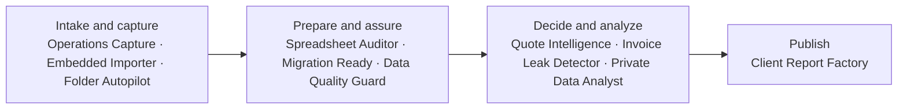

# DataBreeze Platform and Feature Matrix

**Status:** Product specification 
**Version:** 1.0

This matrix is the product-owner view of where each of the ten modules delivers value. The detailed platform and feature specifications remain authoritative for requirements and edge cases.

## 1. Shared Platform Roles

| Platform | Product role |
|---|---|
| **Web** | Complete organization, cloud, governance, collaboration, configuration, reporting, and administration workspace |
| **Windows Desktop** | Approved local-file access, heavy or sensitive processing, offline execution, folder automation, detailed evidence, and safe file effects |
| **Android** | Capture and Share intake, focused review, notifications, online approval, field work, and concise result consumption |

## 2. How the Ten Modules Fit Together

This is a common value flow, not a requirement that every customer use every stage:

- **Operations Capture** collects first-party field records; **Embedded Importer** puts governed import inside another product; **Folder Autopilot** reacts to files entering an approved Windows folder.
- **Spreadsheet Auditor** diagnoses an individual workbook; **Migration Ready** prepares data for a time-bounded system move; **Data Quality Guard** continuously monitors governed data after or between projects.
- **Quote Intelligence** supports supplier-choice decisions; **Invoice Leak Detector** finds and documents payable leakage; **Private Data Analyst** answers broader governed questions.
- **Client Report Factory** turns approved governed results from any earlier module into a stable, reviewable publication.
- Shared Inbox, artifacts, datasets, evidence, jobs, recipes, reviews, permissions, and audit history allow a result to move between modules without copying or redefining its source of truth.

## 3. Module Responsibilities by Platform

| Product module | Web | Windows Desktop | Android |
|---|---|---|---|
| **DataBreeze Quote Intelligence** | Configure RFQs, suppliers, scoring, collaboration, approval, history, and reports. | Extract and compare local quote files, process large batches, inspect local evidence, and export approved copies. | Scan/share quotes, correct uncertain fields, answer review questions, and review or approve a compact comparison online. |
| **DataBreeze Spreadsheet Auditor** | Configure audit profiles/schedules, triage findings, assign work, approve repair plans, and view trends. | Audit large or local workbooks, watch approved folders, inspect formulas and cells, create repaired copies, and work offline. | Receive alerts, inspect high-priority findings, comment, assign, and review or approve repair plans online. |
| **DataBreeze Invoice Leak Detector** | Govern supplier/rate libraries, investigate exceptions, manage cases, approve evidence packages, and view exposure/recovery analysis. | Watch invoice folders, process sensitive or high-volume documents locally, resolve evidence, and generate export copies. | Scan/share invoices, correct uncertain fields, inspect material exceptions, comment, assign, and approve or escalate online. |
| **DataBreeze Embedded Importer** | Manage schemas, mappings, branding, origins, API credentials, webhooks, hosted import UI, logs, usage, and support tools. | Run the local SDK harness and outbound-only gateway for approved files, local parsing, and validation. | Show safe administrative alerts and gateway/import status only; no end-user mapping or commit UI. |
| **DataBreeze Client Report Factory** | Manage clients, governed data bindings, templates, brands, schedules, cloud generation, approval, publication, sharing, and release history. | Prepare local datasets, inspect evidence, render large or sensitive Office/PDF batches, and package approved outputs. | Review mobile renditions and permitted evidence, comment, approve/reject online, receive release alerts, and share an already approved report when allowed. |
| **DataBreeze Migration Ready** | Govern projects, schemas, mappings, rules, profiling, duplicate/reconciliation policy, exceptions, release approval, packages, and reports. | Profile and transform large or sensitive local sources, run dry runs, stage packages, and work offline. | Review assigned mappings, duplicates, validations, evidence, release gates, status, failures, and completion notifications. |
| **DataBreeze Folder Autopilot** | Author typed recipes, bind device/folder capabilities, configure approval gates, and monitor previews, queues, executions, health, and audit. | Hold approved folder paths, watch and fingerprint files, run typed local processing, preview effects, apply approved actions, keep undo journals, and work offline. | Receive alerts, inspect compact previews/evidence, approve or reject online, pause assignments, and view outcomes/undo availability. |
| **DataBreeze Data Quality Guard** | Define quality contracts, monitors, baselines, ownership, escalation, waivers, repairs, trends, reports, and cloud execution. | Check and repair large or sensitive local datasets, run offline schedules, inspect row/cell evidence, and create derived repaired files. | Receive incident/freshness alerts, inspect status/evidence, acknowledge, assign, comment, and approve repairs or waivers online. |
| **DataBreeze Private Data Analyst** | Ask governed questions, inspect typed plans, create tables/charts, certify, schedule, share, embed, and administer AI/egress policy. | Catalog and analyze explicit local datasets, use optional local AI, inspect detailed evidence, save offline analyses, and synchronize permitted results. | Ask text or confirmed-voice questions over authorized synchronized/cloud data; view compact results, caveats, evidence, and scheduled insights; and review or approve publication online. |
| **DataBreeze Operations Capture** | Design/version forms, publish reference data, configure assignments and policy, monitor field work, review exceptions, and report/export. | Import scanner-folder files, run large OCR/extraction locally, bulk review, reconcile submissions, and generate exports. | Primary capture surface for forms, camera/documents, barcode/QR, voice, signatures, consented location, offline drafts, validation, submission, synchronization/status, returned-record review, and authorized online approval. |

## 4. Interpretation Rules

- A module appearing on all three platforms does not mean the same interface is duplicated three times.
- Android final approval always uses current online authorization and MFA when required; an offline note or draft never becomes an ApprovalDecision through synchronization.
- Local originals remain on their authorized source Device unless the effective data-mode policy and an explicit user action permit a transfer.
- Web does not gain remote filesystem access merely because it can configure or monitor a Desktop workflow.
- Each module's platform-responsibility section and the [Web](../specs/platforms/web.md), [Windows Desktop](../specs/platforms/desktop.md), and [Android](../specs/platforms/android.md) specifications define the normative behavior.
