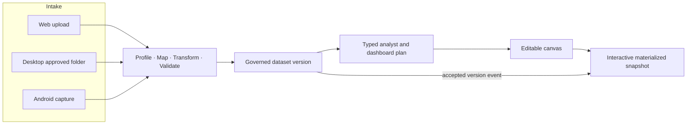

# DataBreeze Platform and Capability Matrix

**Status:** Product specification 
**Version:** 2.0

This matrix is the product-owner view of how Web, Windows Desktop, and Android deliver one Data-to-Dashboard Agent. The detailed platform and feature specifications remain authoritative for requirements and edge cases.

## 1. Platform roles

| Platform | Product role |
|---|---|
| **Web** | Cloud intake, ETL/data-quality review, governed datasets, analyst, dashboard canvas, interactive publication, collaboration, administration, and Cloud/Hybrid execution |
| **Windows Desktop** | Approved local-folder intake, large or sensitive file processing, local ETL/analysis, offline work, detailed evidence, and policy-controlled Hybrid publication |
| **Android** | Active receipt/document capture, secure cloud upload, OCR correction, dashboard consumption, notifications, and focused analyst questions |

## 2. One product flow

## 3. Capability responsibilities

| Capability | Web | Windows Desktop | Android |
|---|---|---|---|
| **Intake** | Upload supported CSV/XLSX into Cloud or Hybrid workspace scope. | Register an approved folder; fingerprint and classify stable supported files. | Capture or select receipt/document images through explicit user action. |
| **Original storage** | Register immutable cloud artifacts in workspace-controlled object storage. | Keep Local/Hybrid originals on the source Device unless explicitly transferred. | Stage securely and upload resumably to an authorized Hybrid/Cloud destination. |
| **Folder intelligence** | Configure purpose, policy, publication projection, and review status without learning local paths. | Maintain local path, manifest, schema fingerprints, append/version rules, debounce, duplicate and drift review. | Show content-safe status only. |
| **ETL and quality** | Review mapping, typed transformations, before/after samples, findings, rejects, quality dimensions, and lineage; run cloud processing. | Run the same typed plans locally, including large/sensitive inputs, and preserve local evidence. | Correct OCR candidates and validation conflicts for captured records. |
| **Governed datasets** | Manage immutable dataset/schema/mapping/rule/metric versions and cloud projections. | Catalog local dataset versions and synchronize only allowed projections/results. | Consume authorized captured-record and dashboard projections. |
| **Analyst** | Ask Vietnamese/English questions, inspect/edit typed plans, view evidence, save analyses, and propose canvas changes. | Ask questions and execute compatible plans locally; optional local AI may interpret intent. | Ask focused questions over authorized cloud/synchronized data and view compact evidence. |
| **Dashboard canvas** | Create pages, add/move/resize/configure widgets and filters, preview responsive layouts, and publish versions. | View/edit compatible dashboards and inspect detailed local evidence; full authoring is Web-first for V1. | View responsive dashboards, filters, drill-down summaries, freshness, and caveats. |
| **Refresh** | Materialize affected results, publish complete snapshots atomically, notify connected viewers, and expose cost/freshness. | Detect new compatible files, run local incremental ETL, and synchronize the approved change/projection. | Receive content-safe update notifications and fetch authorized changed results. |
| **Publication and sharing** | Own dashboard publication, audience, grants, withdrawal, approval when required, and audit. | Publish local results only through an explicit DSO-governed projection/confirmation. | View/share an already authorized dashboard; no offline approval or permission expansion. |
| **Administration** | Own members, roles, policies, devices, data modes, retention, AI egress, billing, usage, APIs/webhooks, and audit history. | Show device, folder, storage, sync, processing, and recovery status. | Show account, upload queue, capture, review, and device status. |

## 4. V1 data-source matrix

| Source | V1 status | Intake owner | Notes |
|---|---|---|---|
| CSV upload | Included | Web/Desktop | Encoding, delimiter, header, type, size, and row limits are explicit. |
| XLSX upload/folder file | Included | Web/Desktop | Supported worksheets only; no macro, external refresh, or arbitrary workbook execution. |
| Approved Desktop folder | Included | Desktop | Compatible new files may process automatically; ambiguity enters review. |
| Receipt/document camera capture | Included | Android | Cloud OCR with field-level confidence and user correction for Hybrid/Cloud destinations. |
| Manual table paste/form | P1 extension | Web | Must create an immutable intake version. |
| Database/API/cloud-drive connector | Post-V1 | Web/INT | Requires explicit authorization, schema, cursor, retention, and cost contracts. |
| Streaming event source | Post-V1 | INT | Requires a separate streaming freshness and capacity design. |

## 5. Data-mode interpretation

- Hybrid is the default.
- Web never browses or commands a Desktop filesystem.
- Desktop paths remain local and are replaced in cloud records by opaque capability/binding identifiers.
- An approved folder does not authorize every file type, transform, dataset interpretation, or cloud transfer.
- Android cloud capture uses secure temporary local state and durable upload work; capture cannot begin remotely.
- Local originals remain on their authorized source Device unless current policy and an explicit user action permit transfer.
- Cloud dashboards over Local/Hybrid sources show the exact publication projection and evidence availability.

## 6. Specialist extensions

The ten earlier product modules are retained as post-V1 solution specifications. They may reuse the dashboard, analyst, dataset, evidence, job, and publication foundations, but they do not expand the V1 release gate merely because their specifications remain available.
