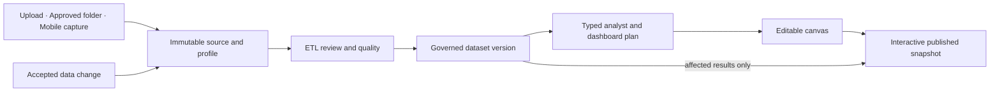

# DataBreeze Product Definition

**Status:** Product specification 
**Version:** 2.1 
**Audience:** Product, design, engineering, operations, reviewers, and implementation agents

## 1. Definition

DataBreeze is a Vietnamese-first, local-first and cloud-capable unified data workspace. It turns user-controlled spreadsheets, tabular files, approved local folders, and captured receipts, invoices, and tables into governed datasets, interactive dashboards, and evidence-backed analysis.

Its product promise is:

> Your data, understood and kept up to date.

DataBreeze is one product across three complementary applications:

- **Web** is the premium cloud workspace with exactly three primary destinations (`Bảng điều khiển`, `Phân tích`, and `Dữ liệu`) for upload, preparation, analysis, dashboard canvas authoring, publication, and administration.
- **Windows Desktop** is the trusted local and Hybrid data agent with a distinct V2 workbench for approved folders, large or sensitive files, local processing, and policy-controlled synchronization.
- **Android** is the cloud-connected capture and consumption companion for receipt/invoice/table scanning, OCR review, dashboards, notifications, and permitted agent analysis without complex canvas authoring.

All three surfaces share identity, workspaces, permissions, immutable artifacts, governed datasets, schemas, mappings, rules, jobs, evidence, data modes, synchronization, notifications, usage, and audit history.

## 2. Problem

Individuals and small teams often have valuable data but cannot turn it into a dependable dashboard without combining several difficult tools:

- Files arrive with inconsistent headers, types, currencies, dates, duplicates, missing values, and naming conventions.
- Dashboard builders often assume the data is already clean and correctly modeled.
- Automated chart generators can produce plausible-looking but incorrect metrics or visualizations.
- Static reports become stale, while continuously querying raw data is expensive and difficult to govern.
- Sensitive or large local files may not be suitable for automatic cloud upload.
- Receipt and document data must be captured, corrected, and reconciled before it can support analysis.
- Users need to understand how a number was produced, not merely see a polished chart.

DataBreeze joins intake, governed ETL, data-quality review, analysis, dashboard construction, publication, and fresh-on-change updates in one traceable workflow.

## 3. Product outcome

A successful workflow has seven properties:

1. **Easy intake:** The user uploads a supported file, registers an approved Desktop folder, or captures a receipt on Android.
2. **Preserved source:** The original becomes an immutable artifact version with visible location and retention behavior.
3. **Reviewed preparation:** DataBreeze profiles the input, proposes typed transformations, and exposes changed, invalid, rejected, and uncertain records.
4. **Measurable trust:** Quality is described through completeness, validity, uniqueness, consistency, freshness, and extraction confidence rather than an unsupported claim of factual correctness.
5. **Editable dashboard:** The agent proposes metrics, charts, filters, and layout on a canvas that the user can inspect and change.
6. **Evidence-backed analysis:** Every material value links to its typed plan, metric definition, dataset version, filters, lineage, and authorized source evidence.
7. **Efficient freshness:** Accepted data changes trigger dependency-aware materialization and atomic dashboard snapshot publication without continuous polling.

## 4. Core V1 capability

The first product version is the **DataBreeze Data-to-Dashboard Agent**.

| Capability | V1 outcome |
|---|---|
| Data intake | Web CSV/XLSX upload, Desktop approved-folder CSV/XLSX intake, and Android receipt/document capture |
| Storage | Immutable originals, governed cleaned dataset versions, and versioned materialized dashboard results |
| ETL review | Profiling, mapping, typed transformations, before/after preview, rejected-row visibility, validation, quality dimensions, and lineage |
| Analyst | Vietnamese/English questions converted to visible typed plans and deterministic results |
| Dashboard canvas | Agent-proposed and user-editable pages, layouts, widgets, filters, evidence, and publication |
| Freshness | On-change, manual, and scheduled refresh with dependency-aware recomputation and atomic snapshots |
| Hybrid operation | Local Desktop execution with policy-controlled publication projections to cloud dashboards |
| Mobile capture | Cloud-connected OCR, field-level confidence, correction, deterministic receipt checks, and governed dataset insertion |

## 5. Primary workflow

AI may interpret intent, propose mappings, suggest visualizations, and draft explanations. Deterministic processors calculate every displayed numeric value. The agent cannot publish, broaden access, move data across a policy boundary, or mutate an original without the required user action and policy decision.

## 6. Platform responsibilities

### Web

Web owns cloud intake, ETL review, governed dataset administration, typed analysis, dashboard authoring, interactive publication, collaboration, sharing, permissions, billing/usage, API administration, and audit history. Web cannot browse or remotely control Desktop folders.

### Windows Desktop

Desktop owns local folder selection, local paths, file stability and fingerprinting, schema grouping, local ETL/analysis, offline state, detailed local evidence, and Hybrid publication projections. It processes only explicitly granted folders and supported typed actions.

### Android

Android V1 owns active camera/document capture, resumable cloud upload for Hybrid/Cloud destinations, OCR candidate review, dashboard consumption, and analyst questions. It uses native Kotlin/Compose and secure local staging/queues; capture is never remote-triggered.

## 7. Data modes

| Mode | Original data | Dashboard behavior |
|---|---|---|
| **Local** | Remains on an authorized source Device. | Local analysis/dashboard is available on Desktop; cloud receives only content-safe metadata or separately approved derived results. |
| **Hybrid** | Remains local by default; explicit artifacts or projections may synchronize. | Default mode. Dashboard-specific aggregates or selected governed data may power Web/mobile dashboards after policy and user review. |
| **Cloud** | Stored in workspace-controlled object storage. | Cloud ETL, analysis, materialization, publication, and authorized cross-device consumption are available. |

Every intake and publication workflow shows where originals, cleaned data, evidence, and dashboard results will live before a sensitive transfer occurs.

## 8. Freshness and cost model

The ordinary V1 dashboard is **fresh on trusted change**, not a continuously queried live database view.

- Dashboard widgets compile to typed query plans and materialized results.
- Page views read bounded authorized materializations rather than scanning raw datasets.
- A committed dataset version emits a versioned event.
- A dependency index selects affected dashboard results.
- Changes inside a short debounce window coalesce.
- A complete new snapshot publishes atomically; a partial refresh never replaces the last good snapshot.
- Connected clients receive a content-safe notification and fetch changed authorized results.
- Cache keys include TenantScope, permission projection, dataset/semantic versions, plan hash, and parameters.
- Compute budgets, concurrency limits, idle suspension, retention, and visible usage prevent accidental cost growth.

The V1 target is a new ordinary dashboard snapshot within 60 seconds after a small accepted data update under the reference workload. Genuine second-by-second streaming is a later capability requiring measured customer need.

## 9. Initial users and positioning

Initial users are Vietnamese solo operators, SMEs, consultants, accountants, and analysts who already work with spreadsheets, recurring exports, or receipts but lack the time or skills to build trustworthy data pipelines and dashboards.

Positioning:

> Turn the data you already have into a checked, interactive dashboard—without hiding how the numbers were produced.

## 10. Business model direction

Plans may meter durable value drivers:

- active workspaces and members;
- cloud storage and retention;
- processed rows, files, pages, or compute units;
- active Desktop folder bindings;
- OCR pages;
- automatic dashboard refreshes and materializations;
- published dashboards and sharing controls; and
- advanced governance, approval, and audit retention.

Viewing a cached dashboard should be inexpensive. Compute is concentrated at intake, ETL, novel analysis, and affected-result refresh rather than every page view.

## 11. Non-goals for V1

V1 does not include:

- unrestricted connectors to arbitrary databases, APIs, cloud drives, email, accounting systems, or marketplaces;
- genuine second-by-second streaming dashboards;
- arbitrary AI-generated SQL, Python, JavaScript, macros, or shell execution;
- silent modification of originals or silently accepted ETL changes;
- automatic publication or permission expansion by an agent;
- factual correctness claims derived only from statistical profiles or AI confidence;
- general-purpose document understanding beyond the initial reviewed capture profiles;
- an unrestricted remote Desktop agent;
- payment execution or external operational actions; or
- simultaneous production delivery of the ten specialist solution modules.

## 12. Specialist extensions

The existing Quote Intelligence, Spreadsheet Auditor, Invoice Leak Detector, Embedded Importer, Client Report Factory, Migration Ready, Folder Autopilot, Data Quality Guard, Private Data Analyst, and Operations Capture specifications are retained as post-V1 specialist extensions. They may reuse the same foundations and dashboard capability after product evidence, but they are not part of the first product release gate unless a later approved plan says otherwise.

## 13. Product success

The product succeeds when users:

- reach a trustworthy first dashboard without writing code;
- understand and correct material data-quality issues before publication;
- can trace every consequential dashboard value to its governed calculation and evidence;
- add new compatible data without rebuilding the dashboard;
- receive a fresh complete snapshot after trusted data changes;
- use the analyst without receiving fabricated numbers or hidden assumptions;
- keep sensitive originals local while publishing only the intended projection; and
- continue using the same dataset, transformations, dashboards, and questions after the first month.

A rapid mentor demonstration is a prototype gate, not a production-completion claim. Production status still requires the applicable requirement-linked security, tenant, recovery, performance, accessibility, data-mode, and audit evidence.
